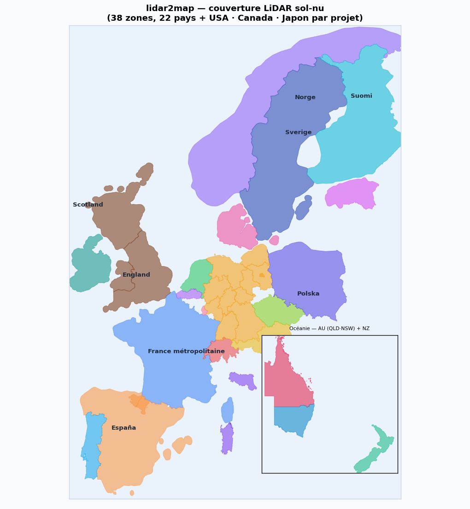

*[English](README.md) | **Français***

# lidar2map

[](https://github.com/nico579/lidar2map/actions/workflows/smoke.yml)

**Cartes offline LiDAR archéologique multi-pays + IGN raster/vecteur + OSM pour Locus Map / OsmAnd / TwoNav**

Outil autonome (exécutables Windows / macOS / Linux sans Python à installer, ou script Python unique) qui télécharge les données LiDAR publiques de portails nationaux dans **<!--N-->25<!--/N--> pays** (<!--LIST-->France, Royaume-Uni, Allemagne, Autriche, Pays-Bas, Suisse, Norvège, Belgique, Luxembourg, Finlande, Danemark, Suède, Irlande, Tchéquie, Slovénie, Estonie, Espagne, Portugal, Italie, Pologne, USA, Canada, Nouvelle-Zélande, Australie, Japon<!--/LIST-->), calcule des ombrages spécialisés pour la prospection archéologique, et génère des cartes utilisables hors-ligne sur smartphone (formats MBTiles, RMAP, SQLiteDB, Mapsforge). Les cartes raster/vecteur IGN restent France-only.


*Même emprise sous trois regards : la photo satellite et la carte OSM ne montrent rien du micro-relief, le Sky-View Factor calculé depuis le LiDAR HD le révèle d'un coup.*

> ⚠️ **Statut** : usage personnel diffusé. Code testé intensivement sur Windows 10/11. Linux et macOS testés partiellement, cas connus + dépannage cross-OS dans la section *Dépannage* de [BUILD.md](BUILD.md). Les retours sont bienvenus via les [issues GitHub](https://github.com/nico579/lidar2map/issues).

---

**Ton pays est-il couvert ?** <!--N-->25<!--/N--> pays en LiDAR sol-nu (dont USA, Canada & Japon en couverture par projet). Repère ta zone avant de te lancer :



*Détails, résolutions et sources évaluées : section [Couverture LiDAR](#couverture-lidar--sources-évaluées) plus bas.*

---

## Pour qui ?

- **Archéologues amateurs** intéressés par la prospection LiDAR : l'outil fonctionne dans **<!--N-->25<!--/N--> pays** (<!--LIST-->France, Royaume-Uni, Allemagne, Autriche, Pays-Bas, Suisse, Norvège, Belgique, Luxembourg, Finlande, Danemark, Suède, Irlande, Tchéquie, Slovénie, Estonie, Espagne, Portugal, Italie, Pologne, USA, Canada, Nouvelle-Zélande, Australie, Japon<!--/LIST-->), avec d'autres en cours. Les calculs d'ombrages (multi, SVF, openness, LRM, RRIM, VAT) sont identiques d'un pays à l'autre.
- **Randonneurs français** qui veulent des cartes IGN topo offline sur téléphone (Locus Map Pro, OsmAnd+) : les onglets IGN raster/vecteur restent France-only.
- **Prospecteurs paysage** qui combinent orthophotos historiques (1950-1995, France) et MNT pour repérer les vestiges humains avant la déprise agricole.
- **Spéléologues / explorateurs** qui ont besoin de fonds de carte précis dans des zones non couvertes par les apps grand public.

L'outil n'est **pas** destiné à la détection métallique. Le code respecte strictement les licences ouvertes (Etalab FR, CC BY 4.0 NO, CC-0 NL, BGDI CH).

## Ce que ça produit

À partir d'une commune, de coordonnées GPS, d'une bbox, d'un département ou d'une région entière :

- **Ombrages archéo** depuis le LiDAR national (résolution 0.5 m à 1 m selon source) :

  | Type | Ce qu'il révèle | Paramètres |
  |------|-----------------|------------|
  | `multi` | Hillshade multidirectionnel (Mark 1992), relief général sans biais d'azimut | `elevation` (° soleil, défaut 25, bas = micro-relief, 45 = usage général) |
  | `315` `045` `135` `225` | Hillshades directionnels, accentuent les structures perpendiculaires à l'azimut choisi | `elevation` (idem) |
  | `slope` | Pente 0-90° étalée sur 1-255, talus, ruptures, terrasses | (aucun) |
  | `svf` | Sky-View Factor, fraction de ciel visible : fossés, restanques, enceintes en sombre | `conv` (`flux` = cos²γ contrasté, défaut ; `rvt` = 1−sin γ, standard archéo Kokalj/Hesse), `dist` (rayon d'horizon en m, défaut 20, 20 = micro-relief, 100 = enceintes/voiries), `gamma` (contraste, défaut 2.0) |
  | `opos` | Openness positive (Yokoyama 2002), angle d'horizon moyen au-dessus de l'horizontale : crêtes, bosses, tumuli en clair | `dist`, `gamma` |
  | `oneg` | Openness négative inversée, vue « vers le bas » : fossés, talus et chemins creux en sombre, le complément du SVF (plus granuleux par nature : sensible au bruit du MNT) | `dist`, `gamma` (appliqué en miroir : renforce les creux sans assombrir le fond) |
  | `lrm` | Local Relief Model, soustrait le relief lissé (gaussienne σ) : supprime collines et vallées, ne garde que les anomalies locales. Rapide et lisible : le défaut de la GUI | `sigma` (rayon gaussien en m ≈ échelle max des structures conservées ; défaut 15 px du provider) |
  | `rrim` | Red Relief Image Map (Chiba 2008), composite couleur : pente en rouge (rampe absolue 0-45°), LRM en clair/foncé, creux ET bosses d'un seul regard | `sigma` (du LRM interne) |
  | `vat` | **Visualization for Archaeological Topography**, le détecteur le plus complet : SVF + openness positif + pente fondus en un seul niveau de gris, révèle creux ET bosses sans choisir une méthode (esprit RVT, ZRC SAZU). Plus lent que `lrm`, plus granuleux aussi. Nécessite numba | `dist` (rayon SVF/openness en m, défaut 20), `gamma` (contraste du composite, défaut 2.0, 1 clair, 2 foncé) |

  Deux façons de les demander :

  ```bash
  # Simple : liste de types, paramètres globaux partagés
  --shadings multi svf oneg --svf-dist 20 --svf-gamma 2

  # Instances paramétrées (répétable) : chaque occurrence porte SES paramètres
  # → plusieurs instances du même type dans un seul run
  --shading svf:dist=20,gamma=2 --shading svf:dist=100,gamma=1.5 \
  --shading oneg:dist=20 --shading 315:elevation=20 --shading lrm:sigma=10

  # Preset par résolution (opt-in) : un stack (svf + opos + lrm + multi + slope)
  # dimensionné en MÈTRES pour la résolution du MNT, pour cibler la même échelle
  # de structures que le MNT soit à 0,25 m ou 5 m. 'auto' choisit le palier selon
  # le provider : micro (<=0,75 m) / standard (~1 m) / landscape (>=5 m)
  --shading-preset auto
  ```

  Les paramètres explicites différents des défauts sont encodés dans le nom du
  fichier produit (`zone_svf_flux_100m_g1p5_ombrage.tif`, `zone_315_e20_ombrage.tif`) :
  pas de collision entre instances, et les ombrages déjà calculés sont réutilisés.
  Dans la GUI, la liste « à traiter » (boutons +/−) fait la même chose : chaque
  instance ajoutée a son propre mini-formulaire de paramètres.
  `--svf-sweep` / `--no-svf-sweep` (kernel sweep-horizon, SVF uniquement) reste global.

  Sources LiDAR : **<!--N-->25<!--/N--> pays** via le flag `--provider <code>` (ou le dropdown
  de la GUI), France (défaut), Pays-Bas, Suisse, Norvège, Allemagne (11 Länder),
  Autriche (national + Tyrol), Royaume-Uni, Belgique (Flandre), Finlande, Danemark,
  Irlande, Tchéquie, Slovénie, Estonie, Espagne (+ Pays basque, Navarre, Catalogne), Italie (Émilie-Romagne, Sardaigne), Pologne, USA, Canada, Nouvelle-Zélande,
  Australie (QLD/NSW). Le détail par provider (donnée, résolution, CRS, mécanisme
  d'accès, couverture, clés API) est dans **l'unique tableau de référence** de la
  section [Providers LiDAR](#providers-lidar--ajouter-un-pays).

- **Cartes raster IGN** *(France uniquement)* : Plan IGN, Orthophotos (actuelles + historiques 1950, 1965, 1980), État-Major XIXᵉ, Pléiades satellite, IRC, etc.
- **Imagerie USGS** *(USA, `--couche naip`)* : imagerie aérienne dérivée NAIP, domaine public (~1 m, cache complet jusqu'à z16), complément image du LiDAR 3DEP `us-tnm`.

- **Cartes vectorielles** : OSM Mapsforge `.map` (international, via Geofabrik) ou IGN BD TOPO *(France uniquement)*. Les deux se rendent aussi en **`transparent-raster`** : les couches choisies (chemins, routes, cours d'eau...) dessinées sur tuiles transparentes (.sqlitedb), à superposer au relief LiDAR dans OsmAnd (qui ne sait pas superposer du vectoriel nativement)

- **Sorties** : MBTiles (universel), RMAP (CompeGPS / TwoNav), SQLiteDB (format RMaps, Locus Map / OsmAnd), Mapsforge `.map` (Locus Map), `.sqlitedb` transparent en superposition (`transparent-raster`)

- **Envoi vers le téléphone** : après génération, le bouton 📲 de la GUI (ou `--serve --zone-name X` en CLI) sert les cartes sur le WiFi local et affiche un QR code. On scanne avec le téléphone, on télécharge, puis « Ouvrir avec » OsmAnd ou Locus : pas de câble, pas de cloud, rien ne sort du réseau. (Android peut avertir que le téléchargement n'est pas sécurisé : choisir Enregistrer, c'est un simple transfert local.)

- **File d'attente des traitements** : dans la GUI, on empile plusieurs zones avec le bouton `＋ File`, puis `Lancer la file` les traite l'une après l'autre, sans surveillance. Un job en échec n'arrête pas la file (chaque item affiche son statut), on peut donc aligner un lot de zones et laisser tourner. En CLI, l'équivalent est l'enchaînement de commandes dans un script shell.

- **Planche d'assemblage** : chaque run dépose un `<produit>_planche.png` à côté des livrables : emprise couverte, contour réel du département (avec un carton de localisation quand la vue est zoomée), et cellules numérotées quand la zone a été découpée. Une planche par produit carto (chaque ombrage a la sienne) ; les couches vecteur d'un run partagent une planche unique. Construite en balayant les fichiers réels (mbtiles/sqlitedb/geojson), donc régénérable sur un dossier projet existant avec `--index-sheet DOSSIER` (alias `--planche`), sans rien rejouer. Désactivable par run avec `--no-index-map`.

---

## Installation et utilisation

**Démarrage rapide : téléchargez l'exécutable autonome de votre OS depuis la [page Releases](https://github.com/nico579/lidar2map/releases), décompressez, lancez. Pas de Python, pas de dépendances, rien à installer.**

Deux façons d'utiliser lidar2map :

| | **A. Exécutable autonome** | **B. Script Python** |
|---|---|---|
| **Prérequis** | Aucun | Python 3.12 |
| **Première install** | Aucune | ~5 min (bootstrap auto dans son propre venv) |
| **Mises à jour** | Patcher les 3 binaires existants sur la release GitHub en une commande : `python update_app.py --release` (voir [`update_app.py`](update_app.py)) | `git pull` + relance |
| **Distribuable** | Oui, `.exe` / `.app` / binaire Linux + bundle zip côte à côte | Non, chaque utilisateur installe Python |
| **Idéal pour** | utilisateur final / Windows / distribuer | dev / Linux / contribuer au code |

### A. Exécutable autonome

Pas de Python à installer côté utilisateur final. Le livrable contient son propre runtime (Python embarqué, deps, JRE, osmosis).

#### 1. Obtenir le livrable

**Option a, Télécharger depuis [Releases](https://github.com/nico579/lidar2map/releases)** (si la version est publiée pour ta plateforme) :

| OS | Archive | Extraire avec |
|----|---------|---------------|
| Windows 10/11 (x86_64) | `lidar2map-windows-x86_64.zip` | `Expand-Archive` (PowerShell) ou double-clic |
| Linux Ubuntu 24.04+ (x86_64) | `lidar2map-linux-x86_64.tar.gz` | `tar xzf` |
| macOS 12+ (Apple Silicon) | `lidar2map-macos-arm64.zip` | `unzip` puis `xattr -dr com.apple.quarantine LIDAR2MAP.app` |

L'archive s'extrait en un dossier `lidar2map-<os>-x86_64/` contenant le binaire et son `lidar2map_bundle.zip` côte à côte. Aucune installation système.

**Option b, Builder soi-même.** Deux scripts par plateforme : un setup machine (à faire **une fois**) puis un build (à relancer à chaque mise à jour de `lidar2map.py`).

##### Windows

```powershell
git clone https://github.com/nico579/lidar2map
cd lidar2map
.\setup_build_windows.ps1     # 1. Setup : Python 3.12, deps, JRE, osmosis, PyInstaller
.\lidar2map_win_build.ps1     # 2. Build : 3 etapes -> dist\lidar2map.exe + dist\lidar2map_bundle.zip
```

##### macOS (Apple Silicon)

```bash
git clone https://github.com/nico579/lidar2map
cd lidar2map
bash setup_build_mac.sh       # 1. Setup
bash lidar2map_mac_build.sh   # 2. Build -> dist/LIDAR2MAP.app
```

##### Linux (Ubuntu / Debian)

Linux réutilise les specs Windows (`_win.spec` produit un ELF sous Linux, le nom est trompeur).

```bash
git clone https://github.com/nico579/lidar2map
cd lidar2map
bash setup_build_linux.sh       # 1. Setup
bash lidar2map_linux_build.sh   # 2. Build -> dist/lidar2map + dist/lidar2map_bundle.zip
```

Prérequis : `sudo apt install zip` si absent. Le binaire produit dépend de la libc de la machine de build (build sur Ubuntu 22.04 → tourne sur Ubuntu ≥ 22.04 / Debian 12+).

Documentation complète du build (architecture du bundle, mise à jour sans rebuild, dépannage) : **[BUILD.md](BUILD.md)**.

#### 2. Lancer le livrable

| OS | Commande |
|----|----------|
| Windows | Double-clic sur `lidar2map.exe` (ou dans un terminal pour voir le log) |
| Linux | `chmod +x lidar2map && ./lidar2map` dans le dossier extrait |
| macOS | Double-clic sur `LIDAR2MAP.app`. Premier lancement bloqué par Gatekeeper : `xattr -dr com.apple.quarantine LIDAR2MAP.app` puis double-clic |
| Linux | `chmod +x lidar2map && ./lidar2map` |

Le premier lancement extrait le bundle (~30-60 s, une fois, il contient Qt) dans :
- Windows : `%LOCALAPPDATA%\lidar2map\`
- macOS : `~/Library/Application Support/lidar2map/`
- Linux : `~/.local/share/lidar2map/`

Désinstallation propre : `lidar2map(.exe) --desinstaller`.
### B. Script Python

Au premier lancement, le script crée `~/.lidar2map/venv` et y installe les dépendances critiques (Pillow, pyproj, numpy, rasterio, pywebview + PyQt6/QtWebEngine…) : votre Python système n'est jamais touché (`--bootstrap=none` si vous préférez gérer l'environnement vous-même). Téléchargement du JRE Temurin 21 et d'osmosis à la demande ; aucun GDAL système requis, les wheels rasterio embarquent le leur. ~400 Mo total, **une seule fois**.

#### Windows 10+

1. Installer [Python 3.12+](https://www.python.org/downloads/)
2. Récupérer le code :
   ```powershell
   git clone https://github.com/nico579/lidar2map
   cd lidar2map
   python lidar2map.py
   ```

#### macOS 11+

```bash
brew install python@3.12
git clone https://github.com/nico579/lidar2map
cd lidar2map
python3.12 lidar2map.py
```

#### Linux (Debian / Ubuntu)

```bash
sudo apt install python3.12 python3.12-venv git
git clone https://github.com/nico579/lidar2map
cd lidar2map
python3.12 lidar2map.py
```

Résolution de problèmes : section *Dépannage* de [BUILD.md](BUILD.md) (incluant les cas spécifiques Linux/macOS : PEP 668, Qt distro packages, Wayland, Gatekeeper sur le JRE…).


---

## Utilisation

Deux modes, sélectionnés automatiquement selon les arguments (même logique que
le projet jumeau [gpxsolar](https://github.com/nico579/gpxsolar)) :

- **Sans argument → interface graphique** (pywebview / Qt). Mode courant.
- **Avec arguments → calcul en ligne de commande** (headless, sans fenêtre).
  Pratique pour scripter, lancer sur un serveur, ou reproduire un rendu précis.

Tout ce qui suit vaut pour le binaire comme pour le script, remplacez simplement
`python lidar2map.py` par `lidar2map.exe` (Windows), `./lidar2map` (Linux) ou
`LIDAR2MAP.app` (macOS).

### Exemples en ligne de commande

> Les options ci-dessous sont en anglais. Les anciens noms français restent acceptés comme alias, les anciennes commandes continuent donc de fonctionner.

**Ombrage SVF + carte topo IGN sur une commune (zone 1 km² autour de Garéoult, France) :**
```bash
python lidar2map.py --lidar --zone-city Gareoult --zone-radius 1 \
    --shadings multi svf --file-formats mbtiles```

**Ombrages sur Amsterdam (Pays-Bas, AHN4) :**
```bash
python lidar2map.py --provider nl-ahn --lidar --download \
    --zone-bbox 120000,486000,122000,488000 --zone-name amsterdam \
    --shadings multi --file-formats mbtiles```

**Ombrages sur Genève (Suisse, swissALTI3D) :**
```bash
python lidar2map.py --provider ch-swisstopo --lidar --download \
    --zone-city Geneve --zone-radius 1 \
    --shadings svf --file-formats mbtiles```

**Ombrages sur Oslo (Norvège, Kartverket) :**
```bash
python lidar2map.py --provider no-kartverket --lidar --download \
    --zone-city Oslo --zone-radius 1 \
    --shadings multi --file-formats mbtiles```

**Orthophoto historique 1950-1965 sur une zone de chasse archéo :**
```bash
python lidar2map.py --raster --zone-bbox 6.0,43.3,6.1,43.4 \
    --layer ortho_1950 --zoom-min 14 --zoom-max 18```

**Carte OSM vectorielle (.map Mapsforge) pour Locus, département entier :**
```bash
python lidar2map.py --osm --zone-department 83 --file-formats map```

**Région entière (`--zone-region`), disponible pour tous les modes :**
```bash
# OSM : une seule carte pour toute la région, sans re-découpe
# (le PBF Geofabrik EST déjà régional, bien plus rapide qu'une boucle par département)
python lidar2map.py --osm --zone-region provence-alpes-cote-d-azur
# IGN vecteur : chemins/itinéraires de toute la région en GeoJSON + carte .map Locus
python lidar2map.py --vector --zone-region provence-alpes-cote-d-azur \
    --layer chemins --file-formats gz map```
Le slug est celui de [Geofabrik France](https://download.geofabrik.de/europe/france.html) (anciennes régions : `provence-alpes-cote-d-azur`, `bretagne`, `corse`, `rhone-alpes`…). En OSM la région est traitée d'un bloc (le fichier Geofabrik est déjà régional, aucun géocodage de département) ; pour les modes raster/vecteur/lidar la zone est la bbox englobant tous les départements de la région. Un slug inconnu liste les régions disponibles.

**Carte IGN BD TOPO (routes + bâtiments) en GeoJSON compressé + carte .map Mapsforge :**
```bash
python lidar2map.py --vector --zone-department 83 \
    --layer routes batiments --file-formats gz map```
Le format `map` convertit le GeoJSON IGN en carte Mapsforge `.map` (lisible par Locus Map ; OsmAnd utilise son propre format vectoriel OBF et ne lit pas le Mapsforge, mais sa carte offline intégrée fournit déjà la couche vectorielle : sur OsmAnd, il suffit de poser le raster LiDAR par-dessus en overlay).

## Providers LiDAR, ajouter un pays

L'abstraction provider permet d'ajouter une source LiDAR nationale sans toucher au cœur du pipeline. Chaque provider vit dans `providers/<code>.py` (~50-200 lignes) et expose :

```python
NAME, CODE, COUNTRY, LICENSE          # métadonnées
CRS_NATIF, RESOLUTION_M, DALLE_KM     # géométrie
discover_dalles(bbox_wgs, bbox_natif, cache)  # → {nom: url}
# + helpers : dalle_filename, dalle_url, subdir_from_name, dalles_pour_bbox
```

Le pipeline en aval (SVF, ombrages, warp EPSG:3857, MBTiles) est provider-agnostique : il consomme les GeoTIFF retournés par `discover_dalles`, peu importe le CRS natif ou le format d'index utilisé en amont.

| Code | Pays | Donnée | Rés. | CRS natif | Accès & particularités |
|---|---|---|---|---|---|
| `fr-ign` | France *(défaut)* | IGN LiDAR HD | 0.5 m | EPSG:2154 (Lambert-93) | TMS vectoriel PBF + WMS GetMap, couverture nationale |
| `nl-ahn` | Pays-Bas | AHN4/5 | 0.5 m | EPSG:28992 (RD New) | ATOM feed + JSON FeatureCollection, couverture nationale |
| `ch-swisstopo` | Suisse | swissALTI3D | 0.5 m | EPSG:2056 (CH1903+/LV95) | STAC API REST, couverture nationale |
| `no-kartverket` | Norvège | Nasjonal Høydemodell | 1 m | EPSG:25833 (UTM33N) | ArcGIS ImageServer exportImage, couverture nationale |
| `se-lantmateriet` | Suède | Markhöjdmodell (laser) | 1 m | EPSG:3006 (SWEREF99 TM) | STAC + COG mosaïque 10 km (lecture fenêtrée), couverture nationale ; **compte GeoTorget gratuit** (env `LANTMATERIET_USER`/`LANTMATERIET_PASS`) pour le download |
| `de-bayern` · `de-nrw` · `de-niedersachsen` · `de-rlp` | Allemagne (4 Länder : Bavière, RNW, Basse-Saxe, Rhénanie-Palatinat) | DGM1 | 1 m | EPSG:25832 (UTM32N) | metalink / index.json / STAC COG, open data (de-rlp : Metalink d'environ 21k tuiles GeoTIFF, post_fetch retire le CRS vertical composé → 25832) |
| `de-thueringen` · `de-berlin` | Allemagne (Thuringe, Berlin) | DGM / DGM1 | 1-2 m / 1 m | EPSG:25832 / 25833 (UTM32N/33N) | index ATOM INSPIRE → XYZ zippé (post_fetch → GeoTIFF), open data (Thuringe dl-de/by-2-0, Berlin dl-de/zero-2-0) |
| `de-hessen` · `de-bw` · `de-mv` · `de-st` · `de-brandenburg` | Allemagne (Hesse, Bade-Wurtemberg, Mecklembourg-Poméranie, Saxe-Anhalt, Brandebourg) | DGM1 | 1 m | EPSG:25832/25833 (UTM32N/33N) | WCS 2.0.1 INSPIRE GetCoverage, open data dl-de/by-2-0 (de-mv/de-st trouvés via l'auto-découverte du catalogue GDI-DE) |
| `at-bev` | Autriche (national) | ALS-DGM | 1 m | EPSG:3035 (LAEA Europe) | index ATOM + COG mosaïque 50 km (lecture fenêtrée via `/vsicurl`), millésime le plus récent par tuile, CC BY 4.0 (BEV) |
| `at-tirol` · `at-osttirol` | Autriche (Tyrol + Osttirol) | DGM | 0.5 m | EPSG:31254/31255 (MGI M28/M31) | WCS 1.0.0 GetCoverage (tiris), plus fin que `at-bev` sur le Tyrol |
| `gb-england` · `gb-wales` | Royaume-Uni | LIDAR Composite DTM | 1 m | EPSG:27700 (OSGB36) | WCS 2.0.1 / WFS catalogue (EA / NRW) |
| `gb-scotland` | Royaume-Uni (Écosse) | LiDAR secteur public écossais (DTM) | 0,5 m | EPSG:27700 (OSGB36) | Bucket AWS S3 public (sans compte), listing de tuiles OS-grid (`ListObjectsV2`) → COG, couverture 50 cm moderne (programme national + Orcades) |
| `be-flanders` | Belgique (Flandre + Bruxelles) | DHMV II DTM | 1 m | EPSG:31370 (Lambert 1972) | WCS 2.0.1, expose aussi SVF 25 cm et hillshade multi 25 cm précalculés |
| `lu-act` | Luxembourg | BD-L-Lidar 2024 (MNT) | 0,5 m | EPSG:2169 (LUREF) | COG national unique (~40 Go) lu en **fenêtré** via HTTP range `/vsicurl`, sans jamais télécharger tout le fichier ; CC0 |
| `fi-maanmittauslaitos` | Finlande | Modèle d'élévation | 2 m | EPSG:3067 (TM35FIN) | WCS 2.0.1, clé API gratuite requise, couverture nationale |
| `dk-datafordeler` | Danemark | DHM DTM | 0.4 m | EPSG:25832 (UTM32N) | WCS 1.0.0, clé API gratuite requise, couverture nationale |
| `ie-gsi` | Irlande | LiDAR DTM | 1 m | EPSG:2157 (ITM) | ArcGIS FeatureServer → ZIP (post_fetch), ~60 % du territoire, CC BY 4.0 |
| `cz-cuzk` | Tchéquie | DMR 5G | 1 m | EPSG:5514 (S-JTSK/Krovak) | Atom INSPIRE 2 niveaux → LAZ (post_fetch, nécessite `lazrs`), couverture nationale |
| `si-arso` | Slovénie | DMR1 (LiDAR 2011-2015) | 1 m | EPSG:3794 (D96/TM) | Index fishnet ArcGIS REST + dalles texte x;y;z → GeoTIFF (post_fetch), couverture nationale |
| `ee-maaamet` | Estonie | DTM 1 m (ALS 2021-2024) | 1 m | EPSG:3301 (L-EST97) | URLs directes par feuille 1:10000 (numérotation = formule pure, pas d'index), couverture nationale, open data |
| `es-cnig` | Espagne | MDT | 5 m | EPSG:25830 (UTM30N) | WCS 2.0.1 INSPIRE, 5 m = échelle paysage (le LiDAR 2 m sol-nu exige le portail à session CNIG) |
| `es-icgc` | Espagne (Catalogne) | MET LiDAR | 0,5 m | EPSG:25831 (UTM31N) | COG régional unique (~433 Go) lu en **fenêtré** via HTTP range `/vsicurl`, 50 cm, bien plus fin que es-cnig 5 m ; CC BY 4.0 (ICGC) |
| `es-euskadi` | Espagne (Pays basque) | MDT LiDAR | 1 m | EPSG:25830 (UTM30N) | WCS 1.0.0 (ArcGIS MapServer WCSServer, geoEuskadi), 1 m sol-nu, bien plus fin que es-cnig 5 m ; CC BY 4.0 |
| `es-navarra` | Espagne (Navarre) | MDT LiDAR | 2 m | EPSG:25830 (UTM30N) | WCS 2.0.1 INSPIRE (IDENA), 2 m sol-nu, NoData 3.4e38 ; CC BY 4.0 |
| `pt-dgt` | Portugal | MDT LiDAR (2024) | 0,5 m | EPSG:3763 (PT-TM06) | OGC-API + POST /search (CQL2), couverture nationale ; **compte DGT gratuit** (env `DGT_USER`/`DGT_PASS`) pour le download authentifié |
| `it-emilia-romagna` | Italie (Émilie-Romagne) | DTM (RER) | 5 m | EPSG:7791 (RDN2008/UTM32N) | WCS 2.0.1 GetCoverage, couverture régionale, CC BY 4.0 (le 0,5 m LiDAR 2023/24 sera servi quand sa couverture sera complète) |
| `it-sardegna` | Italie (Sardaigne) | DTM (RAS) | 1 m | EPSG:7791 (RDN2008/UTM32N) | WCS 2.0.1 GetCoverage (GeoServer), mosaïque LiDAR île entière à trous (côtes, villes, Gallura, bandes fluviales), nodata propre hors couverture, CC BY 4.0 |
| `pl-gugik` | Pologne | NMT (projet ISOK) | 1 m | EPSG:2180 (PUWG 1992) | WCS 2.0.1, données ouvertes, couverture nationale |
| `ca-nrcan` | Canada | HRDEM Mosaic | 1 m | EPSG:3979 (LCC Canada) | STAC + COG mosaïque (lecture fenêtrée), ~95 % de la population |
| `us-tnm` · `us-3dep` | USA | 3DEP | 1 m | EPSG:3857 | TNMAccess S3 direct (sans compte) / OpenTopography (clé gratuite) |
| `jp-gsi` | Japon (partiel) | DEM5A (GSI 標高タイル) | 5 m | EPSG:3857 | **Tuiles XYZ texte** d'altitude ouvertes, sans compte (post_fetch → GeoTIFF), couverture 5 m partielle (cours d'eau/plaines/zones habitées) |
| `nz-linz` | Nouvelle-Zélande | DEM national seamless | 1 m | EPSG:2193 (NZTM2000) | STAC LINZ S3 + COG (lecture fenêtrée) |
| `au-qld` · `au-nsw` | Australie (QLD 0.5 m · NSW 5 m) | DEM LiDAR | 0.5-5 m | EPSG:3857 | ArcGIS ImageServer (ELVIS), couverture **par État** |
| `au-ga` | Australie (national, dispersé) | DEM dérivé LiDAR | 5 m | EPSG:3857 (servi en 4283) | WCS 1.0.0 GetCoverage (Geoscience Australia) → reprojeté au téléchargement, ~245 000 km² sur tous les États (littoral + Murray-Darling), ouvre SA/VIC/TAS/WA au-delà de QLD·NSW |

Sélection : flag `--provider <code>` (CLI), variable d'env `LIDAR2MAP_PROVIDER`, ou dropdown en haut de la GUI. **Ce tableau est l'unique liste de référence des providers**, la section fonctionnalités y renvoie au lieu de la dupliquer.

Pour ajouter un pays (ex. Pologne, Slovénie, Slovaquie, Italie PNRR) : copier le provider le plus proche en paradigme et adapter URLs/CRS/format de nommage. Le 1er provider abouti prend ~½ journée, les suivants ~1-2h chacun. Les providers LAZ (ČÚZK, etc.) ajoutent une étape `post_fetch` (dézip + conversion nuage→GeoTIFF via `laspy`+`lazrs`). Le [roadmap providers](docs/lidar_providers_roadmap.md) recense chaque source évaluée, intégrée ou écartée, avec le motif précis et un aide-mémoire par paradigme.

## Fonctionnalités principales

- **Auto-bootstrap** : aucune dépendance pré-installée requise. Le script télécharge à la demande les deps Python (Pillow, pyproj, numpy, scipy, rasterio, dont les wheels embarquent leur propre GDAL), le JRE Temurin 21, osmosis, mapwriter.
- **Streaming mémoire** : traitement département-scale sans saturer la RAM (ijson, rasterio windowed reads, génération MBTiles tuile par tuile).
- **Cancellation propre** : `Ctrl+C` une fois → arrêt après le morceau en cours. `Ctrl+C` deux fois → arrêt immédiat.
- **Reprise après interruption** : la même commande reprend où elle s'est arrêtée, via un manifeste `.json` qui suit les morceaux terminés.
- **Découpage à priori** : pour les grandes zones, découper en grille N×N **ou en carrés de ~K km** (`--split-radius`, taille de chunk bornée, recommandé à l'échelle nationale), utile pour ne pas avoir à régénérer la zone entière en cas de plantage. Nettoyage disque par morceau (`--cleanup`) et garde-fou d'espace libre (`--min-free-gb`) pour les très grandes couvertures.
- **Historique crash-safe** : chaque exécution est enregistrée *au démarrage* (statut "en cours") puis finalisée en "ok" ou "ko". Un crash dur (kill -9, panne) laisse l'entrée visible dans l'UI, la trace est conservée pour debug.
- **Multi-provider LiDAR** : abstraction `providers/<code>.py` permettant de plugger n'importe quelle source LiDAR. Providers fournis : **FR** (IGN), **NL** (AHN), **CH** (swisstopo), **NO** (Kartverket), **DE** (Bavière, NRW, Basse-Saxe), **AT** (Tyrol, Osttirol), **GB** (Angleterre, Pays de Galles), **US** (3DEP 1 m, sans compte), couvrant des paradigmes d'API variés (TMS PBF, JSON FeatureCollection, STAC, ArcGIS ImageServer, Metalink/`index.json`, **WCS `GetCoverage` par dalle**). Ajout d'un pays = ~100-150 lignes dans un nouveau fichier provider (voir *Couverture & sources évaluées* plus bas).
- **GUI interactive** : 6 onglets (LiDAR, IGN raster, IGN vecteur, OSM, Fusion, Découpage), sélecteur de provider en haut du formulaire (onglets IGN Raster/Vecteur masqués automatiquement pour les providers non-FR), historique des 50 dernières commandes avec badges de statut, validation des paramètres, log live, modal d'erreur, et une file d'attente (`＋ File`) pour enchaîner plusieurs zones.
- **Cartes orthophotos historiques** : combo unique pour l'archéo, SVF 2024 (LiDAR actuel) + ortho 1950 (avant déprise) → révèle les structures encore lisibles 70 ans après.

## Couverture LiDAR & sources évaluées

La carte colorée est [en haut du README](#lidar2map). Version interactive (clic = `NAME` + code) :

🗺️ **[Carte de couverture interactive](coverage.geojson)**, rendue directement par GitHub, ou glissable dans [geojson.io](https://geojson.io) / QGIS pour tester un point.

**Pays sur la carte** (LiDAR sol-nu national) : France · Pays-Bas · Suisse · Norvège · Allemagne (Bavière · RNW · Basse-Saxe · Thuringe) · Autriche (Tyrol) · Royaume-Uni (Angleterre · Pays de Galles · Écosse) · Belgique (Flandre) · Luxembourg · Finlande · Danemark · Irlande · Tchéquie · Espagne *(5 m ; Catalogne 0,5 m)* · Pologne · Nouvelle-Zélande · Australie *(Queensland 0,5 m · NSW 5 m · national 5 m GA, dispersé)*. Résolutions 0,5-1 m sauf indication, codes et détails dans la liste de providers ci-dessus.

La carte est régénérée par `coverage_map.py`, qui lit les titres des zones depuis `providers/*.py`, donc carte et GUI ne peuvent pas diverger. Au clic sur une zone du GeoJSON interactif, GitHub affiche son `NAME` et son/ses code(s).

**🇺🇸 USA & 🇨🇦 Canada, supportés et fonctionnels, juste non tracés.** `us-tnm` / `us-3dep` (3DEP 1 m) et `ca-nrcan` (HRDEM 1 m) marchent, mais leur couverture est **par projet/population** (pas mur-à-mur national) : un polygone plein sur-revendiquerait, d'où la note plutôt qu'une forme. Vérifie ta zone US sur le [TNM Downloader](https://apps.nationalmap.gov/downloader/). Les tuiles 1 m USGS sont des COG 10×10 km **lues en fenêtré** sur ta bbox via `/vsicurl/`, pas de download de la tuile entière.

Un provider s'intègre proprement si la source expose des **tuiles déterministes**
(URL par tuile, ~1 km), **un WCS** (`GetCoverage` par bbox), des **COG mosaïques**
(lecture fenêtrée `/vsicurl/` sur la bbox, cf. `ca-nrcan`) ou des **tuiles LAZ/ZIP**
(hook `post_fetch` : dézip + conversion nuage→GeoTIFF via `laspy`+`lazrs`, cf.
`cz-cuzk`, `ie-gsi`). Restent mal adaptées : les sources par **formulaire/email**,
en **WMS seul** (rendu, pas d'altitude brute) ou en **ASC sans CRS**.

**Pas encore couvert, et pourquoi** : le registre complet des sources évaluées mais non intégrées (Wallonie, Saxe, Slovaquie, Irlande du Nord, Lettonie, Hong Kong, Taïwan, Islande, Italie nationale, Allemagne nationale, et d'autres), chacune avec le motif de blocage précis et une date de re-vérification, vit dans le [roadmap providers](docs/lidar_providers_roadmap.md). Tenu en un seul fichier pour ne pas re-creuser les impasses.

**Tu habites l'un de ces endroits ? Tu connais peut-être une porte d'entrée.** La plupart des cas 🔄 ne demandent qu'un endpoint documenté accessible *par emprise*, un **WCS** `GetCoverage`, un flux **ATOM INSPIRE**, du **STAC**, des **URL par tuile** dérivables, ou un bucket **S3** public. Si tu en connais un pour ton pays/région, ouvre une issue ou une PR, ajouter un provider = ~100-150 lignes (copier le `providers/*.py` le plus proche). L'Allemagne est intégrée au mieux du faisable (4 Länder : Bavière, RNW, Basse-Saxe, Thuringe).

## Captures d'écran

### Interface graphique

Six onglets pour piloter LiDAR, IGN raster/vecteur, OSM, fusion et découpage.

| LiDAR HD (ombrages archéo) | IGN raster (Plan / ortho / historique) | IGN vecteur (BD TOPO) |
|---|---|---|
|  |  |  |

| OSM vectoriel (Mapsforge) | Fusion vecteur | Découpage raster |
|---|---|---|
|  |  |  |

Envoi vers le téléphone : le bouton 📲 sert les cartes générées sur le WiFi local, on scanne le QR code puis « Ouvrir avec » OsmAnd ou Locus.


La planche d'assemblage déposée à côté des livrables : contour réel du département et cellules numérotées (ici un run VAT du Var découpé en 3×4 zones ; les légers chevauchements sont les vraies tuiles de bord partagées aux zooms bas).


### Rendu sur Locus Map

Ombrages LiDAR archéo affichés en superposition sur le terrain dans Locus Map.

| SVF (Sky-View Factor) | Multi-ombrages superposés |
|---|---|
|  |  |

### Rendu sur OsmAnd

Relief LiDAR (LRM) en surcouche semi-transparente au-dessus de la carte
OsmAnd standard (Configurer la carte > Carte de superposition, curseur de
transparence vers le milieu).


### Ce que le SVF révèle, même zone, trois sources

Sous le couvert végétal, la photo aérienne et OSM ne montrent rien. Le SVF
LiDAR fait apparaître les restanques (terrasses en pierre sèche) et les
chemins anciens, invisibles vus du ciel.

| Photo satellite | OSM | SVF (LiDAR HD) |
|---|---|---|
|  |  |  |
| Garrigue opaque | Quasi aucun détail | Restanques + chemins nets |

#### Reproduire ce rendu

Le SVF d'en-tête et du triptyque ci-dessus (secteur de Rougiers, 83) a été calculé avec :

```bash
python lidar2map.py \
  --zone-gps <lat> <lon> --zone-radius 1 --zone-name hero \
  --lidar --download --workers 8 \
  --shadings svf --shading-elevation 25 \
  --svf-conv rvt --svf-dist 20 --svf-gamma 0.8 --svf-sweep \
  --file-formats mbtiles --zoom-min 8 --zoom-max 18 \
  --image-format jpeg --image-quality 85```

Remplace `<lat> <lon>` par ta propre zone ; les paramètres SVF ci-dessus sont
ceux du visuel. Les coordonnées exactes d'un micro-relief ne sont volontairement
pas diffusées (déontologie : ne pas guider vers un vestige précis, cf. le
disclaimer anti-détection ci-dessous).

## Documentation

- **README de l'utilisateur** : ce fichier
- **Build & déploiement** : [BUILD.md](BUILD.md), architecture du bundle, scripts de build par OS, mise à jour sans rebuild, dépannage (incluant cas spécifiques Linux et macOS)
- **Aide intégrée** : `python lidar2map.py --help` (LiDAR), `--raster --help` (raster), `--vector --help` (vecteur), `--osm --help`, `--merge --help`

## Licence

Code distribué sous **GNU General Public License v3.0**, voir [LICENSE](LICENSE).

Vous êtes libre d'utiliser, modifier et redistribuer ce logiciel selon les termes de la GPL v3. En particulier : si vous redistribuez une version modifiée, vous devez fournir le code source modifié sous la même licence.

## Auteur

Conçu et architecturé par **Nicolas Martin** ([@nico579](https://github.com/nico579)). Code développé avec l'assistance de Claude (Anthropic) comme outil de développement.

## Remerciements

Données utilisées :
- **IGN** (Institut national de l'information géographique et forestière), LiDAR HD, BD ORTHO (incluant les versions historiques 1950-1995), BD TOPO, sous licence Etalab 2.0
- **AHN** (Actueel Hoogtebestand Nederland), AHN4/5 0.5m (Pays-Bas), CC BY 4.0
- **swisstopo** (Office fédéral de topographie), swissALTI3D 0.5m (Suisse), open data gratuit © swisstopo
- **Kartverket**, Nasjonal Høydemodell 1m (Norvège), CC BY 4.0
- **Geobasis NRW · LDBV Bayern · LGLN Niedersachsen · TLBG Thüringen**, DGM 1m (1-2m Thuringe) (Allemagne, 4 Länder), Datenlizenz Deutschland Namensnennung 2.0
- **Land Tirol** (tiris), DGM 0.5m (Autriche, Tyrol), CC BY 4.0
- **Environment Agency** (Angleterre) & **DataMapWales / Natural Resources Wales**, LIDAR Composite DTM 1m (Royaume-Uni), Open Government Licence v3
- **Scottish Government / JNCC** (Scottish Remote Sensing Portal), LiDAR secteur public écossais DTM 0,5m (Écosse), Open Government Licence v3
- **ACT** (Administration du Cadastre et de la Topographie), BD-L-Lidar 2024 MNT 0,5m (Luxembourg), CC0
- **USGS**, 3DEP / The National Map 1m (USA), domaine public
- **GSI** (Autorité de l'information géospatiale du Japon), tuiles d'altitude DEM5A 5m (Japon), conditions GSI
- **Digitaal Vlaanderen**, DHMV II DTM/SVF/Hillshade (Belgique Flandre), Open Data Licentie Vlaanderen
- **Maanmittauslaitos**, Modèle d'élévation 2m (Finlande), CC BY 4.0
- **Klimadatastyrelsen / Datafordeler**, DHM DTM 0.4m (Danemark), CC BY
- **Geological Survey Ireland**, LiDAR DTM 1m (Irlande), CC BY 4.0
- **Natural Resources Canada**, HRDEM Mosaic 1m (Canada), Open Government Licence
- **ČÚZK** (office tchèque de cartographie et cadastre), DMR 5G 1m (Tchéquie), Open Data
- **IGN España / CNIG**, MDT 5m (Espagne), CC BY 4.0
- **ICGC** (Institut Cartogràfic i Geològic de Catalunya), MET LiDAR 50cm (Catalogne), CC BY 4.0
- **GUGiK** (office polonais de géodésie et cartographie), NMT 1m LiDAR ISOK (Pologne), données ouvertes
- **LINZ** (Land Information New Zealand), DEM 1m (Nouvelle-Zélande), CC BY 4.0
- **QSpatial** (State of Queensland) & **Spatial Services NSW**, DEM 0.5m / 5m (Australie), CC BY 4.0
- **Geoscience Australia**, DEM dérivé LiDAR 5m (Australie, national), CC BY 4.0
- **OpenStreetMap**, données vectorielles sous licence ODbL, distribuées par Geofabrik
- **Apache JMapsforge / mapsforge-map-writer**, moteur de rendu vectoriel offline

Outils intégrés : GDAL, osmosis, py7zr, pyproj, numpy, scipy, Pillow, ijson, pywebview.
