*[English](README.md) | **Français***

# lidar2map

[](https://github.com/nico579/lidar2map/actions/workflows/smoke.yml)

**Cartes offline LiDAR archéologique multi-pays + IGN raster/vecteur + OSM pour Locus Map / OsmAnd / TwoNav**

Outil autonome qui télécharge le LiDAR public national, calcule des
ombrages spécialisés pour la prospection archéologique et génère des cartes
hors-ligne pour smartphone (MBTiles, RMAP, SQLiteDB, Mapsforge). La
[couverture LiDAR et la liste des pays](#couverture-lidar-et-sources-évaluées)
sont détaillées dans leur chapitre ; les cartes raster/vecteur IGN restent
France-only.

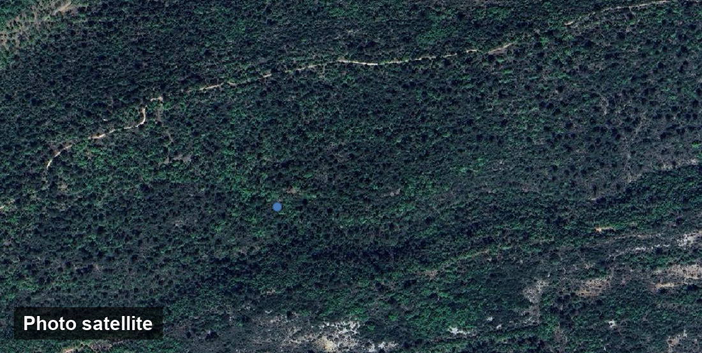

*Même emprise sous trois regards : la photo satellite et la carte OSM ne montrent rien du micro-relief, le Sky-View Factor calculé depuis le LiDAR HD le révèle d'un coup.*

> ⚠️ **Statut** : usage personnel diffusé. Code testé intensivement sur Windows 10/11. Linux et macOS testés partiellement, cas connus + dépannage cross-OS dans la section *Dépannage* de [BUILD.md](BUILD.md). Les retours sont bienvenus via les [issues GitHub](https://github.com/nico579/lidar2map/issues).

---

## Pour qui ?

- **Archéologues amateurs** intéressés par la prospection LiDAR : l'outil couvre de nombreux [pays et sources nationales](#couverture-lidar-et-sources-évaluées), avec les mêmes calculs d'ombrages (multi, SVF, openness, LRM, RRIM, VAT) d'un provider à l'autre.
- **Randonneurs français** qui veulent des cartes IGN topo offline sur téléphone (Locus Map Pro, OsmAnd+) : les onglets IGN raster/vecteur restent France-only.
- **Prospecteurs paysage** qui combinent orthophotos historiques (1950-1995, France) et MNT pour repérer les vestiges humains avant la déprise agricole.
- **Spéléologues / explorateurs** qui ont besoin de fonds de carte précis dans des zones non couvertes par les apps grand public.

L'outil n'est **pas** destiné à la détection métallique. Le code respecte strictement les licences ouvertes (Etalab FR, CC BY 4.0 NO, CC-0 NL, BGDI CH).

## Fonctionnalités principales

- **Multi-provider LiDAR** : les sources nationales sont isolées dans `providers/<code>.py` ; le [tableau des providers](#providers-disponibles) en donne la liste exhaustive.
- **Cartes raster** : IGN (France) et USGS NAIP (USA), voir [Cartes raster](#cartes-raster).
- **Cartes vectorielles** : OSM Mapsforge (international) et IGN BD TOPO (France), voir [Cartes vectorielles](#cartes-vectorielles).
- **Fusion de cartes vectorielles** : `--merge` combine plusieurs GeoJSON (glob accepté) en un seul fichier, par exemple les couches IGN et OSM d'une même zone, ou les exports de runs voisins ; peut produire directement une carte Mapsforge `.map` ou un overlay `transparent-raster` à partir du résultat fusionné.
- **Découpage et contrôle du disque** : `--split-width`, `--cleanup` et `--min-free-gb` encadrent les calculs de grande taille.
- **Découpage raster** : `--split` redécoupe après coup un MBTiles déjà généré, en grille (`--cols`/`--rows`) ou en carrés d'une largeur donnée (`--split-width`), avec conversion optionnelle en RMAP ou SQLiteDB par morceau. Utile pour respecter la limite FAT32 de 4 Go, ou répartir un livrable entre plusieurs appareils. Tous les formats possibles en sortie : [Formats de sortie et compatibilité](#formats-de-sortie-et-compatibilité).
- **Exécutables autonomes multiplateformes** : `lidar2map` tourne sans Python à installer sur Windows, macOS et Linux (GUI ou CLI sur l'ordinateur courant) ; c'est l'usage standard, voir [Installation](#installation).
- **Auto-bootstrap** (script Python) : installe à la demande ses dépendances et les outils cartographiques nécessaires.
- **Streaming mémoire** : les grandes zones sont traitées sans charger toutes les données en RAM.
- **Arrêt et reprise propres** : `Ctrl+C` peut attendre la fin du morceau courant et un manifeste permet de reprendre les morceaux terminés.
- **Historique résistant aux crashs** : chaque exécution reste visible avec son état et ses journaux.
- **GUI interactive** : cinq types de traitement, validation, journal en direct, historique et file d'attente.
- **Envoi vers le téléphone** : après génération, le bouton 📲 de la GUI (ou `--serve --zone-name X` en CLI) sert les cartes sur le WiFi local et affiche un QR code. Rien ne sort du réseau. Dans Locus, utiliser **Gestionnaire de cartes → Importer une carte → gestionnaire de fichiers**.
- **File d'attente** : dans la GUI, `＋ File` empile plusieurs zones et `Lancer la file` les traite sans surveillance ; l'échec d'un job n'arrête pas les suivants.
- **Planche d'assemblage** : chaque run crée un `<produit>_planche.png` montrant l'emprise et les cellules produites. `--index-sheet DOSSIER` la régénère depuis un projet existant et `--no-index-map` la désactive.
- **Exécution à distance et sharding multi-VM** : `rlidar2map_GUI` prépare un bureau RDP sur une VM ; `rlidar2map_CLI` exécute des calculs headless avec surveillance, reprise et synchronisation des résultats ; `--block i/M` répartit une même zone sur plusieurs VM en parallèle pour les grandes surfaces (ex. un département découpé en 3 blocs, une VM chacun). Détails : [Exécution à distance](#exécution-à-distance-sur-une-vm).

## Ce que ça produit

À partir d'une commune, de coordonnées GPS, d'une bbox, d'un département ou d'une région entière :

### Ombrages archéologiques

Calculés depuis le LiDAR national (résolution 0.5 m à 1 m selon source) :

| Type | Ce qu'il révèle | Paramètres |
|------|-----------------|------------|
| `multi` | Hillshade multidirectionnel (Mark 1992), relief général avec biais d'azimut réduit | `elevation` (° soleil, défaut 25, bas = micro-relief, 45 = usage général) |
| `315` `045` `135` `225` | Hillshades directionnels, accentuent les structures perpendiculaires à l'azimut choisi | `elevation` (idem) |
| `slope` | Pente 0-90° étalée sur 1-255, talus, ruptures, terrasses | (aucun) |
| `svf` | Sky-View Factor, fraction de ciel visible : fossés, restanques, enceintes en sombre | `conv` (`flux` = cos²γ contrasté, défaut ; `rvt` = 1−sin γ, standard archéo Kokalj/Hesse), `dist` (rayon d'horizon en m, défaut 20, 20 = micro-relief, 100 = enceintes/voiries), `gamma` (contraste, défaut 2.0) |
| `opos` | Openness positive (Yokoyama 2002), angle d'horizon moyen au-dessus de l'horizontale : crêtes, bosses, tumuli en clair | `dist`, `gamma` |
| `oneg` | Openness négative inversée, vue « vers le bas » : fossés, talus et chemins creux en sombre, le complément du SVF (plus granuleux par nature : sensible au bruit du MNT) | `dist`, `gamma` (appliqué en miroir : renforce les creux sans assombrir le fond) |
| `lrm` | **Local Relief Model** simplifié (SLRM gaussien), soustrait le relief lissé : supprime collines et vallées, ne garde que les anomalies locales. Rapide et lisible : le défaut de la GUI | `sigma` (écart-type gaussien en m ; défaut 15 px du provider) |
| `rrim` | Composite couleur lidar2map inspiré du **Red Relief Image Map** (RRIM, Chiba 2008) : pente en rouge, SLRM en clair/foncé | `sigma` (du SLRM interne) |
| `vat` | Composite lidar2map inspiré du **Visualization for Archaeological Topography** : SVF + openness positif + pente en niveaux de gris | `dist` (rayon SVF/openness en m, défaut 20), `gamma` (contraste final, défaut 2.0) |
| `e4mstp` | Variante lidar2map inspirée de l'**e4MSTP publié** (Kokalj 2025, *enhanced version 4* du **MSTP**, *Multiscale Topographic Position*) : MSTP + SVF + O+/O− + pente + deux SLRM. Très riche mais lourde ; différente du preset RVT exact | `dist` (défaut 20), `gamma` (défaut 0,8) |

**[Guide détaillé des ombrages : histoire, formules, schémas, avantages, limites et méthode de comparaison](docs/shadings.fr.md).**

Deux façons de les demander :

```bash
# Simple : liste de types, paramètres globaux partagés
--shadings multi svf oneg --svf-dist 20 --svf-gamma 2

# Instances paramétrées (répétable) : chaque occurrence porte SES paramètres
# → plusieurs instances du même type dans un seul run
--shading svf:dist=20,gamma=2 --shading svf:dist=100,gamma=1.5 \
--shading oneg:dist=20 --shading 315:elevation=20 --shading lrm:sigma=10

# Preset par résolution (opt-in) : un stack (svf + opos + lrm + multi + slope)
# dimensionné en MÈTRES pour la résolution du MNT, pour cibler la même échelle
# de structures que le MNT soit à 0,25 m ou 5 m. 'auto' choisit le palier selon
# le provider : micro (<=0,75 m) / standard (~1 m) / landscape (>=5 m)
--shading-preset auto
```

Les paramètres explicites différents des défauts sont encodés dans le nom du
fichier produit (`zone_svf_flux_100m_g1p5_ombrage.tif`, `zone_315_e20_ombrage.tif`) :
pas de collision entre instances, et les ombrages déjà calculés sont réutilisés.
Dans la GUI, la liste « à traiter » (boutons +/−) fait la même chose : chaque
instance ajoutée a son propre mini-formulaire de paramètres.
`--svf-sweep` / `--no-svf-sweep` (kernel sweep-horizon, SVF uniquement) reste global.

Sources LiDAR : choisir `--provider <code>` en CLI ou le provider dans la GUI.
La [couverture LiDAR](#couverture-lidar-et-sources-évaluées) et le
[tableau des providers](#providers-disponibles) regroupent la liste
de référence, les résolutions, les CRS, les mécanismes d'accès et les clés API.

> **Limite connue : les ruines debout.** Les MNT sol-nu nationaux suppriment
> *par construction* les murs encore debout au-delà d'environ 1 m (le
> classificateur les range en végétation ou « non classé »), donc aucun
> ombrage calculé depuis le MNT ne peut les faire réapparaître.
>
> Deux socles intégrés au pipeline contournent cette limite : cocher
> **« mode LAZ »** à côté du provider (ou CLI `--laz`) fait tourner tous les
> ombrages sur un modèle **DFM** (*Digital Feature Model*, Štular et al.
> 2021) calculé depuis le nuage de points classé au lieu du MNT, avec le
> choix entre réinjection par classes (`--laz-ground classes`, défaut) ou
> **Cloth Simulation Filter** (`--laz-ground csf`, Zhang et al. 2016 : fond
> plus propre, ~3 min/dalle au lieu de ~20 s). Détails et tous les
> paramètres (`--laz-hmin/-hmax/-classes`, `--laz-csf-*`) dans la
> [référence CLI du mode LAZ](#31-lidar). Coût :
> télécharge le nuage COPC LAZ complet (~205 Mo/km²), donc garder la zone
> petite.
>
> Pour une prospection ciblée hors pipeline (comparaison manuelle sous
> QGIS), [`tools/dfm_ruines.py`](tools/dfm_ruines.py) reconstruit le même
> type de modèle en script autonome et produit des GeoTIFF géoréférencés
> LRM-MNT / LRM-DFM / delta à draper sur l'orthophoto.
>
> Le mode LAZ n'est pas réservé à la France : il tourne aussi sur le nuage
> swissSURFACE3D suisse et sur tout provider publiant un nuage de points
> complet, dense et classé (voir le [tableau des providers](#providers-disponibles)) ;
> un MNT raster bare-earth ou un nuage sol-seul ne peut pas en recevoir.

Une ruine de maison sans toiture (murs ~1,5 m, dép. 83), sous le maquis.
L'orthophoto laisse à peine deviner les murs ; le LRM classique (depuis le
MNT) montre les restanques mais pas la ruine ; le DFM fait réapparaître
l'emprise du bâtiment, et le socle CSF nettoie le fond.

| Orthophoto | LRM classique (depuis le MNT) |
|---|---|
| 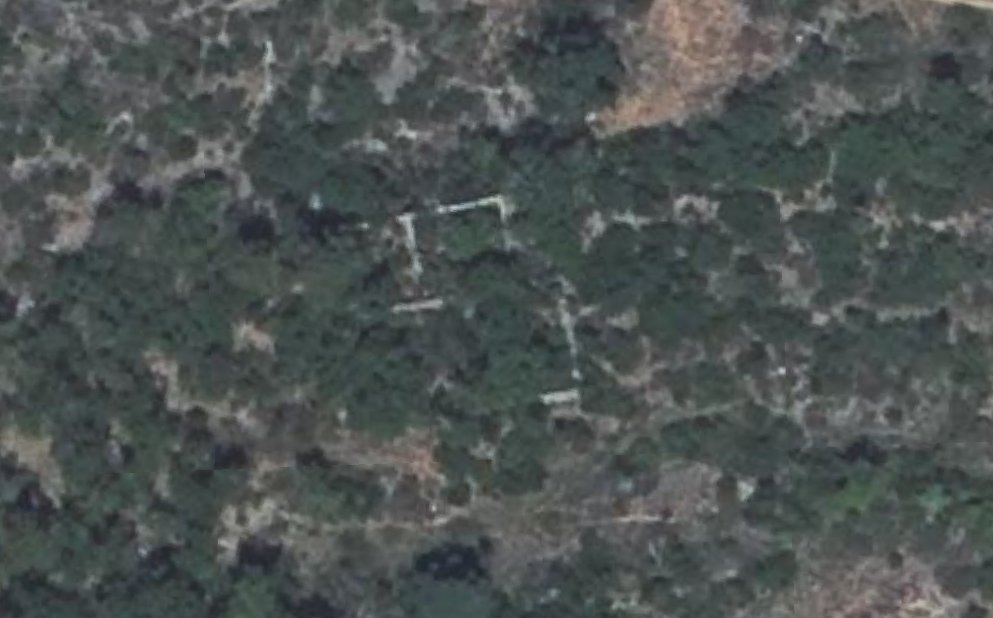 | 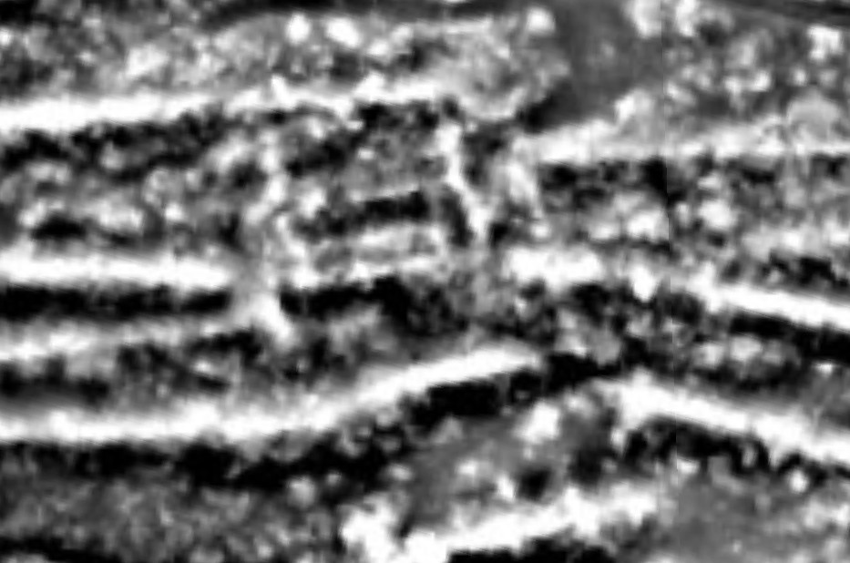 |
| Murs noyés dans la végétation | Les restanques ressortent, pas la ruine |
| **DFM-LRM (réinjection par classes)** | **DFM-LRM (socle tissu CSF)** |
| 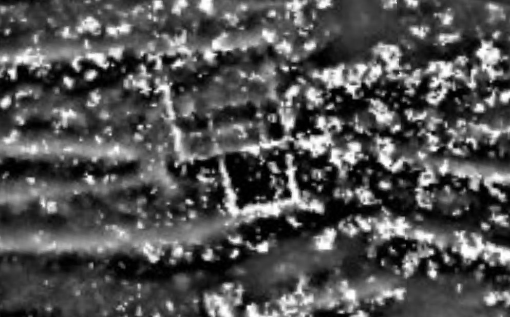 | 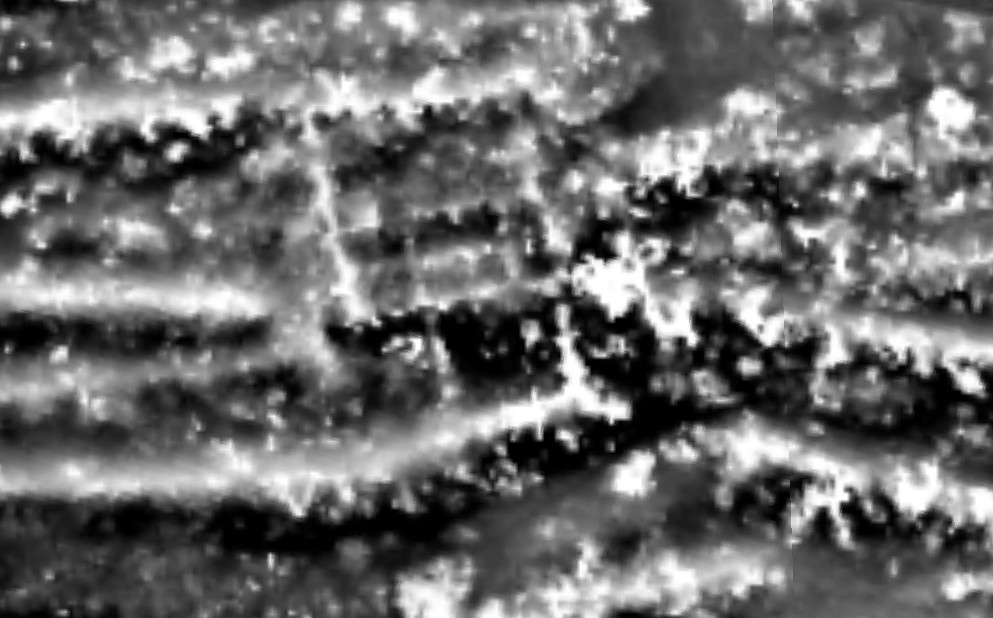 |
| Le rectangle du bâtiment réapparaît (moucheté) | Mêmes murs, fond plus propre |

En dehors du LiDAR, lidar2map produit aussi deux familles de cartes plus classiques, sans calcul d'ombrage :

### Cartes raster

- **IGN** *(France uniquement)* : Plan IGN, Orthophotos (actuelles + historiques 1950, 1965, 1980), État-Major XIXᵉ, Pléiades satellite, IRC, etc.
- **USGS** *(USA, `--layer naip`)* : imagerie aérienne dérivée NAIP, domaine public (~1 m, cache complet jusqu'à z16), complément image du LiDAR 3DEP `us-tnm`.

### Cartes vectorielles

OSM Mapsforge `.map` (international, via Geofabrik) ou IGN BD TOPO *(France uniquement)*. Les deux se rendent aussi en **`transparent-raster`** : les couches choisies (chemins, routes, cours d'eau...) dessinées sur tuiles transparentes (.sqlitedb), à superposer au relief LiDAR dans OsmAnd (qui ne sait pas superposer du vectoriel nativement).

### Formats de sortie et compatibilité

Les formats produits ne sont pas interchangeables : choisissez celui qui correspond à
l'application cible. Le tableau tient compte de la manière dont lidar2map écrit chaque
format (raster tuilé, vectoriel Mapsforge ou GeoJSON d'échange).

| Format produit | Type écrit par lidar2map | Applications principales | Recommandation |
|---|---|---|---|
| **MBTiles** (`.mbtiles`) | Raster tuilé XYZ/TMS (JPEG/PNG ; alpha possible sur les bords) | **Locus Map**, **OruxMaps**, **AlpineQuest**, **Guru Maps**, QGIS | Format raster le plus polyvalent ; recommandé pour Locus. OsmAnd ne l'utilise pas directement comme carte raster : demander aussi `sqlitedb` ou convertir. |
| **SQLiteDB OsmAnd/RMaps** (`.sqlitedb`) | Raster tuilé dans le schéma SQLite attendu par OsmAnd | **OsmAnd** (carte et overlay), RMaps ; import possible dans Guru Maps et d'autres applications RMaps | Format recommandé pour OsmAnd. `transparent-raster` écrit des tuiles PNG avec alpha, prévues pour une superposition OsmAnd. Pour Locus, préférer le MBTiles produit par lidar2map. |
| **RMAP** (`.rmap`) | Raster géoréférencé, tuiles JPEG (format propriétaire) | **TwoNav / CompeGPS**, **OruxMaps**, AlpineQuest ; support limité dans Locus | À choisir principalement pour TwoNav/CompeGPS. La conversion lidar2map ré-encode les tuiles en JPEG conformément au format RMAP. |
| **Mapsforge** (`.map`) | Carte vectorielle OSM/IGN écrite au format Mapsforge | **Locus Map** et **OruxMaps** | À placer dans le dossier des cartes vectorielles. Ce n'est pas un raster ; OsmAnd utilise son propre format vectoriel `.obf` et ne lit pas ce fichier. |
| **GeoJSON** (`.geojson` ou `.geojson.gz`) | Données vectorielles (chemins, routes, rivières, bâtiments...) | **Locus Map** (import d'objets), **Guru Maps** (overlay), **QGIS**, geojson.io et les outils SIG | Locus peut importer les entités, mais le GeoJSON n'est pas une carte hors-ligne affichable comme un `.map` ou un MBTiles. Décompresser le `.gz` avant un import dans une application qui ne gère pas gzip. Pour une vraie carte vectorielle Locus, utiliser Mapsforge `.map`. |

Références : [Locus — formats externes](https://docs.locusmap.app/doku.php/manual%3Auser_guide%3Amaps_external), [OsmAnd — formats de fichiers](https://www.osmand.net/docs/technical/osmand-file-formats/), [TwoNav — RMAP](https://manual.twonav.com/manual/Manual_TwoNav_Tablet_22_en.pdf), [OruxMaps](https://www.oruxmaps.com/index_en.html), [AlpineQuest](https://www.alpinequest.net/en/help/v2/maps/file-based-select), [Guru Maps](https://gurumaps.app/docs/intro).

---

## Installation

**Démarrage rapide : téléchargez l'exécutable autonome de votre OS depuis la [page Releases](https://github.com/nico579/lidar2map/releases), décompressez, lancez. Pas de Python, pas de dépendances, rien à installer.**

Deux façons d'utiliser lidar2map :

| | **A. Exécutable autonome** | **B. Script Python** |
|---|---|---|
| **Prérequis** | Aucun | Python 3.12 |
| **Première install** | Aucune | ~5 min (bootstrap auto dans son propre venv) |
| **Mises à jour** | Patcher les 3 binaires existants sur la release GitHub en une commande : `python update_app.py --release` (voir [`update_app.py`](update_app.py)) | `git pull` + relance |
| **Distribuable** | Oui, `.exe` / `.app` / binaire Linux + bundle zip côte à côte | Non, chaque utilisateur installe Python |
| **Idéal pour** | utilisateur final / Windows / distribuer | dev / Linux / contribuer au code |

### A. Exécutable autonome

Le livrable embarque son propre runtime : Python, dépendances, JRE, osmosis.

#### 1. Obtenir le livrable

**Option a, Télécharger depuis [Releases](https://github.com/nico579/lidar2map/releases)** (si la version est publiée pour ta plateforme) :

| OS | Archive | Extraire avec |
|----|---------|---------------|
| Windows 10/11 (x86_64) | `lidar2map-windows-x86_64.zip` | `Expand-Archive` (PowerShell) ou double-clic |
| Linux Ubuntu 24.04+ (x86_64) | `lidar2map-linux-x86_64.tar.gz` | `tar xzf` |
| macOS 12+ (Apple Silicon) | `lidar2map-macos-arm64.zip` | `unzip` puis `xattr -dr com.apple.quarantine LIDAR2MAP.app` |
| macOS 12+ (Intel) | `lidar2map-macos-x86_64.zip` | idem |

L'archive s'extrait en un dossier `lidar2map-<os>-x86_64/` contenant le binaire et son `lidar2map_bundle.zip` côte à côte. Aucune installation système.

**Option b, Builder soi-même.** Deux scripts par plateforme : un setup machine (à faire **une fois**) puis un build (à relancer à chaque mise à jour de `lidar2map.py`).

##### Windows

```powershell
git clone https://github.com/nico579/lidar2map
cd lidar2map
.\setup_build_windows.ps1     # 1. Setup : Python 3.12, deps, JRE, osmosis, PyInstaller
.\lidar2map_win_build.ps1     # 2. Build : 3 etapes -> dist\lidar2map.exe + dist\lidar2map_bundle.zip
```

##### macOS (Apple Silicon ou Intel)

```bash
git clone https://github.com/nico579/lidar2map
cd lidar2map
bash setup_build_mac.sh       # 1. Setup
bash lidar2map_mac_build.sh   # 2. Build -> dist/LIDAR2MAP.app
```

L'archive prend l'architecture de la machine de build
(`lidar2map-macos-arm64.zip` ou `-x86_64.zip`). PyInstaller ne cross-compile
pas : un build Intel exige un Mac Intel (ou Rosetta 2 avec un Python x86_64).

##### Linux (Ubuntu / Debian)

Linux réutilise les specs Windows (`_win.spec` produit un ELF sous Linux, le nom est trompeur).

```bash
git clone https://github.com/nico579/lidar2map
cd lidar2map
bash setup_build_linux.sh       # 1. Setup
bash lidar2map_linux_build.sh   # 2. Build -> dist/lidar2map + dist/lidar2map_bundle.zip
```

Prérequis : `sudo apt install zip` si absent. Le binaire produit dépend de la libc de la machine de build (build sur Ubuntu 22.04 → tourne sur Ubuntu ≥ 22.04 / Debian 12+).

Documentation complète du build (architecture du bundle, mise à jour sans rebuild, dépannage) : **[BUILD.md](BUILD.md)**.

#### 2. Lancer le livrable

| OS | Commande |
|----|----------|
| Windows | Double-clic sur `lidar2map.exe` (ou dans un terminal pour voir le log) |
| Linux | `chmod +x lidar2map && ./lidar2map` dans le dossier extrait |
| macOS | Double-clic sur `LIDAR2MAP.app`. Premier lancement bloqué par Gatekeeper : `xattr -dr com.apple.quarantine LIDAR2MAP.app` puis double-clic |
| Linux | `chmod +x lidar2map && ./lidar2map` |

Le premier lancement extrait le bundle (~30-60 s, une fois, il contient Qt) dans :
- Windows : `%LOCALAPPDATA%\lidar2map\`
- macOS : `~/Library/Application Support/lidar2map/`
- Linux : `~/.local/share/lidar2map/`

Désinstallation propre : `lidar2map(.exe) --desinstaller`.
### B. Script Python

Au premier lancement, le script crée `~/.lidar2map/venv` et y installe les dépendances critiques (Pillow, pyproj, numpy, rasterio, pywebview + PyQt6/QtWebEngine…) : votre Python système n'est jamais touché (`--bootstrap=none` si vous préférez gérer l'environnement vous-même). Téléchargement du JRE Temurin 21 et d'osmosis à la demande ; aucun GDAL système requis, les wheels rasterio embarquent le leur. ~400 Mo total, **une seule fois**.

#### Windows 10+

1. Installer [Python 3.12+](https://www.python.org/downloads/)
2. Récupérer le code :
   ```powershell
   git clone https://github.com/nico579/lidar2map
   cd lidar2map
   python lidar2map.py
   ```

#### macOS 11+

```bash
brew install python@3.12
git clone https://github.com/nico579/lidar2map
cd lidar2map
python3.12 lidar2map.py
```

#### Linux (Debian / Ubuntu)

```bash
sudo apt install python3.12 python3.12-venv git
git clone https://github.com/nico579/lidar2map
cd lidar2map
python3.12 lidar2map.py
```

Résolution de problèmes : section *Dépannage* de [BUILD.md](BUILD.md) (incluant les cas spécifiques Linux/macOS : PEP 668, Qt distro packages, Wayland, Gatekeeper sur le JRE…).


---

## Utilisation

Deux modes locaux, sélectionnés automatiquement selon les arguments :

- **Sans argument → interface graphique** (pywebview / Qt). Mode courant.
- **Avec arguments → calcul en ligne de commande** (headless, sans fenêtre).
  Pratique pour scripter, lancer sur un serveur, ou reproduire un rendu précis.

Tout ce qui suit vaut pour le binaire comme pour le script, remplacez simplement
`python lidar2map.py` par `lidar2map.exe` (Windows), `./lidar2map` (Linux) ou
`LIDAR2MAP.app` (macOS).

### Référence complète des paramètres CLI

Les tableaux reprennent les options canoniques réellement exposées par le
parseur. `python lidar2map.py <mode> --help` affiche également l'aide propre à
chaque mode.

Numérotés dans l'ordre du formulaire GUI : 1. dossiers du projet, 2. zone
géographique, 3. type de calcul (cinq types, 3.1 à 3.5, dans l'ordre des
onglets), 4. format de sortie, 5. partage/maintenance, 6. particularités
françaises.

#### 1. Dossiers et projet

| Paramètre | Valeur / défaut | Fonction |
|---|---|---|
| `--zone-name NOM` | automatique | Nom du projet ; obligatoire avec `--zone-gps` et `--zone-bbox`. |
| `--output-dir PATH` | `Projets/` | Racine des livrables ; le remote CLI la réserve pour isoler ses sessions. |
| `--cache-dir PATH` | `cache/` | Racine des caches persistants : dalles, WMTS, PBF et index. |
| `--production-dir PATH` | `production/` | Artefacts calculés réutilisables, notamment les TIF issus des LAZ. |

#### 2. Zone géographique

| Paramètre | Valeur / défaut | Fonction |
|---|---|---|
| `--zone-city NOM` | — | Géocode une commune avec Nominatim. |
| `--zone-gps LAT,LON` | — | Centre WGS84, par exemple `43.3156,6.0423`. |
| `--zone-bbox W,S,E,N` | — | Emprise WGS84 en degrés. |
| `--zone-width KM` | `20` | Côté du carré autour d'une ville ou d'un point GPS, pas son rayon. |

Département et région (France) : voir [Paramètres propres à la France](#6-paramètres-propres-à-la-france).

#### 3. Type de calcul

Cinq types, sélectionnés par un mode :

| Paramètre | Fonction |
|---|---|
| *(aucun argument)* | Ouvre l'interface graphique. |
| `-h`, `--help` | Affiche l'aide du mode sélectionné. |
| `--version` | Affiche la version et quitte. |
| `--lidar` | Télécharge/traite le relief LiDAR, calcule les ombrages et produit les cartes raster. |
| `--raster` | Télécharge une couche raster du provider (`fr-ign`, ou `us-tnm` avec `naip`). |
| `--osm` / `--vector` | Produit une carte vectorielle : `--osm` (OSM Mapsforge/GeoJSON/overlay transparent, international) ou `--vector` (IGN WFS, France, voir plus bas). |
| `--merge` | Fusionne plusieurs GeoJSON. Requiert `--source`. |
| `--split` | Découpe après coup un MBTiles existant. Requiert `--source`. |
| `--serve` | Envoie les livrables d'un projet vers le téléphone : sert le dossier sur le WiFi local avec URL et QR code. |
| `--index-sheet DIR` | Régénère uniquement la planche d'assemblage d'un projet existant. |

`--source PATH...` : source existante à réutiliser selon le mode : TIF vers
raster tuilé, MBTiles vers RMAP/SQLiteDB, PBF vers OSM, ou plusieurs GeoJSON
avec `--merge`.

##### 3.1 LiDAR

**3.1.1 Source des données**

| Paramètre | Valeur / défaut | Fonction |
|---|---|---|
| `--provider CODE` | `fr-ign` | Source LiDAR ; codes dans le [tableau des providers](#providers-disponibles). |
| `--api-key KEY` | variable d'environnement possible | Clé du provider lorsque la source l'exige. |
| `--laz` | désactivé (calcul depuis le MNT) | Bascule sur le nuage de points classé (LAZ) pour reconstruire les structures debout ; sans cette option, lidar2map calcule depuis le MNT officiel du provider. |
| `--laz-ground` | `[classes]\|csf` | Socle issu des classes producteur ou d'un Cloth Simulation Filter. |
| `--laz-hmin M` | `0.4` | Hauteur minimale réinjectée avec le socle `classes`. |
| `--laz-hmax M` | `2.5` | Hauteur maximale réinjectée avec le socle `classes`. |
| `--laz-classes LISTE` | `1,2,3,4,9,66` | Classes LAS participantes, séparées par des virgules. |
| `--laz-csf-threshold M` | `0.5` | Distance d'absorption point-tissu du CSF. |
| `--laz-csf-resolution M` | `0.5` | Taille de maille du tissu CSF. |
| `--laz-csf-rigidness` | `[1]\|2\|3` | Rigidité CSF : terrain pentu, intermédiaire ou plat. |
| `--laz-parallel N` | `1` | Conversions LAZ simultanées ; prévoir environ 3 Go de RAM par conversion. |

**3.1.2 Découpage à priori (grandes zones)**

| Paramètre | Valeur / défaut | Fonction |
|---|---|---|
| `--split-cols N` | `1` | Colonnes du découpage avant calcul. |
| `--split-rows N` | `1` | Lignes du découpage avant calcul. |
| `--split-width KM` | — | Découpe en carrés d'environ `KM` km de côté, alternative à la grille. |
| `--block i/M` | — | Ne traite que le bloc `i` parmi `M`, pour répartir la zone sur plusieurs machines. |
| `--cleanup` | désactivé | Supprime les intermédiaires après chaque morceau réussi. |
| `--cleanup-keep-tiles` | désactivé | Avec `--cleanup`, conserve les dalles téléchargées partagées. |
| `--min-free-gb GB` | désactivé | Arrêt propre, code 3, avant un morceau si l'espace libre passe sous le seuil. |

**3.1.3 Télécharger**

| Paramètre | Valeur / défaut | Fonction |
|---|---|---|
| `--download` | désactivé | Télécharge les dalles manquantes. |
| `--workers N` | `8` | Connexions simultanées. |
| `--download-compress` | activé | Compression DEFLATE des dalles en cache. |
| `--download-force` | désactivé | Retélécharge les dalles déjà présentes. |
| `--download-overwrite` | désactivé | Écrase et retélécharge les données en cache ; équivalent de `--download-force`. |
| `--tiles-dir PATH` | sous le projet | Cache de dalles séparé, prioritaire sur `--cache-dir`. |

**3.1.4 Calculer les ombrages**

| Paramètre | Valeur / défaut | Fonction |
|---|---|---|
| `--shadings TYPE...` | interactif | Types parmi `lrm vat e4mstp svf opos oneg rrim multi 315 045 135 225 slope`, ainsi que `all`/`none`. |
| `--shading TYPE[:k=v,...]` | répétable | Ajoute une instance paramétrée, par exemple `svf:dist=100,gamma=1.5`. Paramètres par type ci-dessous. |
| `--shading-preset` | désactivé ; `auto`\|`micro`\|`standard`\|`landscape` | Ajoute un ensemble SVF, openness, LRM, multi et pente adapté à la résolution. |
| `--shading-elevation DEG` | `25` | Élévation solaire des hillshades directionnels/multidirectionnels. |
| `--svf-conv` | `[flux]\|rvt` | Convention du Sky-View Factor. |
| `--svf-dist M` | `20` | Rayon d'horizon du SVF, de l'openness et des composites. |
| `--svf-gamma G` | `2.0` | Gamma final du SVF, de l'openness et du VAT. |
| `--svf-sweep` / `--no-svf-sweep` | activé | Active ou désactive le noyau SVF accéléré. |
| `--shadings-overwrite` | désactivé | Recalcule les ombrages existants. |
| `--shadings-compress` | désactivé | Compresse les TIF d'ombrage bruts existants. |

Paramètres acceptés par `--shading TYPE:k=v,...`, par type d'ombrage :

| Paramètre | Types concernés | Valeur / défaut |
|---|---|---|
| `elevation` | `multi 315 045 135 225` | degrés, `[25]` |
| `conv` | `svf` | `[flux]\|rvt` |
| `dist` | `svf opos oneg vat e4mstp` | mètres, `[20]` |
| `gamma` | `svf opos oneg vat` | `[2.0]` |
| `gamma` | `e4mstp` | `[0.8]` |
| `sweep` | `svf` | booléen, `[activé]` |
| `sigma` | `lrm rrim` | pixels du provider, `[15]` |
| *(aucun)* | `slope` | — |

**3.1.5 Générer la carte** : zoom, format d'image et formats de fichier sont
communs à tous les types, voir [Format de sortie](#4-format-de-sortie).

##### 3.2 Raster

**3.2.1 Source des données**

| Paramètre | Valeur / défaut | Fonction |
|---|---|---|
| `--provider CODE` | `fr-ign` | `fr-ign` (France, WMTS) ou `us-tnm` (USA, avec `--layer naip`). |
| `--layer LAYER` | `planign` | Alias ou identifiant WMTS complet ; catalogue complet dans [Paramètres propres à la France](#6-paramètres-propres-à-la-france). |
| `--api-key KEY` | — | Clé `cartes.gouv.fr`, requise seulement pour les couches Scan professionnelles IGN. |

**3.2.2 Découpage à priori** : mêmes paramètres que pour le LiDAR ci-dessus
(`--split-cols`, `--split-rows`, `--split-width`, `--cleanup`, `--min-free-gb`),
sans `--block` ni `--cleanup-keep-tiles`.

**3.2.3 Télécharger**

| Paramètre | Valeur / défaut | Fonction |
|---|---|---|
| `--workers N` | `8` | Connexions simultanées. |

**3.2.4 Générer la carte** : voir [Format de sortie](#4-format-de-sortie).

##### 3.3 Vectoriel

**3.3.1 Source des données**

| Paramètre | Valeur / défaut | Fonction |
|---|---|---|
| `--osm` | — | Source OSM / Geofabrik (PBF), international. |
| `--vector` | — | Source IGN Géoplateforme (WFS), France uniquement. |
| `--layer TAGS...` avec `--osm` | défaut si omis : `highway=* waterway=* boundary=administrative natural=water natural=coastline waterway=river waterway=stream waterway=canal` | Tags OSM à inclure (libre, n'importe quel `clé=valeur`). Catalogue proposé par la GUI : `highway=* waterway=* natural=water natural=* boundary=administrative landuse=* building=* historic=*`. |
| `--layer NAME...` avec `--vector` | `[cadastre]` | Couches IGN, catalogue complet dans [Paramètres propres à la France](#6-paramètres-propres-à-la-france). |
| `--zone-region SLUG` avec `--osm` | — | Conserve le PBF régional complet au lieu de découper (France). |

**3.3.2 Télécharger**

| Paramètre | Valeur / défaut | Fonction |
|---|---|---|
| `--workers N` | `4` | Connexions simultanées ; le WFS IGN limite à 4, au-delà les couches commencent à échouer. |

**3.3.3 Générer la carte**

| Paramètre | Valeur / défaut | Fonction |
|---|---|---|
| `--vector-simplify M` | automatique | Tolérance Douglas-Peucker en mètres des sorties vectorielles. |

Formats de fichier : voir [Format de sortie](#4-format-de-sortie).

##### 3.4 Fusion vectorielle

| Paramètre | Valeur / défaut | Fonction |
|---|---|---|
| `--source PATH...` | requis | GeoJSON à fusionner, glob accepté. |
| `--output-file FILE` | automatique | Nom du GeoJSON fusionné. |
| `--no-gz` | désactivé | Produit un `.geojson` non compressé au lieu de `.geojson.gz`. |
| `--vector-simplify M` | automatique | Tolérance Douglas-Peucker en mètres du résultat fusionné. |

Formats de fichier : voir [Format de sortie](#4-format-de-sortie).

##### 3.5 Découpage raster

| Paramètre | Valeur / défaut | Fonction |
|---|---|---|
| `--source PATH` | requis | MBTiles à redécouper. |
| `--cols N` | `1` | Colonnes de la grille de découpage. |
| `--rows N` | `1` | Lignes de la grille de découpage. |
| `--split-width KM` | — | Découpe en carrés d'environ `KM` km de côté, alternative à la grille. |

Formats de fichier : voir [Format de sortie](#4-format-de-sortie).

#### 4. Format de sortie

| Paramètre | Valeur / défaut | Fonction |
|---|---|---|
| `--file-formats FMT...` | LiDAR/raster : `mbtiles rmap sqlitedb` ; vecteur/fusion : `map geojson gz transparent-raster` | Formats de fichier à générer, selon le mode. |
| `--zoom-min N` | `13` LiDAR, `10` raster | Zoom minimal des cartes tuilées. |
| `--zoom-max N` | `18` LiDAR, `16` raster | Zoom maximal des cartes tuilées. |
| `--image-format` | `[auto]\|jpeg\|png` | Encodage des tuiles raster. Les bords peuvent rester en PNG avec alpha. |
| `--image-quality Q` | `85` | Qualité JPEG de 1 à 100. |
| `--tiles-overwrite` | désactivé | Régénère les MBTiles, SQLiteDB, RMAP ou Mapsforge existants. |
| `--index-map` | activé | Génère `<produit>_planche.png` (emprise, découpage, cellules numérotées). |

#### 5. Partage et maintenance

| Paramètre | Mode | Fonction |
|---|---|---|
| `--serve` | — | Envoie les livrables d'un projet vers le téléphone : sert le dossier sur le WiFi local avec URL et QR code. |
| `--zone-name NOM` | avec `--serve` | Projet à envoyer vers le téléphone. |
| `--tiles-purge-invalid` | LiDAR | Supprime les dalles de cache trop petites ou invalides. |
| `--tiles-purge-out-of-zone` | LiDAR | Supprime du cache les dalles hors de la zone demandée. |
| `--bootstrap` | `[auto]\|pip\|none` | Démarrage : venv automatique, installation dans l'environnement courant, ou aucune installation. |
| `--help-bootstrap` | démarrage | Affiche l'aide du bootstrap. |
| `--installer-deps` | maintenance/build | Installe toutes les dépendances, y compris optionnelles, puis quitte. |
| `--telecharger-outils` | maintenance/build | Télécharge le JRE, osmosis et mapwriter, puis quitte. |
| `--desinstaller` | maintenance | Supprime le venv et les outils installés, mais pas le script ou l'exécutable. |
| `--smoketest` | validation | Exécute le test intégré des principaux pipelines. |

#### 6. Paramètres propres à la France

| Paramètre | Valeur / défaut | Fonction |
|---|---|---|
| `--zone-department NUM` | — | Département français. Accepte un numéro, une liste (`30,35,75`) ou une plage (`1-10`). |
| `--zone-region SLUG` | — | Région Geofabrik française ; avec `--osm`, conserve le PBF régional complet. |
| `--vector` | — | Télécharge les couches IGN WFS et produit `geojson`, `gz`, `map` ou `transparent-raster`. |
| `--layer NAME...` avec `--vector` | `[cadastre]` | Couches IGN : `cadastre cours_eau troncons_eau plans_eau detail_hydro batiments constructions cimetieres routes chemins lignes_orog detail_orog forets reserves lieux_dits communes rpg`. |
| `--raster --provider fr-ign` | — | Raster IGN WMTS. |
| `--layer LAYER` avec le raster IGN | `[planign]` | Topo publique : `planign etatmajor40 etatmajor10 pentes`. Imagerie publique : `ortho ortho_1950 ortho_1965 ortho_1980 ortho_irc pleiades spot edugeo_marseille_1969 edugeo_marseille_1980 edugeo_marseille_1987 edugeo_marseille_1988 edugeo_marseille_2010 edugeo_toulon_1972`. Thématique publique : `cadastre ombrage`. Professionnel, clé requise : `scan25 scan25tour scan100 scanoaci`. |
| `--api-key KEY` avec le raster IGN | — | Clé `cartes.gouv.fr` pour `scan25`, `scan25tour`, `scan100` et `scanoaci` ; inutile pour les couches publiques. |

### Exemples en ligne de commande

**Ombrage SVF + carte topo IGN sur une commune (zone 2 km autour de Garéoult, France) :**
```bash
python lidar2map.py --lidar --zone-city Gareoult --zone-width 2 \
    --shadings multi svf --file-formats mbtiles
```

**Orthophoto historique 1950-1965 sur une zone de chasse archéo :**
```bash
python lidar2map.py --raster --zone-bbox 6.0,43.3,6.1,43.4 \
    --layer ortho_1950 --zoom-min 14 --zoom-max 18
```

**Carte OSM vectorielle (.map Mapsforge) pour Locus, département entier :**
```bash
python lidar2map.py --osm --zone-department 83 --file-formats map
```

**Région entière (`--zone-region`), disponible pour tous les modes :**
```bash
# OSM : une seule carte pour toute la région, sans re-découpe
# (le PBF Geofabrik EST déjà régional, bien plus rapide qu'une boucle par département)
python lidar2map.py --osm --zone-region provence-alpes-cote-d-azur
# IGN vecteur : chemins/itinéraires de toute la région en GeoJSON + carte .map Locus
python lidar2map.py --vector --zone-region provence-alpes-cote-d-azur \
    --layer chemins --file-formats gz map
```
Le slug est celui de [Geofabrik France](https://download.geofabrik.de/europe/france.html) (anciennes régions : `provence-alpes-cote-d-azur`, `bretagne`, `corse`, `rhone-alpes`…). En OSM la région est traitée d'un bloc (le fichier Geofabrik est déjà régional, aucun géocodage de département) ; pour les modes raster/vecteur/lidar la zone est la bbox englobant tous les départements de la région. Un slug inconnu liste les régions disponibles.

**Carte IGN BD TOPO (routes + bâtiments) en GeoJSON compressé + carte .map Mapsforge :**
```bash
python lidar2map.py --vector --zone-department 83 \
    --layer routes batiments --file-formats gz map
```
Le format `map` convertit le GeoJSON IGN en carte Mapsforge `.map` (lisible par Locus Map ; OsmAnd utilise son propre format vectoriel OBF et ne lit pas le Mapsforge, mais sa carte offline intégrée fournit déjà la couche vectorielle : sur OsmAnd, il suffit de poser le raster LiDAR par-dessus en overlay).

## Exécution à distance sur une VM

Pour les grandes surfaces (un département entier, plusieurs régions), lidar2map
peut tourner sur une VM de calcul au lieu de l'ordinateur local, avec un
sharding multi-VM via `--block i/M`. Les trois programmes sont autonomes sur
Windows, Linux et macOS :

| Programme | Usage | Fonctionnement |
|---|---|---|
| `lidar2map` | Calcul local | GUI ou CLI sur l'ordinateur courant |
| `rlidar2map_GUI` | Bureau graphique distant | prépare une VM Ubuntu 24.04/26.04 avec XFCE + xrdp, installe lidar2map puis ouvre le client RDP |
| `rlidar2map_CLI` | Calcul distant sans bureau | installe et lance lidar2map dans `tmux`, surveille le calcul et synchronise progressivement les résultats |

Les clients distants ne nécessitent pas Python sur l'ordinateur de départ. Ils
sont publiés avec lidar2map sur la [page Releases](https://github.com/nico579/lidar2map/releases).
Le guide [Exécuter lidar2map sur une VM](tools/README_rlidar2map.md) explique le
choix GUI/CLI, la connexion SSH, le compte RDP, les calculs longs, le
découpage `--block i/M` sur plusieurs machines, et les plateformes prises en
charge.

## Providers LiDAR et couverture

### Providers disponibles

| Code | Pays | Donnée | Rés. | CRS natif | Accès & particularités |
|---|---|---|---|---|---|
| `fr-ign` | France *(défaut)* | IGN LiDAR HD | 0.5 m | EPSG:2154 (Lambert-93) | TMS vectoriel PBF + WMS GetMap, couverture nationale (métropole) |
| `fr-reunion` · `fr-guadeloupe` | France (Réunion, Guadeloupe DROM) | IGN LiDAR HD | 0.5 m | EPSG:2975 / 5490 (UTM40S / UTM20N) | Index WFS `IGNF_MNT-LIDAR-HD:dalle` (chaque dalle porte son `url` de download direct), GeoTIFF 0,5 m, Licence Ouverte 2.0 (Martinique/Mayotte annoncées mais WFS vide pour l'instant) |
| `fr-ign` + **mode LAZ** | France (**mode ruines debout**, expérimental) | DFM depuis le nuage classé LiDAR HD | 0,5 m | EPSG:2154 (Lambert-93) | Case « mode LAZ » dans la GUI (ou CLI `--laz`) : télécharge les dalles **COPC LAZ** (~205 Mo/km² !) et reconstruit le modèle depuis le socle par défaut `--laz-ground classes` (ensemble `1,2,3,4,9,66` : 2/9/66 = socle terrain comme le MNT officiel, les autres réinjectées dans les trous du sol) ou `--laz-ground csf`. **Peut réintroduire les retours compatibles avec des murs debout** que le MNT efface (candidats, pas une classification de murs : le maquis revient aussi ; cf. encadré « Limite connue »). Tous les paramètres de réglage (`--laz-hmin/-hmax/-classes`, `--laz-csf-*`) : [référence CLI](#31-lidar). Nom de zone auto-suffixé (`_laz_dfm` / `_laz_csf`) : les sorties MNT et nuage ne se mélangent jamais. Le LAZ reste dans le cache : changer les réglages reconvertit sans retélécharger. Prospection ciblée de quelques km², pas de grandes cartes |
| `nl-ahn` | Pays-Bas | AHN4/5 | 0.5 m | EPSG:28992 (RD New) | ATOM feed + JSON FeatureCollection, couverture nationale |
| `ch-swisstopo` | Suisse | swissALTI3D | 0.5 m | EPSG:2056 (CH1903+/LV95) | STAC API REST, couverture nationale |
| `ch-swisstopo` + **mode LAZ** | Suisse (**mode structures debout**, expérimental) | DFM depuis le nuage classé swissSURFACE3D | 0,5 m | EPSG:2056 (CH1903+/LV95) | Case « mode LAZ » (ou CLI `--laz`) sur le provider suisse : télécharge les tuiles **swissSURFACE3D `.las.zip`** (~125 Mo/km²) via la même API STAC, dézippe le nuage et reconstruit le modèle « structures debout ». Socle par défaut = **CSF** (`--laz-ground csf`, Cloth Simulation Filter) car les codes de classification swisstopo ne sont pas garantis compatibles IGN ; le mode `classes` reste disponible. Mêmes réglages par site et cache-puis-réajuste que le DFM France (~6 min/tuile). Prospection ciblée, validation terrain conseillée |
| **+ mode LAZ (autres providers)** | Pologne, Estonie, Flandre, Canada (NRCan + Québec), USA, Danemark, France (CRAIG Auvergne) | DFM/CSF depuis le nuage classé national | 0,5 m | *(CRS de chaque provider)* | Le **mode LAZ** (`--laz`) marche aussi sur les providers dont le pays publie le nuage de points classé complet : `pl-gugik-laz`, `ee-maaamet-laz`, `be-flanders-laz`, `ca-nrcan-laz` (COPC fenêtré), `us-3dep-laz` (COPC fenêtré, compte non requis), `ca-quebec-laz`, `dk-datafordeler-laz` (clé API), `fr-craig-laz`. Même machinerie DFM/CSF que fr/ch ; densité, classes et CRS varient selon la source. Détails : `docs/lidar_providers_roadmap.md`. Expérimental, prospection ciblée |
| `no-kartverket` | Norvège | Nasjonal Høydemodell | 1 m | EPSG:25833 (UTM33N) | ArcGIS ImageServer exportImage, couverture nationale |
| `se-lantmateriet` | Suède | Markhöjdmodell (laser) | 1 m | EPSG:3006 (SWEREF99 TM) | STAC + COG mosaïque 10 km (lecture fenêtrée), couverture nationale ; **compte GeoTorget gratuit** (env `LANTMATERIET_USER`/`LANTMATERIET_PASS`) pour le download |
| `de-bayern` · `de-nrw` · `de-niedersachsen` · `de-rlp` | Allemagne (4 Länder : Bavière, RNW, Basse-Saxe, Rhénanie-Palatinat) | DGM1 | 1 m | EPSG:25832 (UTM32N) | metalink / index.json / STAC COG, open data (de-rlp : Metalink d'environ 21k tuiles GeoTIFF, post_fetch retire le CRS vertical composé → 25832) |
| `de-thueringen` · `de-berlin` · `de-sh` | Allemagne (Thuringe, Berlin, Schleswig-Holstein) | DGM / DGM1 | 1-2 m / 1 m | EPSG:25832 / 25833 (UTM32N/33N) | index spatial (ATOM ou GeoJSON) → tuiles XYZ texte (post_fetch → GeoTIFF), open data (Thuringe/SH CC BY / dl-de/by-2-0, Berlin dl-de/zero-2-0) |
| `de-hessen` · `de-bw` · `de-mv` · `de-st` · `de-brandenburg` | Allemagne (Hesse, Bade-Wurtemberg, Mecklembourg-Poméranie, Saxe-Anhalt, Brandebourg) | DGM1 | 1 m | EPSG:25832/25833 (UTM32N/33N) | WCS 2.0.1 INSPIRE GetCoverage, open data dl-de/by-2-0 (de-mv/de-st trouvés via l'auto-découverte du catalogue GDI-DE) |
| `at-bev` | Autriche (national) | ALS-DGM | 1 m | EPSG:3035 (LAEA Europe) | index ATOM + COG mosaïque 50 km (lecture fenêtrée via `/vsicurl`), millésime le plus récent par tuile, CC BY 4.0 (BEV) |
| `at-tirol` · `at-osttirol` | Autriche (Tyrol + Osttirol) | DGM | 0.5 m | EPSG:31254/31255 (MGI M28/M31) | WCS 1.0.0 GetCoverage (tiris), plus fin que `at-bev` sur le Tyrol |
| `gb-england` · `gb-wales` | Royaume-Uni | LIDAR Composite DTM | 1 m | EPSG:27700 (OSGB36) | WCS 2.0.1 / WFS catalogue (EA / NRW) |
| `gb-scotland` | Royaume-Uni (Écosse) | LiDAR secteur public écossais (DTM) | 0,5 m | EPSG:27700 (OSGB36) | Bucket AWS S3 public (sans compte), listing de tuiles OS-grid (`ListObjectsV2`) → COG, couverture 50 cm moderne (programme national + Orcades) |
| `be-flanders` | Belgique (Flandre + Bruxelles) | DHMV II DTM | 1 m | EPSG:31370 (Lambert 1972) | WCS 2.0.1, expose aussi SVF 25 cm et hillshade multi 25 cm précalculés |
| `lu-act` | Luxembourg | BD-L-Lidar 2024 (MNT) | 0,5 m | EPSG:2169 (LUREF) | COG national unique (~40 Go) lu en **fenêtré** via HTTP range `/vsicurl`, sans jamais télécharger tout le fichier ; CC0 |
| `fi-maanmittauslaitos` | Finlande | Modèle d'élévation | 2 m | EPSG:3067 (TM35FIN) | WCS 2.0.1, clé API gratuite requise, couverture nationale |
| `dk-datafordeler` | Danemark | DHM DTM | 0.4 m | EPSG:25832 (UTM32N) | WCS 1.0.0, clé API gratuite requise, couverture nationale |
| `ie-gsi` | Irlande | LiDAR DTM | 1 m | EPSG:2157 (ITM) | ArcGIS FeatureServer → ZIP (post_fetch), ~60 % du territoire, CC BY 4.0 |
| `cz-cuzk` | Tchéquie | DMR 5G | 1 m | EPSG:5514 (S-JTSK/Krovak) | Atom INSPIRE 2 niveaux → LAZ (post_fetch, nécessite `lazrs`), couverture nationale |
| `si-arso` | Slovénie | DMR1 (LiDAR 2011-2015) | 1 m | EPSG:3794 (D96/TM) | Index fishnet ArcGIS REST + dalles texte x;y;z → GeoTIFF (post_fetch), couverture nationale |
| `ee-maaamet` | Estonie | DTM 1 m (ALS 2021-2024) | 1 m | EPSG:3301 (L-EST97) | URLs directes par feuille 1:10000 (numérotation = formule pure, pas d'index), couverture nationale, open data |
| `lv-lgia` | Lettonie | DTM 1 m (LiDAR ALS) | 1 m | EPSG:3059 (LKS-92/TM) | Index S3 d'environ 66k dalles LAS classifiées → download → binning classe 2 vers GeoTIFF avec comblement des trous (nécessite `laspy`), couverture nationale, CC BY 4.0 (emprises mesurées depuis les en-têtes LAS, grille TKS-93) |
| `es-cnig` | Espagne | MDT | 5 m | EPSG:25830 (UTM30N) | WCS 2.0.1 INSPIRE, 5 m = échelle paysage (le LiDAR 2 m sol-nu exige le portail à session CNIG) |
| `es-icgc` | Espagne (Catalogne) | MET LiDAR | 0,5 m | EPSG:25831 (UTM31N) | COG régional unique (~433 Go) lu en **fenêtré** via HTTP range `/vsicurl`, 50 cm, bien plus fin que es-cnig 5 m ; CC BY 4.0 (ICGC) |
| `es-euskadi` | Espagne (Pays basque) | MDT LiDAR | 1 m | EPSG:25830 (UTM30N) | WCS 1.0.0 (ArcGIS MapServer WCSServer, geoEuskadi), 1 m sol-nu, bien plus fin que es-cnig 5 m ; CC BY 4.0 |
| `es-navarra` | Espagne (Navarre) | MDT LiDAR | 2 m | EPSG:25830 (UTM30N) | WCS 2.0.1 INSPIRE (IDENA), 2 m sol-nu, NoData 3.4e38 ; CC BY 4.0 |
| `pt-dgt` | Portugal | MDT LiDAR (2024) | 0,5 m | EPSG:3763 (PT-TM06) | OGC-API + POST /search (CQL2), couverture nationale ; **compte DGT gratuit** (env `DGT_USER`/`DGT_PASS`) pour le download authentifié |
| `it-emilia-romagna` | Italie (Émilie-Romagne) | DTM (RER) | 5 m | EPSG:7791 (RDN2008/UTM32N) | WCS 2.0.1 GetCoverage, couverture régionale, CC BY 4.0 (le 0,5 m LiDAR 2023/24 sera servi quand sa couverture sera complète) |
| `it-sardegna` | Italie (Sardaigne) | DTM (RAS) | 1 m | EPSG:7791 (RDN2008/UTM32N) | WCS 2.0.1 GetCoverage (GeoServer), mosaïque LiDAR île entière à trous (côtes, villes, Gallura, bandes fluviales), nodata propre hors couverture, CC BY 4.0 |
| `it-piemonte` | Italie (Piémont) | DTM (LiDAR ICE) | 5 m | EPSG:32632 (UTM32N) | WCS 1.0.0 GetCoverage (MapServer), `format=image/tiff` pour le vrai Float32 (GTiff = UInt8 quantifié), NoData -99, CC BY 4.0 |
| `pl-gugik` | Pologne | NMT (projet ISOK) | 1 m | EPSG:2180 (PUWG 1992) | WCS 2.0.1, données ouvertes, couverture nationale |
| `ca-nrcan` | Canada | HRDEM Mosaic | 1 m | EPSG:3979 (LCC Canada) | STAC + COG mosaïque (lecture fenêtrée), ~95 % de la population |
| `us-tnm` · `us-3dep` | USA | 3DEP | 1 m | EPSG:3857 | TNMAccess S3 direct (sans compte) / OpenTopography (clé gratuite) |
| `us-cnmi` | Îles Mariannes du Nord (territoire US) | Topobathy DEM | 1 m | EPSG:8693 (NAD83(MA11)/UTM55N) | Mosaïque NOAA **VRT** unique lue en fenêtré via `/vsicurl` (bucket `noaa-nos-coastal-lidar-pds`), sol-nu par classe sol à terre + bathymétrie en mer, domaine public (patron d'un provider NOAA générique) |
| `jp-gsi` | Japon (partiel) | DEM5A (GSI 標高タイル) | 5 m | EPSG:3857 | **Tuiles XYZ texte** d'altitude ouvertes, sans compte (post_fetch → GeoTIFF), couverture 5 m partielle (cours d'eau/plaines/zones habitées) |
| `ph-taal` | Philippines (zone du volcan Taal seulement) | DTM 1 m (UP TCAGP) | 1 m | EPSG:32651 (UTM51N) | Grille de tuiles GeoJSON statique → GeoTIFF direct sur S3 (`<GRIDREF>_DTM.tif`), environ 20 km autour du volcan Taal, open data |
| `nz-linz` | Nouvelle-Zélande | DEM national seamless | 1 m | EPSG:2193 (NZTM2000) | STAC LINZ S3 + COG (lecture fenêtrée) |
| `au-qld` · `au-nsw` | Australie (QLD 0.5 m · NSW 5 m) | DEM LiDAR | 0.5-5 m | EPSG:3857 | ArcGIS ImageServer (ELVIS), couverture **par État** |
| `au-ga` | Australie (national, dispersé) | DEM dérivé LiDAR | 5 m | EPSG:3857 (servi en 4283) | WCS 1.0.0 GetCoverage (Geoscience Australia) → reprojeté au téléchargement, ~245 000 km² sur tous les États (littoral + Murray-Darling), ouvre SA/VIC/TAS/WA au-delà de QLD·NSW |

Sélection : flag `--provider <code>` (CLI), variable d'env `LIDAR2MAP_PROVIDER`, ou dropdown en haut de la GUI.

### Couverture LiDAR et sources évaluées

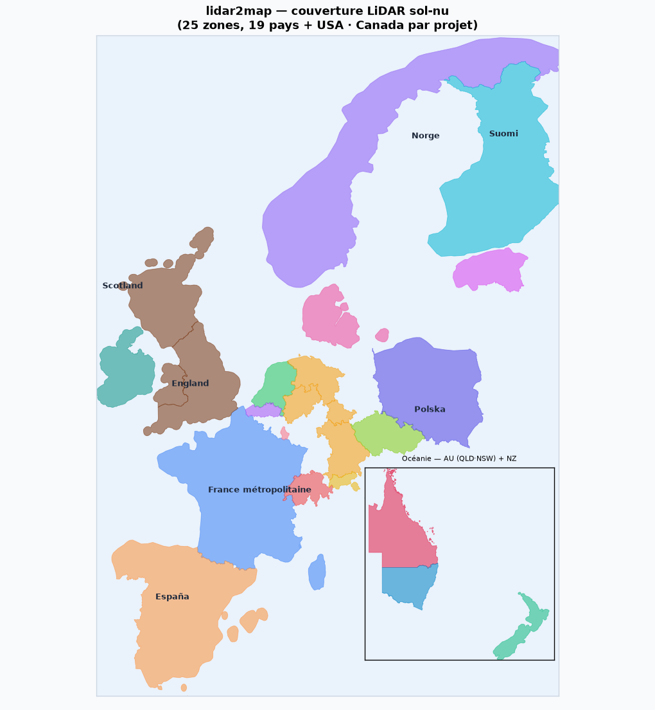

La carte colorée résume la couverture nationale disponible. Version interactive
(clic = `NAME` + code) :

🗺️ **[Carte de couverture interactive](coverage.geojson)**, rendue directement par GitHub, ou glissable dans [geojson.io](https://geojson.io) / QGIS pour tester un point.

La carte est régénérée par `coverage_map.py`, qui lit les titres des zones depuis `providers/*.py`, donc carte et GUI ne peuvent pas diverger. Au clic sur une zone du GeoJSON interactif, GitHub affiche son `NAME` et son/ses code(s).

**🇺🇸 USA & 🇨🇦 Canada, supportés et fonctionnels, juste non tracés.** `us-tnm` / `us-3dep` (3DEP 1 m) et `ca-nrcan` (HRDEM 1 m) marchent, mais leur couverture est **par projet/population** (pas mur-à-mur national) : un polygone plein sur-revendiquerait, d'où la note plutôt qu'une forme. Vérifie ta zone US sur le [TNM Downloader](https://apps.nationalmap.gov/downloader/). Les tuiles 1 m USGS sont des COG 10×10 km **lues en fenêtré** sur ta bbox via `/vsicurl/`, pas de download de la tuile entière.

### Ajouter un provider LiDAR

L'abstraction provider permet d'ajouter une source nationale ou régionale sans
modifier le cœur du pipeline. Chaque module `providers/<code>.py` expose au
minimum ses métadonnées, sa géométrie et sa fonction de découverte :

```python
NAME, CODE, COUNTRY, LICENSE
CRS_NATIF, RESOLUTION_M, DALLE_KM

def discover_dalles(bbox_wgs84, bbox_natif, cache_path, workers=1):
    ...  # retourne {nom_de_dalle: URL_ou_source}
```

Des hooks optionnels gèrent les cas particuliers, notamment `post_fetch` pour
décompresser ou convertir des tuiles LAZ/ZIP en GeoTIFF. Le pipeline en aval
(ombrages, reprojection EPSG:3857, tuilage et formats de sortie) reste
provider-agnostique : il consomme les GeoTIFF découverts, quels que soient le
CRS natif et le mécanisme d'accès.

Une source s'intègre directement si elle expose des **URL de tuiles
déterministes**, un **WCS** (`GetCoverage` par emprise), un catalogue **STAC**,
des **COG mosaïques** lisibles par fenêtre, un index **ATOM/FeatureServer** ou
des tuiles **LAZ/ZIP** convertibles. Les commandes par formulaire ou e-mail, un
WMS de rendu sans altitude brute et les fichiers sans CRS demandent un travail
supplémentaire ou ne conviennent pas au pipeline actuel.

Le [roadmap providers](docs/lidar_providers_roadmap.md) centralise les sources
évaluées, intégrées ou écartées, avec leur état et le motif précis. Pour proposer
une nouvelle source, ouvrir une issue ou une PR et partir du provider existant
dont le mécanisme d'accès est le plus proche.

## Captures d'écran

### Interface graphique

Cinq types de traitement : LiDAR, raster, vectoriel, fusion vectorielle et découpage raster. L'onglet LiDAR couvre les deux surfaces, le MNT raster et le nuage de points LAZ (mode LAZ « structures debout », avec un socle par classes ou par tissu CSF).

| LiDAR (surface MNT) | LiDAR (LAZ, socle classes sol) | LiDAR (LAZ, socle tissu CSF) |
|---|---|---|
| 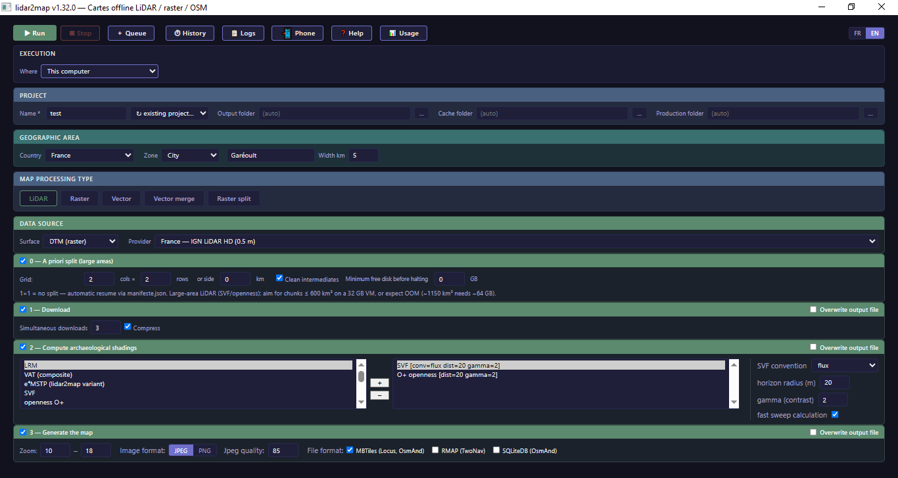 | 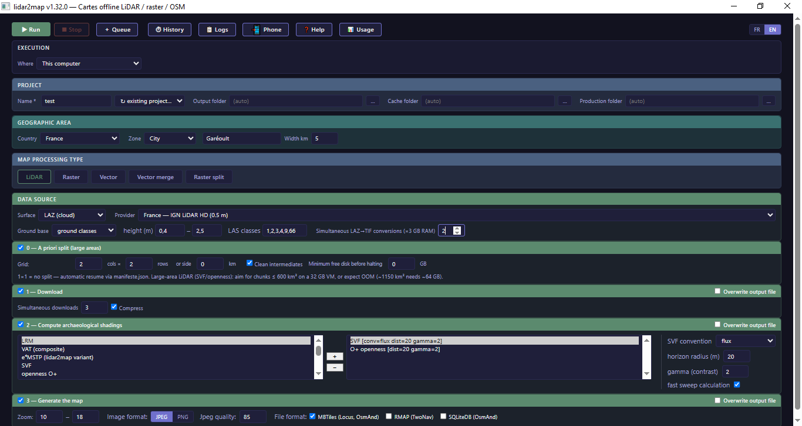 | 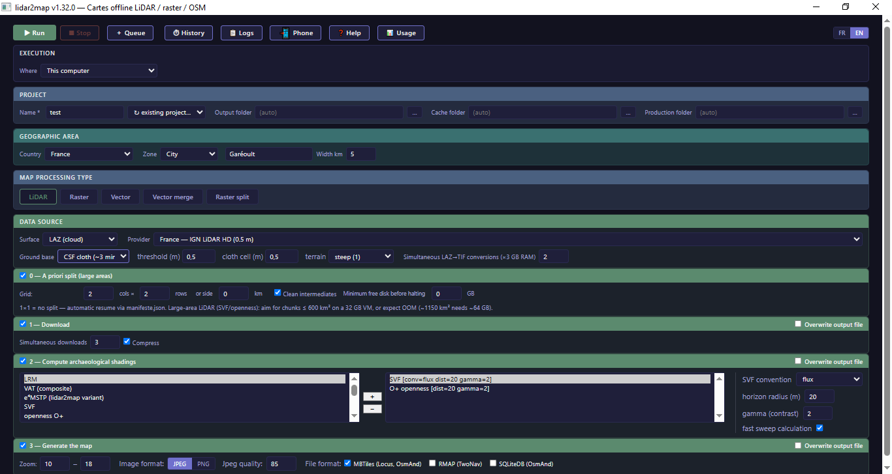 |

| Raster (Plan / ortho / historique) | Vectoriel, IGN BD TOPO (WFS) | Vectoriel, OSM (Mapsforge) |
|---|---|---|
| 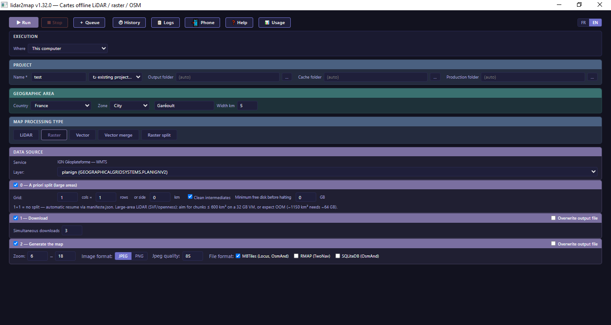 | 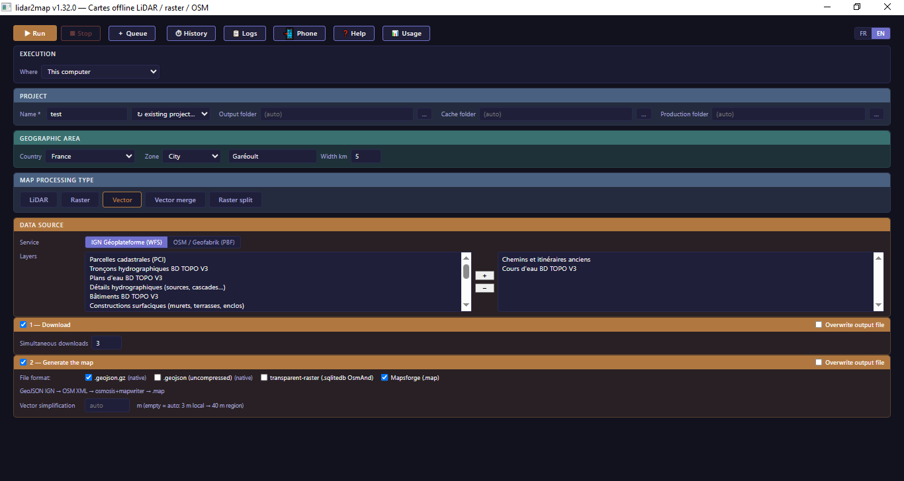 | 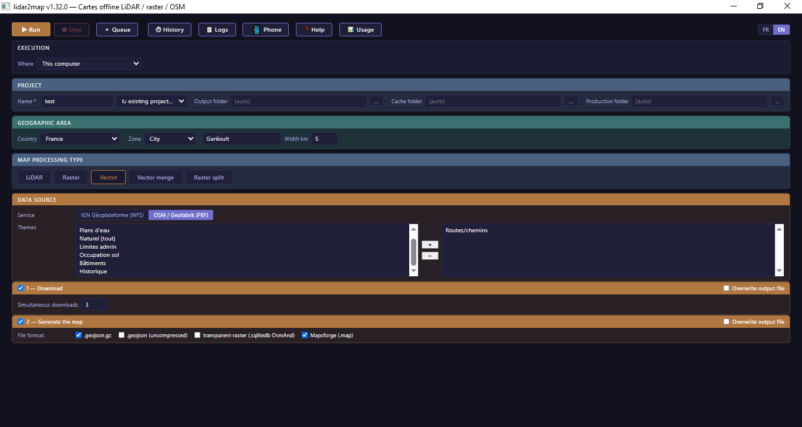 |

| Fusion vectorielle | Découpage raster |
|---|---|
| 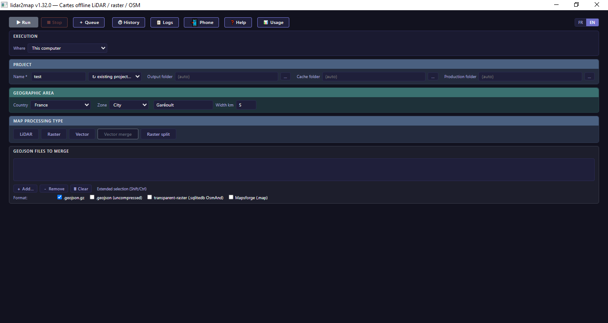 | 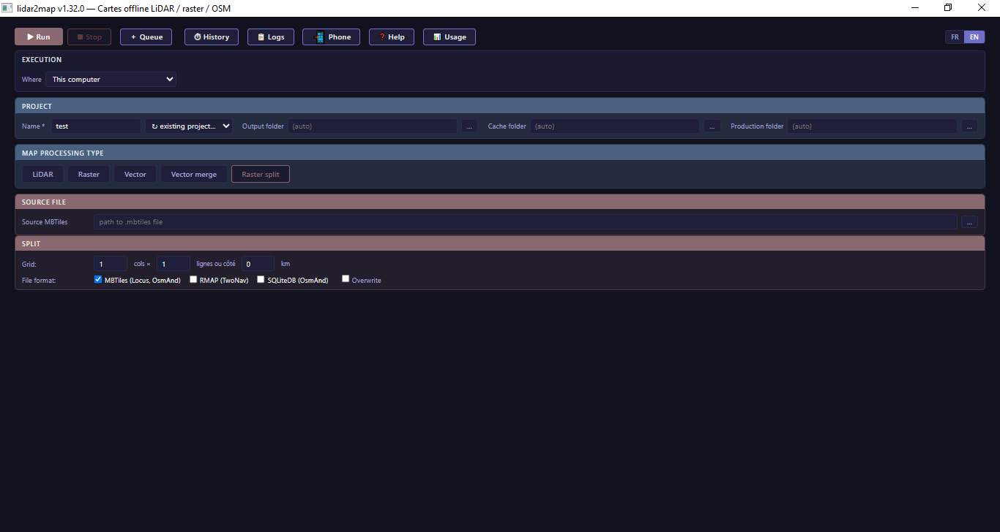 |

Envoi vers le téléphone : le bouton 📲 sert les cartes générées sur le WiFi local. On scanne le QR code, on télécharge, puis on importe dans Locus via **Gestionnaire de cartes → Importer une carte → gestionnaire de fichiers**. « Ouvrir avec » peut aussi fonctionner selon Android.

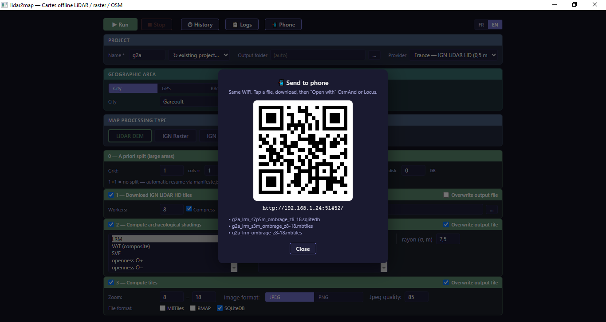

La planche d'assemblage déposée à côté des livrables : contour réel du département et cellules numérotées (ici un run VAT du Var découpé en 3×4 zones ; les légers chevauchements sont les vraies tuiles de bord partagées aux zooms bas). La planche elle-même fonctionne partout ; le fond avec le contour administratif est un habillage best-effort (département en France, équivalent géocodé ailleurs) : hors connexion ou si aucune limite n'est résolue, la planche reste générée, avec l'emprise et les cellules seules.

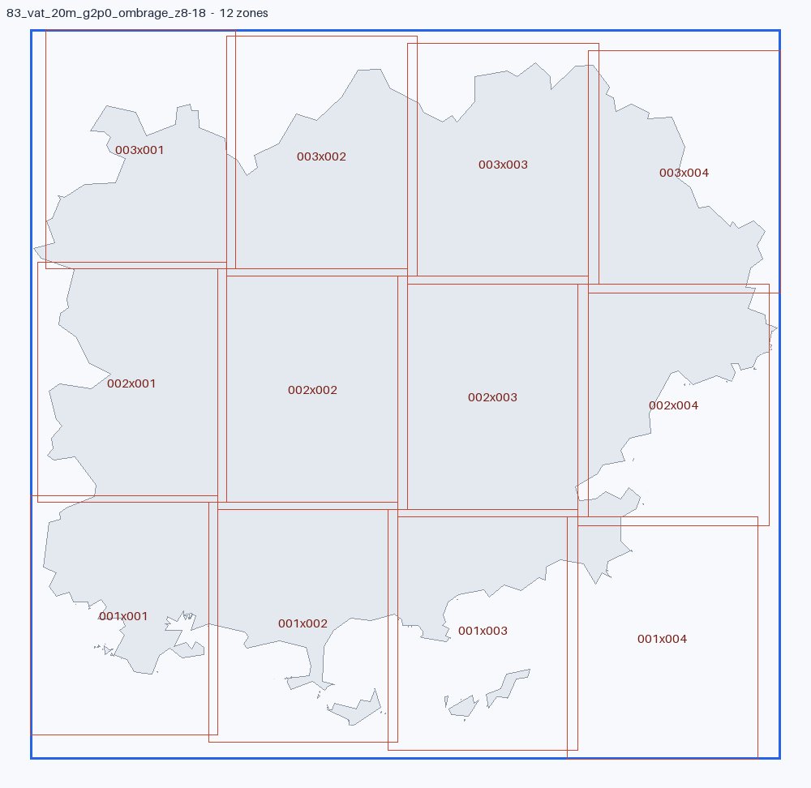

### Rendu sur Locus Map

Ombrages LiDAR archéo affichés en superposition sur le terrain dans Locus Map.

| SVF (Sky-View Factor) | Multi-ombrages superposés |
|---|---|
| 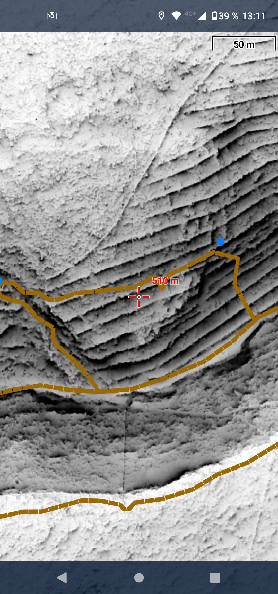 | 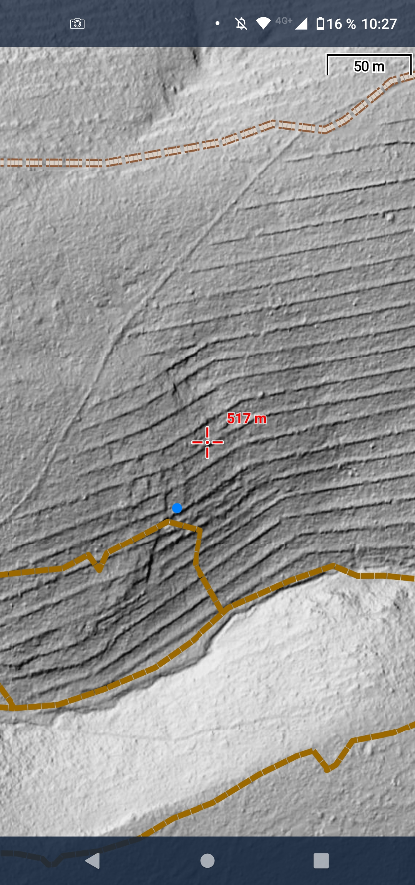 |

### Rendu sur OsmAnd

Relief LiDAR (LRM) en surcouche semi-transparente au-dessus de la carte
OsmAnd standard (Configurer la carte > Carte de superposition, curseur de
transparence vers le milieu).

<p align="center">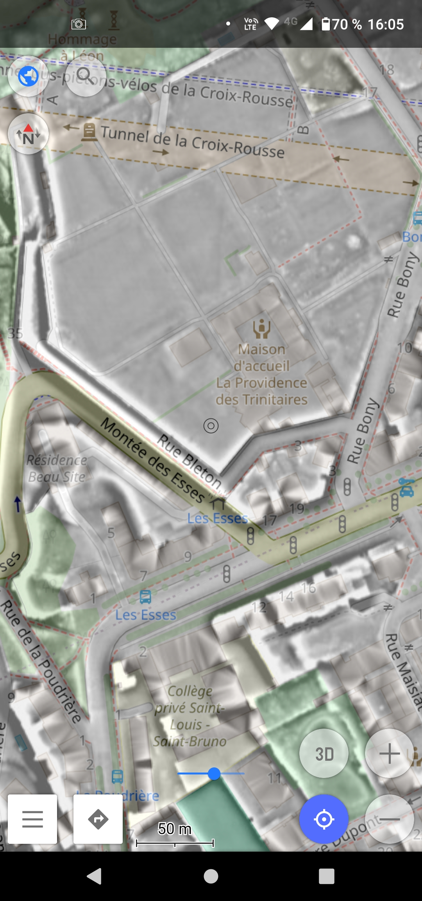</p>

### Ce que le SVF révèle, même zone, trois sources

Sous le couvert végétal, la photo aérienne et OSM ne montrent rien. Le SVF
LiDAR fait apparaître les restanques (terrasses en pierre sèche) et les
chemins anciens, invisibles vus du ciel.

| Photo satellite | OSM | SVF (LiDAR HD) |
|---|---|---|
| 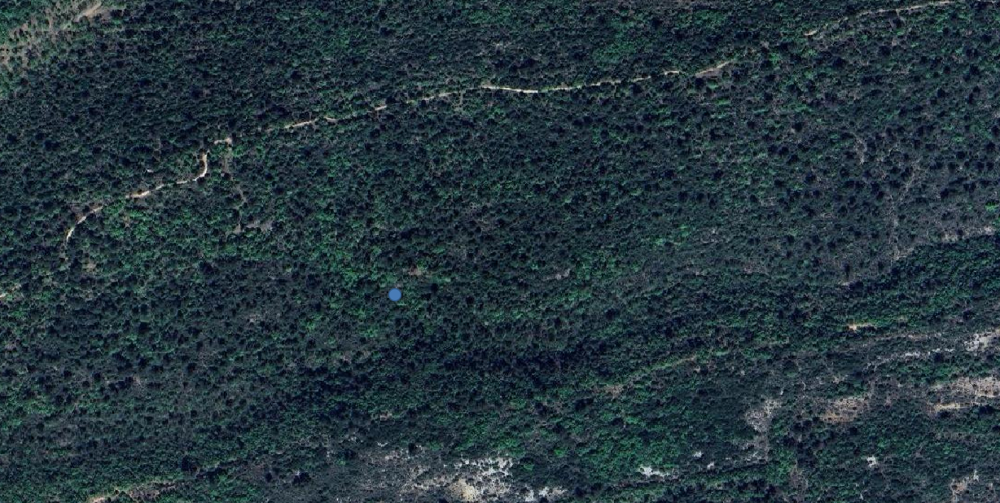 | 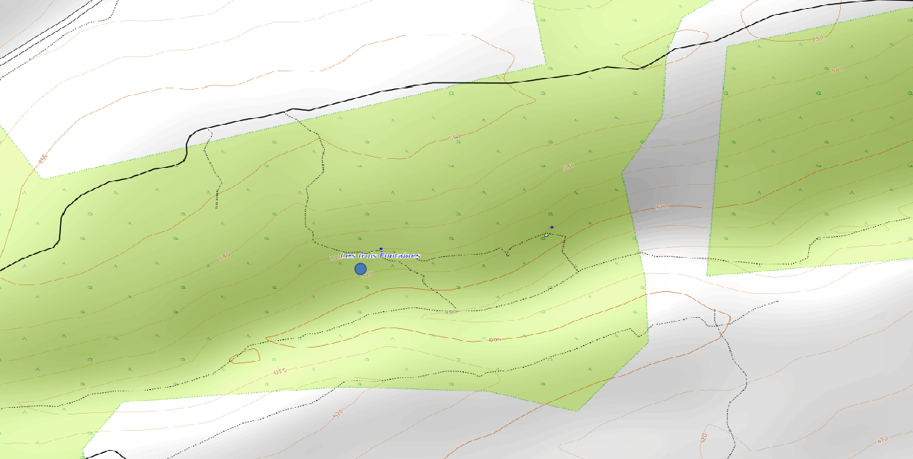 | 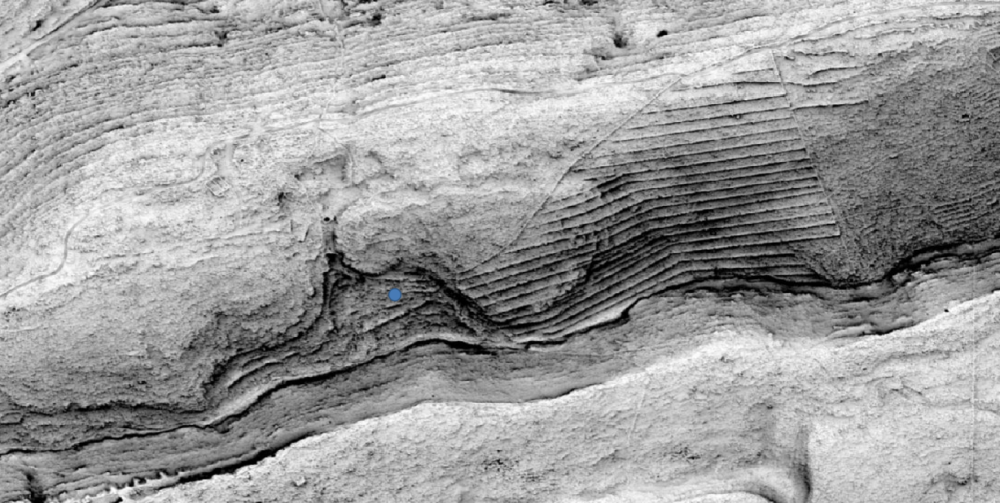 |
| Garrigue opaque | Quasi aucun détail | Restanques + chemins nets |

#### Reproduire ce rendu

Le SVF d'en-tête et du triptyque ci-dessus (secteur de Rougiers, 83) a été calculé avec :

```bash
python lidar2map.py \
  --zone-gps <lat>,<lon> --zone-width 2 --zone-name hero \
  --lidar --download --workers 8 \
  --shadings svf --shading-elevation 25 \
  --svf-conv rvt --svf-dist 20 --svf-gamma 0.8 --svf-sweep \
  --file-formats mbtiles --zoom-min 8 --zoom-max 18 \
  --image-format jpeg --image-quality 85
```

Remplace `<lat>,<lon>` par ta propre zone ; les paramètres SVF ci-dessus sont
ceux du visuel. Les coordonnées exactes d'un micro-relief ne sont volontairement
pas diffusées (déontologie : ne pas guider vers un vestige précis, cf. le
disclaimer anti-détection ci-dessous).

## Documentation

- **README de l'utilisateur** : ce fichier
- **Choisir un ombrage LiDAR** : [histoire, formules, schémas, avantages et limites de chaque rendu](docs/shadings.fr.md)
- **Build & déploiement** : [BUILD.md](BUILD.md), architecture du bundle, scripts de build par OS, mise à jour sans rebuild, dépannage (incluant cas spécifiques Linux et macOS)
- **Aide intégrée** : `python lidar2map.py --help` (LiDAR), `--raster --help` (raster), `--vector --help` (vecteur), `--osm --help`, `--merge --help`

## Licence

Code distribué sous **GNU General Public License v3.0**, voir [LICENSE](LICENSE).

Vous êtes libre d'utiliser, modifier et redistribuer ce logiciel selon les termes de la GPL v3. En particulier : si vous redistribuez une version modifiée, vous devez fournir le code source modifié sous la même licence.

## Auteur

Conçu et architecturé par **Nicolas Martin** ([@nico579](https://github.com/nico579)). Code développé avec l'assistance de Claude (Anthropic) comme outil de développement.

## Remerciements

Données utilisées :
- **IGN** (Institut national de l'information géographique et forestière), LiDAR HD, BD ORTHO (incluant les versions historiques 1950-1995), BD TOPO, sous licence Etalab 2.0
- **AHN** (Actueel Hoogtebestand Nederland), AHN4/5 0.5m (Pays-Bas), CC BY 4.0
- **swisstopo** (Office fédéral de topographie), swissALTI3D 0.5m (Suisse), open data gratuit © swisstopo
- **Kartverket**, Nasjonal Høydemodell 1m (Norvège), CC BY 4.0
- **Geobasis NRW · LDBV Bayern · LGLN Niedersachsen · TLBG Thüringen**, DGM 1m (1-2m Thuringe) (Allemagne, 4 Länder), Datenlizenz Deutschland Namensnennung 2.0
- **Land Tirol** (tiris), DGM 0.5m (Autriche, Tyrol), CC BY 4.0
- **Environment Agency** (Angleterre) & **DataMapWales / Natural Resources Wales**, LIDAR Composite DTM 1m (Royaume-Uni), Open Government Licence v3
- **Scottish Government / JNCC** (Scottish Remote Sensing Portal), LiDAR secteur public écossais DTM 0,5m (Écosse), Open Government Licence v3
- **ACT** (Administration du Cadastre et de la Topographie), BD-L-Lidar 2024 MNT 0,5m (Luxembourg), CC0
- **USGS**, 3DEP / The National Map 1m (USA), domaine public
- **GSI** (Autorité de l'information géospatiale du Japon), tuiles d'altitude DEM5A 5m (Japon), conditions GSI
- **Digitaal Vlaanderen**, DHMV II DTM/SVF/Hillshade (Belgique Flandre), Open Data Licentie Vlaanderen
- **Maanmittauslaitos**, Modèle d'élévation 2m (Finlande), CC BY 4.0
- **Klimadatastyrelsen / Datafordeler**, DHM DTM 0.4m (Danemark), CC BY
- **Geological Survey Ireland**, LiDAR DTM 1m (Irlande), CC BY 4.0
- **Natural Resources Canada**, HRDEM Mosaic 1m (Canada), Open Government Licence
- **ČÚZK** (office tchèque de cartographie et cadastre), DMR 5G 1m (Tchéquie), Open Data
- **IGN España / CNIG**, MDT 5m (Espagne), CC BY 4.0
- **ICGC** (Institut Cartogràfic i Geològic de Catalunya), MET LiDAR 50cm (Catalogne), CC BY 4.0
- **GUGiK** (office polonais de géodésie et cartographie), NMT 1m LiDAR ISOK (Pologne), données ouvertes
- **LINZ** (Land Information New Zealand), DEM 1m (Nouvelle-Zélande), CC BY 4.0
- **QSpatial** (State of Queensland) & **Spatial Services NSW**, DEM 0.5m / 5m (Australie), CC BY 4.0
- **Geoscience Australia**, DEM dérivé LiDAR 5m (Australie, national), CC BY 4.0
- **OpenStreetMap**, données vectorielles sous licence ODbL, distribuées par Geofabrik
- **Apache JMapsforge / mapsforge-map-writer**, moteur de rendu vectoriel offline

Outils intégrés : GDAL, osmosis, py7zr, pyproj, numpy, scipy, Pillow, ijson, pywebview.
