***English** | [Français](README.fr.md)*

# lidar2map

[](https://github.com/nico579/lidar2map/actions/workflows/smoke.yml)

**Offline archaeological LiDAR maps, multi-country + IGN raster/vector + OSM, for Locus Map / OsmAnd / TwoNav**

A self-contained tool (standalone executables for Windows / macOS / Linux, no Python required; also runs as a single Python script) that downloads public LiDAR data from national portals across **<!--N-->27<!--/N--> countries** (<!--LIST-->France, UK, Germany, Austria, Netherlands, Switzerland, Norway, Belgium, Luxembourg, Finland, Denmark, Sweden, Ireland, Czechia, Slovenia, Estonia, Latvia, Spain, Portugal, Italy, Poland, USA, Canada, New Zealand, Australia, Philippines, Japan<!--/LIST-->), computes relief visualizations tuned for archaeological prospection, and generates maps usable offline on a smartphone (MBTiles, RMAP, SQLiteDB, Mapsforge formats). The IGN raster/vector maps remain France-only.

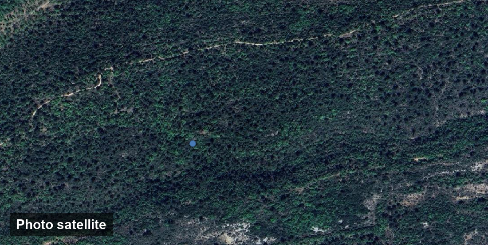

*The same extent under three views: aerial imagery and the OSM map show nothing of the micro-relief, the Sky-View Factor computed from the HD LiDAR reveals it instantly.*

> ⚠️ **Status**: personal project, publicly released. Heavily tested on Windows 10/11. Linux and macOS tested partially, known cases + cross-OS troubleshooting in the *Troubleshooting* section of [BUILD.md](BUILD.md). Feedback welcome via [GitHub issues](https://github.com/nico579/lidar2map/issues).
>
> **Note:** the GUI auto-detects your language (English/French, with a manual toggle) and the CLI flags and `--help` are in English. The former French flag names still work as aliases, so older example commands keep working.

---

**Is your country covered?** <!--N-->27<!--/N--> countries with bare-earth LiDAR (incl. USA, Canada & Japan, project-based). Check your area before diving in:

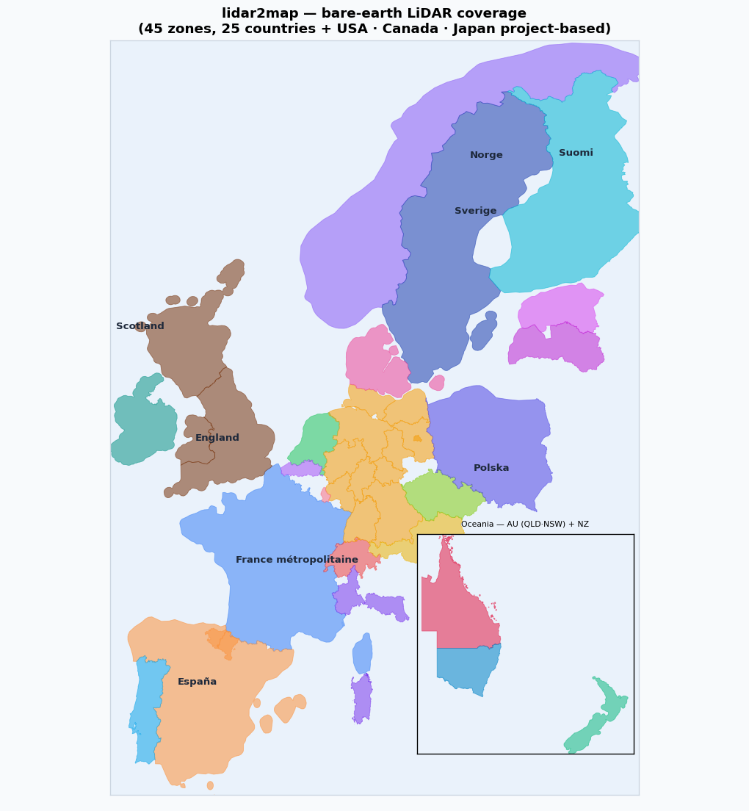

*Resolutions, codes and evaluated sources: see the [LiDAR coverage](#lidar-coverage--evaluated-sources) section below.*

---

## Who is it for?

- **Amateur archaeologists** interested in LiDAR prospection: the tool works across **<!--N-->27<!--/N--> countries** (<!--LIST-->France, UK, Germany, Austria, Netherlands, Switzerland, Norway, Belgium, Luxembourg, Finland, Denmark, Sweden, Ireland, Czechia, Slovenia, Estonia, Latvia, Spain, Portugal, Italy, Poland, USA, Canada, New Zealand, Australia, Philippines, Japan<!--/LIST-->) with more in progress. The relief computations (multi, SVF, openness, LRM, RRIM, VAT) are identical from one country to the next.
- **French hikers** who want offline IGN topo maps on their phone (Locus Map Pro, OsmAnd+): the IGN raster/vector tabs remain France-only.
- **Landscape surveyors** who combine historical orthophotos (1950-1995, France) with a DEM to spot human remains before agricultural land abandonment erases them.
- **Cavers / explorers** who need accurate base maps in areas not covered by mainstream apps.

The tool is **not** intended for metal detecting. The code strictly respects the open licenses involved (Etalab FR, CC BY 4.0 NO, CC-0 NL, BGDI CH).

## What it produces

From a town, GPS coordinates, a bbox, a département or a whole region:

- **Archaeological relief** from national LiDAR (0.5 m to 1 m resolution depending on source):

  | Type | What it reveals | Parameters |
  |------|-----------------|------------|
  | `multi` | Multidirectional hillshade (Mark 1992), general relief without azimuth bias | `elevation` (° sun, default 25, low = micro-relief, 45 = general use) |
  | `315` `045` `135` `225` | Directional hillshades, emphasize structures perpendicular to the chosen azimuth | `elevation` (same) |
  | `slope` | Slope 0-90° stretched to 1-255, banks, breaks, terraces | (none) |
  | `svf` | Sky-View Factor, fraction of visible sky: ditches, terraces, enclosures shown dark | `conv` (`flux` = cos²γ contrasted, default; `rvt` = 1−sin γ, the Kokalj/Hesse archaeology standard), `dist` (horizon radius in m, default 20, 20 = micro-relief, 100 = enclosures/roads), `gamma` (contrast, default 2.0) |
  | `opos` | Positive openness (Yokoyama 2002), mean horizon angle above the horizontal: ridges, mounds, barrows shown bright | `dist`, `gamma` |
  | `oneg` | Inverted negative openness, the "looking down" view: ditches, banks and hollow ways shown dark, the SVF's companion (inherently grainier: sensitive to DTM noise) | `dist`, `gamma` (applied mirrored: deepens hollows without darkening the background) |
  | `lrm` | Local Relief Model, subtracts the smoothed terrain (gaussian σ): removes hills and valleys, keeps only local anomalies. Fast and readable: the GUI default | `sigma` (gaussian radius in m ≈ max scale of preserved structures; default 15 px of the provider) |
  | `rrim` | Red Relief Image Map (Chiba 2008), color composite: slope in red (absolute 0-45° ramp), LRM as light/dark, hollows AND mounds at a glance | `sigma` (of the internal LRM) |
  | `vat` | **Visualization for Archaeological Topography**, the most complete detector: SVF + positive openness + slope blended into a single grayscale, reveals hollows AND mounds without picking a method (RVT style, ZRC SAZU). Slower than `lrm`, grainier too. Needs numba | `dist` (SVF/openness radius in m, default 20), `gamma` (final composite contrast, default 2.0, 1 light, 2 dark) |

  Two ways to request them:

  ```bash
  # Simple: list of types, shared global parameters
  --shadings multi svf oneg --svf-dist 20 --svf-gamma 2

  # Parameterized instances (repeatable): each occurrence carries ITS OWN params
  # → several instances of the same type in a single run
  --shading svf:dist=20,gamma=2 --shading svf:dist=100,gamma=1.5 \
  --shading oneg:dist=20 --shading 315:elevation=20 --shading lrm:sigma=10

  # Resolution preset (opt-in): a stack (svf + opos + lrm + multi + slope) sized
  # in METRES for the DEM resolution, so the same ground-scale features are
  # targeted whether the DEM is 0.25 m or 5 m. 'auto' picks the tier per provider:
  #   micro (<=0.75 m) / standard (~1 m) / landscape (>=5 m)
  --shading-preset auto
  ```

  Explicit parameters that differ from the defaults are encoded in the output
  filename (`zone_svf_flux_100m_g1p5_ombrage.tif`, `zone_315_e20_ombrage.tif`):
  no collision between instances, and already-computed shadings are reused.
  In the GUI, the "to process" list (+/− buttons) does the same: each added
  instance has its own little parameter form.
  `--svf-sweep` / `--no-svf-sweep` (sweep-horizon kernel, SVF only) stays global.

  LiDAR sources: **<!--N-->27<!--/N--> countries** via the `--provider <code>` flag (or the GUI
  dropdown), France (default), Netherlands, Switzerland, Norway, Germany
  (12 Länder), Austria (national + Tyrol), United Kingdom, Belgium (Flanders), Finland,
  Denmark, Ireland, Czechia, Slovenia, Estonia, Latvia, Spain (+ Basque Country, Navarre, Catalonia), Italy (Emilia-Romagna, Sardinia), Poland, USA, Canada, New Zealand,
  Australia (QLD/NSW), Philippines (Taal area). Per-provider details (dataset, resolution, CRS, access
  mechanism, coverage, API keys) live in **the single reference table** of the
  [LiDAR providers](#lidar-providers--adding-a-country) section.

- **IGN raster maps** *(France only)*: Plan IGN, orthophotos (current + historical 1950, 1965, 1980), 19th-century État-Major, Pléiades satellite, CIR, etc.
- **USGS Imagery** *(USA, `--layer naip`)*: public-domain NAIP-derived aerial imagery (~1 m, cache complete to z16), pairs with the 3DEP LiDAR (`us-tnm`).

- **Vector maps**: OSM Mapsforge `.map` (international, via Geofabrik) or IGN BD TOPO *(France only)*. Both can also render as **`transparent-raster`**: the selected layers (paths, roads, rivers...) drawn on transparent tiles (.sqlitedb), to float above the LiDAR relief as an OsmAnd overlay (OsmAnd cannot overlay vector data natively)

- **Outputs**: MBTiles (universal), RMAP (CompeGPS / TwoNav), SQLiteDB (RMaps schema, Locus Map / OsmAnd), Mapsforge `.map` (Locus Map), transparent overlay `.sqlitedb` (`transparent-raster`)

- **Send to phone**: after generating, the GUI's 📲 button (or `--serve --zone-name X` in CLI) serves the maps on your local WiFi and shows a QR code. Scan with the phone, download, then "Open with" OsmAnd or Locus: no cable, no cloud, nothing leaves your network. (Android may warn the download is insecure: choose Save, it is a plain local transfer.)

- **Processing queue**: in the GUI, stack several zones with the `＋ Queue` button, then `Run queue` runs them one after another, unattended. A failed job doesn't stop the queue (each item shows its status), so you can line up a batch of areas and walk away. The CLI equivalent is chaining commands in a shell script.

- **Index sheet**: each run drops a `<product>_planche.png` next to the deliverables, showing the coverage extent, the real department outline (with a locator inset when the view is zoomed in), and the numbered chunk cells when the area was split. One sheet per map product (each shading gets its own); the vector layers of a run share a single sheet. Built by scanning the actual files (mbtiles/sqlitedb/geojson), so you can also regenerate it for any existing project folder with `--index-sheet DIR`, without re-running anything. Disable per-run with `--no-index-map`.

---

## Installation and usage

**Quick start: download the standalone executable for your OS from the [Releases page](https://github.com/nico579/lidar2map/releases), extract, run. No Python, no dependencies, nothing to install.**

Two ways to use lidar2map:

| | **A. Standalone executable** | **B. Python script** |
|---|---|---|
| **Requirements** | None | Python 3.12 |
| **First install** | None | ~5 min (auto bootstrap in its own venv) |
| **Updates** | Patch the 3 existing binaries on the GitHub release in one command: `python update_app.py --release` (see [`update_app.py`](update_app.py)) | `git pull` + relaunch |
| **Distributable** | Yes, `.exe` / `.app` / Linux binary + zip bundle side by side | No, each user installs Python |
| **Best for** | end user / Windows / distributing | dev / Linux / contributing code |

### A. Standalone executable

No Python for the end user to install. The deliverable carries its own runtime (embedded Python, deps, JRE, osmosis).

#### 1. Get the deliverable

**Option a, Download from [Releases](https://github.com/nico579/lidar2map/releases)** (if the version is published for your platform):

| OS | Archive | Extract with |
|----|---------|--------------|
| Windows 10/11 (x86_64) | `lidar2map-windows-x86_64.zip` | `Expand-Archive` (PowerShell) or double-click |
| Linux Ubuntu 24.04+ (x86_64) | `lidar2map-linux-x86_64.tar.gz` | `tar xzf` |
| macOS 12+ (Apple Silicon) | `lidar2map-macos-arm64.zip` | `unzip` then `xattr -dr com.apple.quarantine LIDAR2MAP.app` |

The archive extracts into a `lidar2map-<os>-x86_64/` folder containing the binary and its `lidar2map_bundle.zip` side by side. No system installation.

**Option b, Build it yourself.** Two scripts per platform: a machine setup (do **once**) then a build (re-run each time `lidar2map.py` is updated).

##### Windows

```powershell
git clone https://github.com/nico579/lidar2map
cd lidar2map
.\setup_build_windows.ps1     # 1. Setup: Python 3.12, deps, JRE, osmosis, PyInstaller
.\lidar2map_win_build.ps1     # 2. Build: 3 steps -> dist\lidar2map.exe + dist\lidar2map_bundle.zip
```

##### macOS (Apple Silicon)

```bash
git clone https://github.com/nico579/lidar2map
cd lidar2map
bash setup_build_mac.sh       # 1. Setup
bash lidar2map_mac_build.sh   # 2. Build -> dist/LIDAR2MAP.app
```

##### Linux (Ubuntu / Debian)

Linux reuses the Windows specs (`_win.spec` produces an ELF on Linux, the name is misleading).

```bash
git clone https://github.com/nico579/lidar2map
cd lidar2map
bash setup_build_linux.sh       # 1. Setup
bash lidar2map_linux_build.sh   # 2. Build -> dist/lidar2map + dist/lidar2map_bundle.zip
```

Requirement: `sudo apt install zip` if missing. The produced binary depends on the build machine's libc (build on Ubuntu 22.04 → runs on Ubuntu ≥ 22.04 / Debian 12+).

Full build documentation (bundle architecture, updating without rebuild, troubleshooting): **[BUILD.md](BUILD.md)**.

#### 2. Run the deliverable

| OS | Command |
|----|---------|
| Windows | Double-click `lidar2map.exe` (or run from a terminal to see the log) |
| Linux | `chmod +x lidar2map && ./lidar2map` in the extracted folder |
| macOS | Double-click `LIDAR2MAP.app`. First launch blocked by Gatekeeper: `xattr -dr com.apple.quarantine LIDAR2MAP.app` then double-click |
| Linux | `chmod +x lidar2map && ./lidar2map` |

The first launch extracts the bundle (~30-60 s, once, it contains Qt) into:
- Windows: `%LOCALAPPDATA%\lidar2map\`
- macOS: `~/Library/Application Support/lidar2map/`
- Linux: `~/.local/share/lidar2map/`

Clean uninstall: `lidar2map(.exe) --desinstaller`.
### B. Python script

On first launch, the script creates `~/.lidar2map/venv` and installs the critical dependencies there (Pillow, pyproj, numpy, rasterio, pywebview + PyQt6/QtWebEngine…): your system Python is never touched (`--bootstrap=none` if you prefer to manage the environment yourself). The Temurin 21 JRE and osmosis are downloaded on demand; no system GDAL needed, the rasterio wheels embed their own. ~400 MB total, **once**.

#### Windows 10+

1. Install [Python 3.12+](https://www.python.org/downloads/)
2. Get the code:
   ```powershell
   git clone https://github.com/nico579/lidar2map
   cd lidar2map
   python lidar2map.py
   ```

#### macOS 11+

```bash
brew install python@3.12
git clone https://github.com/nico579/lidar2map
cd lidar2map
python3.12 lidar2map.py
```

#### Linux (Debian / Ubuntu)

```bash
sudo apt install python3.12 python3.12-venv git
git clone https://github.com/nico579/lidar2map
cd lidar2map
python3.12 lidar2map.py
```

Troubleshooting: the *Troubleshooting* section of [BUILD.md](BUILD.md) (including Linux/macOS-specific cases: PEP 668, Qt distro packages, Wayland, Gatekeeper on the JRE…).


---

## Usage

Two modes, selected automatically based on the arguments (same logic as the
twin project [gpxsolar](https://github.com/nico579/gpxsolar)):

- **No argument → graphical interface** (pywebview / Qt). The common mode.
- **With arguments → command-line computation** (headless, no window).
  Handy for scripting, running on a server, or reproducing an exact render.

Everything below applies to the binary as well as the script, just replace
`python lidar2map.py` with `lidar2map.exe` (Windows), `./lidar2map` (Linux) or
`LIDAR2MAP.app` (macOS).

### Command-line examples

> The flags below are English. The former French flag names still work as aliases, so older commands keep working.

**SVF relief + IGN topo map over a town (1 km² zone around Garéoult, France):**
```bash
python lidar2map.py --lidar --zone-city Gareoult --zone-radius 1 \
    --shadings multi svf --file-formats mbtiles```

**Relief over Amsterdam (Netherlands, AHN4):**
```bash
python lidar2map.py --provider nl-ahn --lidar --download \
    --zone-bbox 120000,486000,122000,488000 --zone-name amsterdam \
    --shadings multi --file-formats mbtiles```

**Relief over Geneva (Switzerland, swissALTI3D):**
```bash
python lidar2map.py --provider ch-swisstopo --lidar --download \
    --zone-city Geneve --zone-radius 1 \
    --shadings svf --file-formats mbtiles```

**Relief over Oslo (Norway, Kartverket):**
```bash
python lidar2map.py --provider no-kartverket --lidar --download \
    --zone-city Oslo --zone-radius 1 \
    --shadings multi --file-formats mbtiles```

**Historical 1950-1965 orthophoto over an archaeological survey area:**
```bash
python lidar2map.py --raster --zone-bbox 6.0,43.3,6.1,43.4 \
    --layer ortho_1950 --zoom-min 14 --zoom-max 18```

**OSM vector map (Mapsforge .map) for Locus, whole département:**
```bash
python lidar2map.py --osm --zone-department 83 --file-formats map```

**Whole region (`--zone-region`), available for all modes:**
```bash
# OSM: a single map for the whole region, no re-splitting
# (the Geofabrik PBF IS already regional, far faster than looping per département)
python lidar2map.py --osm --zone-region provence-alpes-cote-d-azur
# IGN vector: paths/routes for the whole region as GeoJSON + Locus .map
python lidar2map.py --vector --zone-region provence-alpes-cote-d-azur \
    --layer chemins --file-formats gz map```
The slug is the one from [Geofabrik France](https://download.geofabrik.de/europe/france.html) (old-style regions: `provence-alpes-cote-d-azur`, `bretagne`, `corse`, `rhone-alpes`…). In OSM the region is processed as one block (the Geofabrik file is already regional, no per-département geocoding); for the raster/vector/lidar modes the area is the bbox enclosing all the départements of the region. An unknown slug lists the available regions.

**IGN BD TOPO map (roads + buildings) as compressed GeoJSON + Mapsforge .map:**
```bash
python lidar2map.py --vector --zone-department 83 \
    --layer routes batiments --file-formats gz map```
The `map` format converts the IGN GeoJSON into a Mapsforge `.map` map (readable by Locus Map; OsmAnd uses its own OBF vector format and cannot read Mapsforge files, but its built-in offline map already provides the vector layer, so on OsmAnd simply put the LiDAR raster on top as an overlay).

## LiDAR providers, adding a country

The provider abstraction lets you add a national LiDAR source without touching the core of the pipeline. Each provider lives in `providers/<code>.py` (~50-200 lines) and exposes:

```python
NAME, CODE, COUNTRY, LICENSE          # metadata
CRS_NATIF, RESOLUTION_M, DALLE_KM     # geometry
discover_dalles(bbox_wgs, bbox_natif, cache)  # → {name: url}
# + helpers: dalle_filename, dalle_url, subdir_from_name, dalles_pour_bbox
```

The downstream pipeline (SVF, relief, EPSG:3857 warp, MBTiles) is provider-agnostic: it consumes the GeoTIFFs returned by `discover_dalles`, regardless of the native CRS or the index format used upstream.

| Code | Country | Dataset | Res. | Native CRS | Access & specifics |
|---|---|---|---|---|---|
| `fr-ign` | France *(default)* | IGN LiDAR HD | 0.5 m | EPSG:2154 (Lambert-93) | Vector TMS PBF + WMS GetMap, national coverage (mainland) |
| `fr-reunion` · `fr-guadeloupe` | France (Réunion, Guadeloupe DROM) | IGN LiDAR HD | 0.5 m | EPSG:2975 / 5490 (UTM40S / UTM20N) | WFS `IGNF_MNT-LIDAR-HD:dalle` index (each tile feature carries its direct download `url`), 0.5 m GeoTIFF, Licence Ouverte 2.0 (Martinique/Mayotte announced but WFS empty for now) |
| `nl-ahn` | Netherlands | AHN4/5 | 0.5 m | EPSG:28992 (RD New) | ATOM feed + JSON FeatureCollection, national coverage |
| `ch-swisstopo` | Switzerland | swissALTI3D | 0.5 m | EPSG:2056 (CH1903+/LV95) | STAC REST API, national coverage |
| `no-kartverket` | Norway | Nasjonal Høydemodell | 1 m | EPSG:25833 (UTM33N) | ArcGIS ImageServer exportImage, national coverage |
| `se-lantmateriet` | Sweden | Markhöjdmodell (laser) | 1 m | EPSG:3006 (SWEREF99 TM) | STAC + 10 km mosaic COG (windowed read), national coverage; **free GeoTorget account** (env `LANTMATERIET_USER`/`LANTMATERIET_PASS`) for the download |
| `de-bayern` · `de-nrw` · `de-niedersachsen` · `de-rlp` | Germany (4 Länder: Bavaria, NRW, Lower Saxony, Rhineland-Palatinate) | DGM1 | 1 m | EPSG:25832 (UTM32N) | metalink / index.json / STAC COG, open data (de-rlp: Metalink index of ~21k GeoTIFF tiles, post_fetch strips the compound vertical CRS to 25832) |
| `de-thueringen` · `de-berlin` · `de-sh` | Germany (Thuringia, Berlin, Schleswig-Holstein) | DGM / DGM1 | 1-2 m / 1 m | EPSG:25832 / 25833 (UTM32N/33N) | Spatial index (ATOM or GeoJSON) → XYZ text tiles (post_fetch → GeoTIFF), open data (Thuringia/SH CC BY / dl-de/by-2-0, Berlin dl-de/zero-2-0) |
| `de-hessen` · `de-bw` · `de-mv` · `de-st` · `de-brandenburg` | Germany (Hesse, Baden-Württemberg, Mecklenburg-Vorpommern, Saxony-Anhalt, Brandenburg) | DGM1 | 1 m | EPSG:25832/25833 (UTM32N/33N) | WCS 2.0.1 INSPIRE GetCoverage, open data dl-de/by-2-0 (de-mv/de-st found via the GDI-DE catalog auto-discovery) |
| `at-bev` | Austria (national) | ALS-DGM | 1 m | EPSG:3035 (LAEA Europe) | ATOM index + 50 km mosaic COG (windowed read via `/vsicurl`), latest survey per tile, CC BY 4.0 (BEV) |
| `at-tirol` · `at-osttirol` | Austria (Tyrol + East Tyrol) | DGM | 0.5 m | EPSG:31254/31255 (MGI M28/M31) | WCS 1.0.0 GetCoverage (tiris), finer than `at-bev` over Tyrol |
| `gb-england` · `gb-wales` | United Kingdom | LIDAR Composite DTM | 1 m | EPSG:27700 (OSGB36) | WCS 2.0.1 / WFS catalogue (EA / NRW) |
| `gb-scotland` | United Kingdom (Scotland) | Scottish Public Sector LiDAR DTM | 0.5 m | EPSG:27700 (OSGB36) | Public AWS S3 bucket (no account), OS-grid tile listing (`ListObjectsV2`) → COG, modern 50 cm coverage (national programme + Orkney) |
| `be-flanders` | Belgium (Flanders + Brussels) | DHMV II DTM | 1 m | EPSG:31370 (Lambert 1972) | WCS 2.0.1, also exposes pre-computed 25 cm SVF and multi-hillshade |
| `lu-act` | Luxembourg | BD-L-Lidar 2024 DTM | 0.5 m | EPSG:2169 (LUREF) | Single national COG (~40 GB) read **windowed** via `/vsicurl` HTTP range, never downloads the whole file; CC0 |
| `fi-maanmittauslaitos` | Finland | Elevation Model | 2 m | EPSG:3067 (TM35FIN) | WCS 2.0.1, free API key required, national coverage |
| `dk-datafordeler` | Denmark | DHM DTM | 0.4 m | EPSG:25832 (UTM32N) | WCS 1.0.0, free API key required, national coverage |
| `ie-gsi` | Ireland | LiDAR DTM | 1 m | EPSG:2157 (ITM) | ArcGIS FeatureServer → ZIP (post_fetch), ~60% coverage, CC BY 4.0 |
| `cz-cuzk` | Czechia | DMR 5G | 1 m | EPSG:5514 (S-JTSK/Krovak) | Atom INSPIRE 2-level → LAZ (post_fetch, requires `lazrs`), national coverage |
| `si-arso` | Slovenia | DMR1 (2011-2015 LiDAR) | 1 m | EPSG:3794 (D96/TM) | ArcGIS REST fishnet index + x;y;z text tiles → GeoTIFF (post_fetch), national coverage |
| `ee-maaamet` | Estonia | DTM 1 m (2021-2024 ALS) | 1 m | EPSG:3301 (L-EST97) | Direct per-sheet URLs, 1:10000 grid (sheet numbering = pure formula, no index), national coverage, open data |
| `lv-lgia` | Latvia | DTM 1 m (LiDAR ALS) | 1 m | EPSG:3059 (LKS-92/TM) | S3 index of ~66k classified LAS tiles → download → class-2 binning to GeoTIFF with hole-fill (requires `laspy`), national coverage, CC BY 4.0 (tile extents measured from LAS headers, TKS-93 sheet grid) |
| `es-cnig` | Spain | MDT | 5 m | EPSG:25830 (UTM30N) | WCS 2.0.1 INSPIRE, 5 m = landscape scale (the 2 m bare-earth LiDAR requires the session-based CNIG portal) |
| `es-icgc` | Spain (Catalonia) | MET LiDAR | 0.5 m | EPSG:25831 (UTM31N) | Single regional COG (~433 GB) read **windowed** via `/vsicurl` HTTP range, 50 cm, far finer than es-cnig 5 m; CC BY 4.0 (ICGC) |
| `es-euskadi` | Spain (Basque Country) | MDT LiDAR | 1 m | EPSG:25830 (UTM30N) | WCS 1.0.0 (ArcGIS MapServer WCSServer, geoEuskadi), 1 m bare-earth, far finer than es-cnig 5 m; CC BY 4.0 |
| `es-navarra` | Spain (Navarre) | MDT LiDAR | 2 m | EPSG:25830 (UTM30N) | WCS 2.0.1 INSPIRE (IDENA), 2 m bare-earth, NoData 3.4e38; CC BY 4.0 |
| `pt-dgt` | Portugal | MDT LiDAR (2024) | 0.5 m | EPSG:3763 (PT-TM06) | OGC-API + POST /search (CQL2), national coverage; **free DGT account** (env `DGT_USER`/`DGT_PASS`) for the authenticated download |
| `it-emilia-romagna` | Italy (Emilia-Romagna) | DTM (RER) | 5 m | EPSG:7791 (RDN2008/UTM32N) | WCS 2.0.1 GetCoverage, regional coverage, CC BY 4.0 (the 0.5 m LiDAR 2023/24 is served once its coverage completes) |
| `it-sardegna` | Italy (Sardinia) | DTM (RAS) | 1 m | EPSG:7791 (RDN2008/UTM32N) | WCS 2.0.1 GetCoverage (GeoServer), island-wide LiDAR mosaic with gaps (coast, towns, Gallura, river bands), clean nodata off-coverage, CC BY 4.0 |
| `it-piemonte` | Italy (Piedmont) | DTM (ICE LiDAR) | 5 m | EPSG:32632 (UTM32N) | WCS 1.0.0 GetCoverage (MapServer), `format=image/tiff` for the real Float32 (GTiff returns quantised UInt8), NoData -99, CC BY 4.0 |
| `pl-gugik` | Poland | NMT (ISOK project) | 1 m | EPSG:2180 (PUWG 1992) | WCS 2.0.1, open data, national coverage |
| `ca-nrcan` | Canada | HRDEM Mosaic | 1 m | EPSG:3979 (LCC Canada) | STAC + mosaic COG (windowed read), ~95% of population |
| `us-tnm` · `us-3dep` | USA | 3DEP | 1 m | EPSG:3857 | TNMAccess direct S3 (no account) / OpenTopography (free key) |
| `us-cnmi` | Northern Mariana Islands (US territory) | Topobathy DEM | 1 m | EPSG:8693 (NAD83(MA11)/UTM55N) | Single NOAA mosaic **VRT** read windowed via `/vsicurl` (bucket `noaa-nos-coastal-lidar-pds`), ground-class bare earth on land + bathymetry offshore, public domain (pattern for a generic NOAA provider) |
| `jp-gsi` | Japan (partial) | DEM5A (GSI 標高タイル) | 5 m | EPSG:3857 | Open elevation XYZ **text tiles**, no account (post_fetch → GeoTIFF), partial 5 m coverage (rivers/plains/populated) |
| `ph-taal` | Philippines (Taal volcano area only) | DTM 1 m (UP TCAGP) | 1 m | EPSG:32651 (UTM51N) | Static GeoJSON tile grid → direct GeoTIFF on S3 (`<GRIDREF>_DTM.tif`), ~20 km around Taal volcano, open data |
| `nz-linz` | New Zealand | National seamless DEM | 1 m | EPSG:2193 (NZTM2000) | LINZ S3 STAC + COG (windowed read) |
| `au-qld` · `au-nsw` | Australia (QLD 0.5 m · NSW 5 m) | LiDAR DEM | 0.5-5 m | EPSG:3857 | ArcGIS ImageServer (ELVIS), **per-state** coverage |
| `au-ga` | Australia (national, scattered) | DEM derived from LiDAR | 5 m | EPSG:3857 (served as 4283) | WCS 1.0.0 GetCoverage (Geoscience Australia) → reprojected on download, ~245,000 km² across all states (coastal + Murray-Darling), opens SA/VIC/TAS/WA beyond QLD·NSW |

Selection: `--provider <code>` flag (CLI), `LIDAR2MAP_PROVIDER` env var, or the dropdown at the top of the GUI. **This table is the single reference list of providers**, the features section links here instead of duplicating it.

To add a new country: copy the provider closest in paradigm (WCS, STAC, ArcGIS ImageServer, direct COG, FeatureServer catalogue…) and adapt URLs/CRS/naming format. The first provider for a new paradigm takes ~½ day; subsequent ones with the same pattern take ~1-2 h. The [provider roadmap](docs/lidar_providers_roadmap.md) documents every evaluated source, integrated and set-aside, with the precise reason and a paradigm-by-paradigm cheat sheet.

## Main features

- **Auto-bootstrap**: no pre-installed dependency required. The script downloads on demand: Python deps (Pillow, pyproj, numpy, scipy, rasterio, whose wheels embed their own GDAL), Temurin 21 JRE, osmosis, mapwriter.
- **Memory streaming**: département-scale processing without saturating RAM (ijson, rasterio windowed reads, tile-by-tile MBTiles generation).
- **Clean cancellation**: `Ctrl+C` once → stops after the current chunk. `Ctrl+C` twice → immediate stop.
- **Resume after interruption**: the same command resumes where it stopped, via a `.json` manifest that tracks completed chunks.
- **Up-front splitting**: for large areas, split into an N×N grid **or ~K km squares** (`--split-radius`, bounded chunk size, recommended at national scale), useful so you don't have to regenerate the whole area if something crashes. Per-chunk disk cleanup (`--cleanup`) and a free-space guard (`--min-free-gb`) for very large coverage.
- **Crash-safe history**: each run is recorded *at startup* (status "running") then finalized to "ok" or "ko". A hard crash (kill -9, power loss) leaves the entry visible in the UI, the trace is kept for debugging.
- **Multi-provider LiDAR**: a `providers/<code>.py` abstraction that lets you plug in any LiDAR source. Shipped providers: **FR** (IGN), **NL** (AHN), **CH** (swisstopo), **NO** (Kartverket), **DE** (Bavaria, NRW, Lower Saxony), **AT** (Tyrol, East Tyrol), **GB** (England, Wales), **BE** (Flanders WCS), **FI** (NLS WCS), **DK** (Datafordeler WCS), **IE** (GSI catalogue), **CA** (NRCan STAC), **NZ** (LINZ S3), **AU** (Geoscience Australia WCS), **US** (3DEP 1m, no account), covering varied API paradigms (TMS PBF, JSON FeatureCollection, STAC, ArcGIS FeatureServer/ImageServer, Metalink/`index.json`, **per-tile WCS `GetCoverage`**, S3 public COG). Providers can also expose **pre-computed shadings** (`PROVIDES_SHADINGS`), the pipeline downloads them directly instead of computing from the DEM (e.g. BE Flanders SVF 25 cm, multi-hillshade 25 cm). Adding a country = ~100-150 lines (see *LiDAR coverage & evaluated sources* below).
- **Interactive GUI**: 6 tabs (LiDAR, IGN raster, IGN vector, OSM, Merge, Splitting), provider selector at the top of the form (IGN Raster/Vector tabs hidden automatically for non-FR providers), history of the last 50 commands with status badges, parameter validation, live log, error modal, and a processing queue (`＋ Queue`) to run several zones back-to-back.
- **Historical orthophoto maps**: a unique combo for archaeology, SVF 2024 (current LiDAR) + 1950 ortho (before land abandonment) → reveals structures still legible 70 years later.

## LiDAR coverage & evaluated sources

The colour map is [at the top of the README](#lidar2map). Interactive version (click = `NAME` + code):

🗺️ **[Interactive coverage map](coverage.geojson)**, rendered directly by GitHub, or droppable into [geojson.io](https://geojson.io) / QGIS to test a point.

**Countries on the map** (national bare-earth LiDAR): France · Netherlands · Switzerland · Norway · Germany (Bavaria · NRW · Lower Saxony · Thuringia) · Austria (Tyrol) · United Kingdom (England · Wales · Scotland) · Belgium (Flanders) · Luxembourg · Finland · Denmark · Ireland · Czechia · Spain *(5 m; Catalonia 0.5 m)* · Poland · New Zealand · Australia *(Queensland 0.5 m · NSW 5 m · national 5 m GA, scattered)*. Resolutions 0.5-1 m unless noted, see the provider list above for codes and details.

The map is regenerated by `coverage_map.py`, which reads zone titles from `providers/*.py`, so the map and the GUI can't drift. Clicking a zone in the interactive GeoJSON shows its `NAME` and code(s).

**🇺🇸 USA & 🇨🇦 Canada, supported and working, just not drawn.** `us-tnm` / `us-3dep` (3DEP 1 m) and `ca-nrcan` (HRDEM 1 m) are fully functional, but their coverage is **project/population-based** (not wall-to-wall national), so a full-country polygon would over-claim, hence the note rather than a shape. Check your US area on the [TNM Downloader](https://apps.nationalmap.gov/downloader/). The USGS 1 m tiles are 10×10 km COGs, **read windowed** to your bbox via `/vsicurl/`, no full-tile download.

**🇧🇪 Belgium (Flanders)**: a bonus, the WCS also exposes `DHMV_II_SVF_25cm` (Sky-View Factor at 25 cm, 16 directions, r=2.5 m) and `DHMV_II_HILL_25cm` (multidirectional hillshade at 25 cm, pre-computed by Digitaal Vlaanderen). When one of those shadings is requested, lidar2map downloads it directly instead of computing it from the 1 m DEM, both faster and at higher resolution.

A source plugs in cleanly when it exposes **deterministic tiles** (one URL per
~1 km tile), **a WCS** (`GetCoverage` by bbox), **mosaic COGs** (windowed
`/vsicurl/` read on the bbox, see `ca-nrcan`) or **LAZ/ZIP tiles** (`post_fetch`
hook: unzip + point-cloud→GeoTIFF via `laspy`+`lazrs`, see `cz-cuzk`, `ie-gsi`).
Still a poor fit: sources via **form/email order**, **WMS only** (rendered, no raw
elevation) or **ASC without a CRS**.

**Not covered yet, and why**: the full registry of evaluated-but-not-integrated sources (Wallonia, Saxony, Slovakia, Northern Ireland, Latvia, Hong Kong, Taiwan, Iceland, national Italy, national Germany, and more), each with the precise blocking reason and a re-check date, lives in the [provider roadmap](docs/lidar_providers_roadmap.md). Kept as a single file to avoid re-digging dead ends.
| Africa · rest of Asia | ⛔ structural | no open national bare-earth LiDAR (global 30 m DEMs only). |
| OpenTopography (global) | ⛔ structural | fine LiDAR = point cloud / async jobs; its simple raster API is 30 m satellite. |

🔄 **pending** = open data but no per-bbox programmatic access *yet*, re-checked periodically (next review ~Dec 2026). ⛔ **structural** = blocked for now (data nonexistent, paid, classified, too coarse, or not bare-earth LiDAR).

**Live in one of these places? You may know a way in.** Most 🔄 cases just need a documented endpoint accessible *by bounding box*, a **WCS** `GetCoverage`, an **INSPIRE ATOM** feed, **STAC**, derivable **per-tile URLs**, or a public **S3** bucket. If you know one for your country/region, open an issue or PR, adding a provider is ~100-150 lines (copy the closest `providers/*.py`). Germany is in as far as cleanly possible (4 states: Bavaria, NRW, Lower Saxony, Thuringia).

## Screenshots

### Graphical interface

Six tabs to drive LiDAR, IGN raster/vector, OSM, merge and splitting.

| HD LiDAR (archaeological relief) | IGN raster (Plan / ortho / historical) | IGN vector (BD TOPO) |
|---|---|---|
| 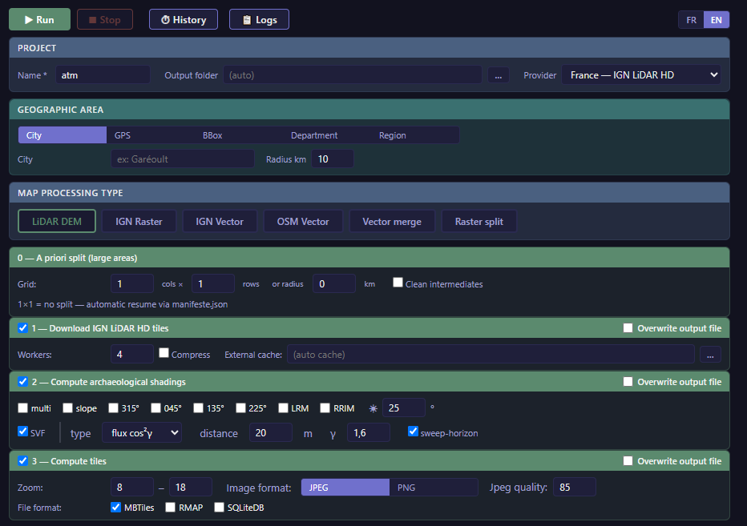 | 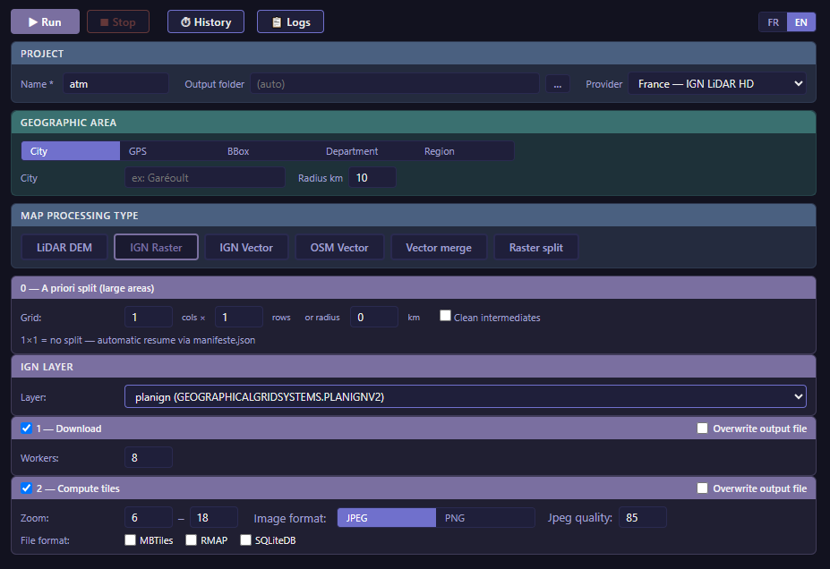 | 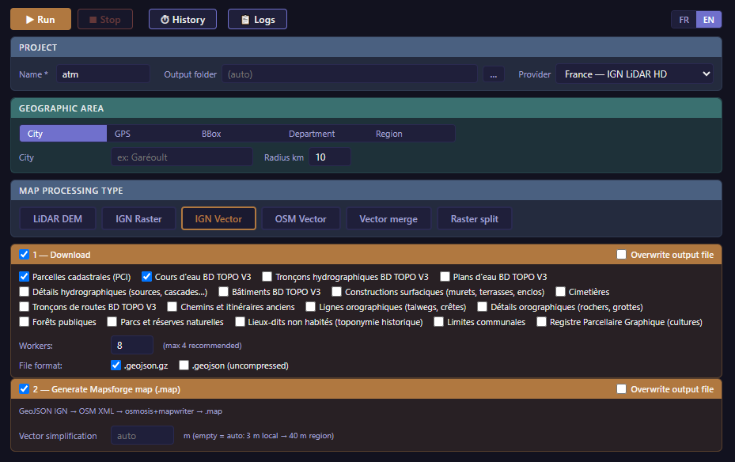 |

| OSM vector (Mapsforge) | Vector merge | Raster splitting |
|---|---|---|
| 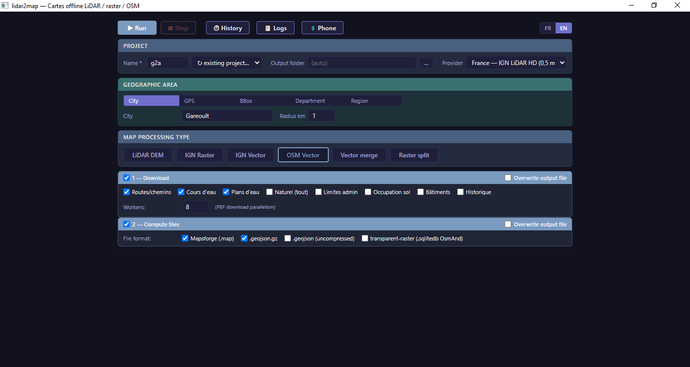 | 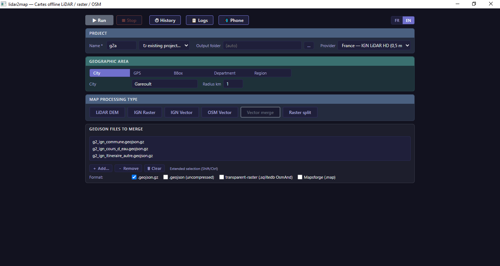 | 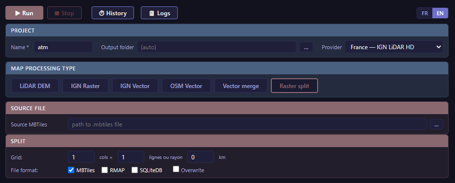 |

Send to phone: the 📲 button serves the generated maps over local WiFi, scan the QR code and "Open with" OsmAnd or Locus.

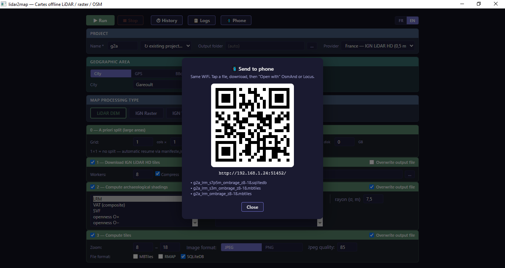

The index sheet dropped next to the deliverables: real department outline and numbered chunk cells (here a Var department VAT run split into 3×4 zones; the slight overlaps are the real shared edge tiles at low zooms).

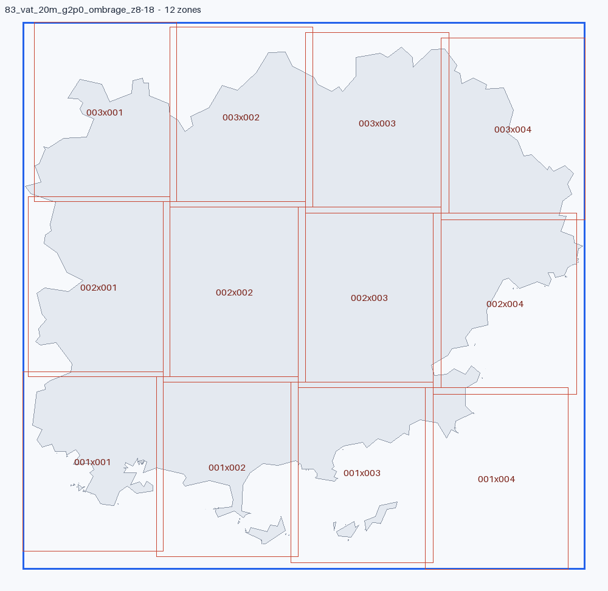

### Rendering in Locus Map

Archaeological LiDAR relief shown as an overlay on the terrain in Locus Map.

| SVF (Sky-View Factor) | Multi-hillshade overlay |
|---|---|
| 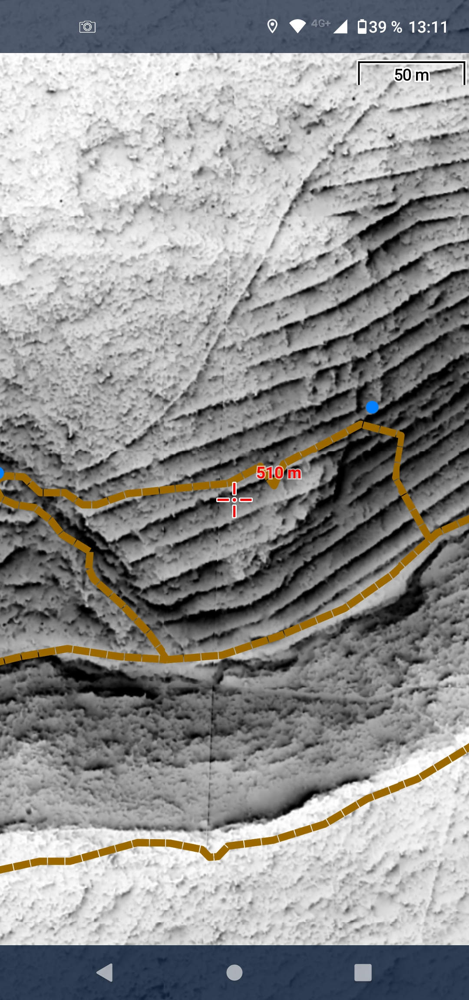 | 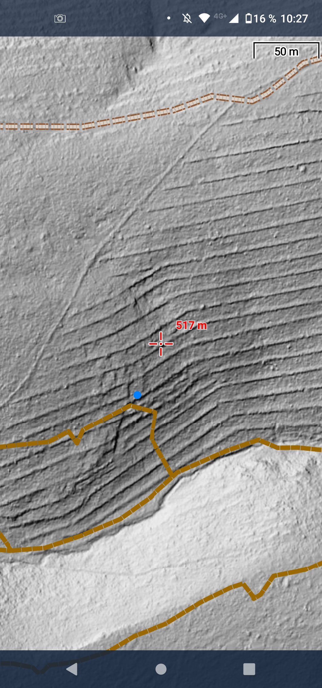 |

### Rendering in OsmAnd

LiDAR relief (LRM) as a semi-transparent Overlay map above the standard
OsmAnd map (Configure map > Overlay map, transparency slider around the
middle).

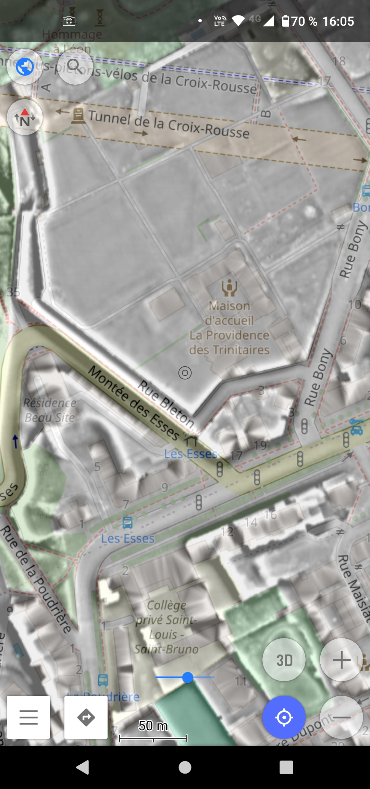

### What SVF reveals, same area, three sources

Under tree cover, the aerial photo and OSM show nothing. The LiDAR SVF makes
the terraces (dry-stone restanques) and old paths appear, invisible from above.

| Satellite photo | OSM | SVF (HD LiDAR) |
|---|---|---|
| 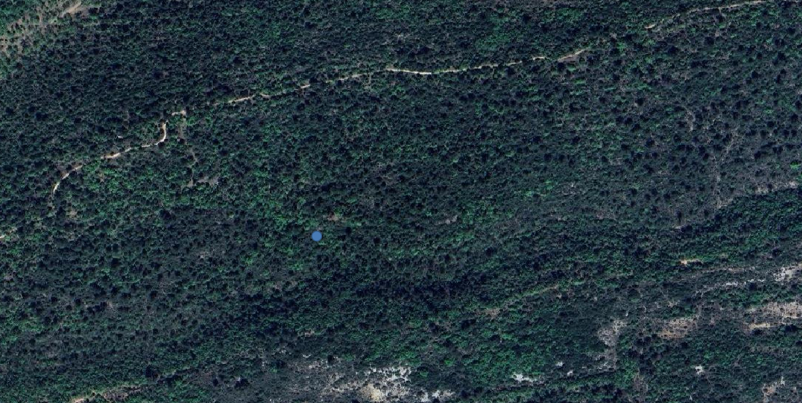 | 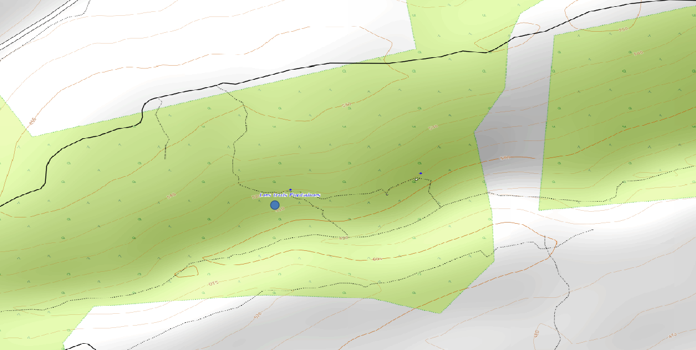 | 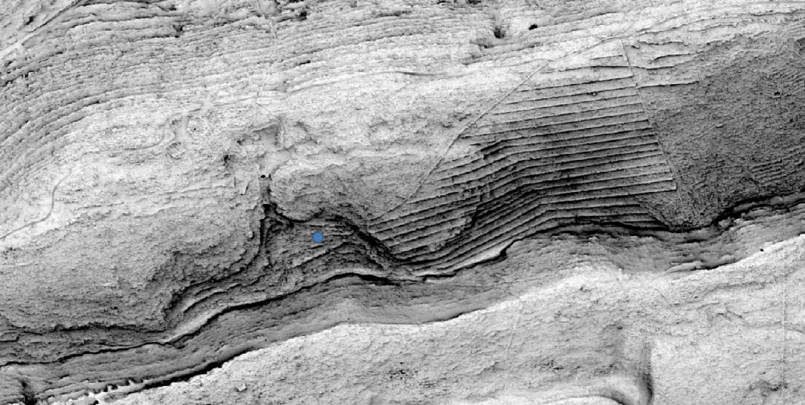 |
| Opaque scrubland | Almost no detail | Crisp terraces + paths |

#### Reproducing this render

The header SVF and the triptych above (Rougiers area, dép. 83, France) were computed with:

```bash
python lidar2map.py \
  --zone-gps <lat> <lon> --zone-radius 1 --zone-name hero \
  --lidar --download --workers 8 \
  --shadings svf --shading-elevation 25 \
  --svf-conv rvt --svf-dist 20 --svf-gamma 0.8 --svf-sweep \
  --file-formats mbtiles --zoom-min 8 --zoom-max 18 \
  --image-format jpeg --image-quality 85```

Replace `<lat> <lon>` with your own area; the SVF parameters above are the ones
used for the visual. The exact coordinates of a micro-relief are deliberately
not published (ethics: do not guide anyone toward a specific site, see the
anti-detecting disclaimer above).

## Documentation

- **User README**: this file
- **Build & deployment**: [BUILD.md](BUILD.md), bundle architecture, per-OS build scripts, updating without rebuild, troubleshooting (including Linux- and macOS-specific cases)
- **Built-in help**: `python lidar2map.py --help` (LiDAR), `--raster --help` (raster), `--vector --help` (vector), `--osm --help`, `--merge --help`

## License

Code distributed under the **GNU General Public License v3.0**, see [LICENSE](LICENSE).

You are free to use, modify and redistribute this software under the terms of the GPL v3. In particular: if you redistribute a modified version, you must provide the modified source code under the same license.

## Author

Designed and architected by **Nicolas Martin** ([@nico579](https://github.com/nico579)). Code developed with the assistance of Claude (Anthropic) as a development tool.

## Acknowledgements

Data used:
- **IGN** (French National Institute of Geographic and Forest Information), LiDAR HD, BD ORTHO (including the historical 1950-1995 versions), BD TOPO, under the Etalab 2.0 license
- **AHN** (Actueel Hoogtebestand Nederland), AHN4/5 0.5m (Netherlands), CC BY 4.0
- **swisstopo** (Swiss Federal Office of Topography), swissALTI3D 0.5m (Switzerland), free open data © swisstopo
- **Kartverket**, Nasjonal Høydemodell 1m (Norway), CC BY 4.0
- **Geobasis NRW · LDBV Bayern · LGLN Niedersachsen · TLBG Thüringen**, DGM 1m (1-2m Thuringia) (Germany, 4 Länder), Datenlizenz Deutschland Namensnennung 2.0
- **Land Tirol** (tiris), DGM 0.5m (Austria, Tyrol), CC BY 4.0
- **Environment Agency** (England) & **DataMapWales / Natural Resources Wales**, LIDAR Composite DTM 1m (UK), Open Government Licence v3
- **Scottish Government / JNCC** (Scottish Remote Sensing Portal), Scottish Public Sector LiDAR DTM 0.5m (Scotland), Open Government Licence v3
- **ACT** (Administration du Cadastre et de la Topographie), BD-L-Lidar 2024 DTM 0.5m (Luxembourg), CC0
- **USGS**, 3DEP / The National Map 1m (USA), public domain
- **GSI** (Geospatial Information Authority of Japan), DEM5A elevation tiles 5m (Japan), GSI content terms
- **Digitaal Vlaanderen**, DHMV II DTM/SVF/Hillshade (Belgium Flanders), Open Data Licentie Vlaanderen
- **Maanmittauslaitos**, Elevation Model 2m (Finland), CC BY 4.0
- **Klimadatastyrelsen / Datafordeler**, DHM DTM 0.4m (Denmark), CC BY
- **Geological Survey Ireland**, LiDAR DTM 1m (Ireland), CC BY 4.0
- **Natural Resources Canada**, HRDEM Mosaic 1m (Canada), Open Government Licence
- **ČÚZK** (Czech Office for Surveying, Mapping and Cadastre), DMR 5G 1m (Czechia), Open Data
- **IGN España / CNIG**, MDT 5m (Spain), CC BY 4.0
- **ICGC** (Institut Cartogràfic i Geològic de Catalunya), MET LiDAR 50cm (Catalonia), CC BY 4.0
- **GUGiK** (Polish Head Office of Geodesy and Cartography), NMT 1m LiDAR ISOK (Poland), open data
- **LINZ** (Land Information New Zealand), 1m DEM (New Zealand), CC BY 4.0
- **QSpatial** (State of Queensland) & **Spatial Services NSW**, 0.5m / 5m DEM (Australia), CC BY 4.0
- **Geoscience Australia**, DEM of Australia derived from LiDAR 5m (Australia, national), CC BY 4.0
- **OpenStreetMap**, vector data under the ODbL license, distributed by Geofabrik
- **Apache JMapsforge / mapsforge-map-writer**, offline vector rendering engine

Bundled tools: GDAL, osmosis, py7zr, pyproj, numpy, scipy, Pillow, ijson, pywebview.
