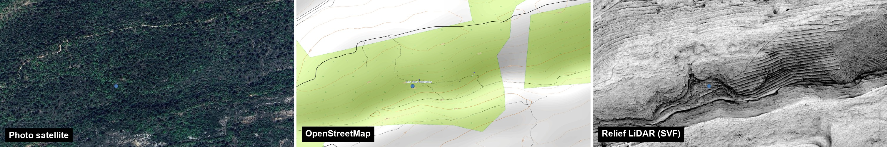
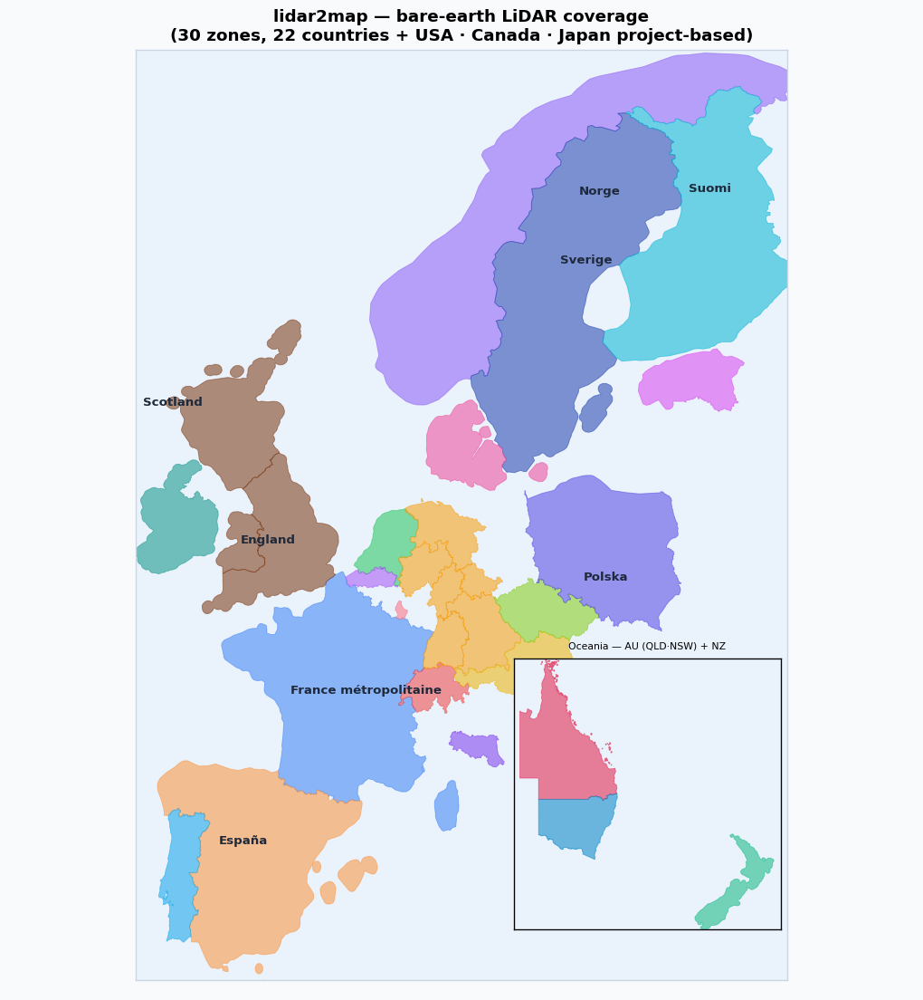

***English** | [Français](README.fr.md)*

# lidar2map

**Turn public LiDAR into field-ready offline relief maps.**

Choose an area. lidar2map retrieves the available elevation data, creates
visualizations that expose subtle terrain, and exports maps for Locus Map,
OsmAnd, TwoNav, or GIS software. The standalone application provides a GUI and
CLI without requiring a Python or GIS toolchain.

lidar2map can make terraces, ditches, hollow ways, banks, and enclosures visible
where aerial imagery and conventional maps show little. It does **not** identify
archaeological sites automatically: it produces terrain visualizations for
human interpretation.



*The aerial image and OpenStreetMap hide most of the micro-relief. Sky-View
Factor computed from the LiDAR reveals terraces and old paths.*

**[Download the latest release](https://github.com/nico579/lidar2map/releases/latest)** ·
**[Create a first map](docs/getting-started.md)** ·
**[Check LiDAR coverage](#lidar-coverage)** ·
**[Browse the documentation](docs/README.md)**

## From an area to a field map

| 1. Choose an area | 2. Reveal the terrain | 3. Take it into the field |
|---|---|---|
| Enter a town, GPS point, WGS84 bounding box, French département, or region. | lidar2map selects a public provider, downloads missing data, and computes one or several relief visualizations. | Export MBTiles, SQLiteDB, RMAP, Mapsforge, or GeoJSON for a phone or GIS application. |

The first data acquisition needs a network connection. Downloaded source data
is cached and valid files are reused; the generated map can then be used
offline in the field.

Typical uses include archaeological and landscape survey, comparison with
historical imagery before traces disappear beneath later land use, offline IGN
mapping for hiking in France, and accurate base maps for caving or exploration
outside the coverage of mainstream applications.

## LiDAR coverage

[](coverage.geojson)

lidar2map provides one workflow over national and regional elevation sources
across many countries. Resolution, exact coverage, credentials, and DFM
availability vary by source. USA and Canada are supported but are not drawn as
full-country polygons because their high-resolution coverage is not wall to
wall.

- [Open the interactive coverage map](coverage.geojson)
- [See every provider, resolution, account, and access constraint](docs/providers.md)
- [Review sources that were evaluated but not integrated](docs/lidar_providers_roadmap.md)

IGN raster and BD TOPO vector workflows remain France-specific. OSM vector
maps can be produced internationally; automatic Geofabrik selection currently
covers France, while another country can be processed from a supplied PBF.

## Quick start

### Graphical interface

1. Download the archive for Windows, Ubuntu, or macOS from
   [Releases](https://github.com/nico579/lidar2map/releases/latest).
2. Extract it and keep the launcher next to `lidar2map_bundle.zip`.
3. Start lidar2map without arguments.
4. Choose a small area, keep **Download missing data** enabled, and run the
   default LRM relief before expanding the area or adding visualizations.

No Python installation is required. The complete per-platform procedure,
first-launch paths, source installation, GUI queue, history, clean stop,
index sheet, and uninstall procedure are in
**[Getting started](docs/getting-started.md)**.


### Command line

A LiDAR job needs an explicit workflow, provider, and geographic area. A town
or GPS point also needs the width of the square to process:

```bash
python lidar2map.py --lidar --provider fr-ign \
  --zone-city Gareoult --zone-width 2
```

On an empty cache, this downloads the missing provider data, computes LRM, and
creates an MBTiles map. Existing valid data is never downloaded again unless
`--download-force` or `--download-overwrite` is requested.

The normal behaviour already reuses every valid cached source and downloads
only what is missing. Use `--no-download` to prohibit source-data downloads and
require a populated cache; missing sources are not fetched. GPS and
bounding-box projects receive a stable automatic name; `--zone-name` remains
available when you want a human-readable one.

See the **[complete CLI reference](docs/cli.md)** for every workflow, default,
parameter interaction, maintenance action, and reproducible example.

## What lidar2map can create

### Archaeology-focused LiDAR relief

Every provider feeds the same processing pipeline. A practical first set is:

| Visualization | Start with it when… |
|---|---|
| **LRM** | You want a fast, readable first view of local anomalies. This is the GUI and CLI default. |
| **SVF** | You are looking for ditches, terraces, enclosures, or hollow ways under vegetation. |
| **Multidirectional hillshade** | You want an intuitive relief whose structures are not tied to one lighting direction. |

Slope, positive/negative openness, RRIM, VAT, e4MSTP, directional hillshades,
parameterized instances, and resolution-aware presets are also available.
Their history, formulas, parameters, diagrams, strengths, limitations, and
comparison method are maintained in **[Choosing LiDAR visualizations](docs/shadings.md)**.

Bare-earth DTMs intentionally remove many standing structures. On providers
that publish dense classified point clouds, the alternative DFM/LAZ workflow
can reintroduce candidate walls using producer classes or a Cloth Simulation
Filter. It is data-heavy, intended for small targeted areas, and still requires
human and field validation. See **[DFM, LAZ, and CSF](docs/dfm.md)**.

### Context maps

- **Classic raster:** IGN Plan, current and historical orthophotos,
  État-Major, Pléiades, and other French layers; USGS NAIP imagery in the USA.
- **Vector:** OSM Mapsforge/GeoJSON, or IGN BD TOPO in France.
- **Transparent vector overlay:** paths, roads, rivers, and other selected
  features rasterized above LiDAR in OsmAnd.
- **Post-processing:** merge neighbouring or complementary GeoJSON exports;
  split an existing MBTiles into a grid or fixed-width cells and convert each
  part independently.

All layers, application constraints, conversion behaviour, and import steps
are in **[Output formats and mobile applications](docs/formats.md)**.

## Put the result on a phone

| Target | Recommended lidar2map output |
|---|---|
| Locus Map / OruxMaps | MBTiles for raster relief; Mapsforge `.map` for vector data |
| OsmAnd | `.sqlitedb` for a raster map or transparent overlay |
| TwoNav / CompeGPS | RMAP |
| QGIS and GIS tools | MBTiles, GeoTIFF intermediates, or GeoJSON |

After a run, the GUI's 📲 button serves the project on the local Wi-Fi network
and displays a QR code. Nothing is uploaded. The CLI equivalent is
`--serve --zone-name PROJECT_NAME`.

Example rendering in Locus and OsmAnd:

<p align="center">
  
  
</p>

## Large jobs, automation, and remote VMs

- Large areas are streamed chunk by chunk instead of being loaded entirely
  into RAM. SVF and openness remain memory-intensive inside each chunk.
- A manifest records completed chunks for clean stop and resume.
- `--split-width`, grid splitting, cleanup, minimum-free-space checks, and
  index sheets keep large deliverables manageable.
- The GUI queue processes several configured areas unattended; one failed job
  does not stop the following jobs.
- lidar2map can prepare an Ubuntu 24.04/26.04 VM, run a headless job
  in an isolated session, monitor it, reconnect, and synchronize results.
- `--block i/M` distributes one geographic area across several VMs.

Stopping local monitoring does not have to stop the VM job. When an exact
remote session is stopped, its files are preserved by default so the job can be
inspected or resumed. Purge is a separate, explicit action and never removes
the shared source cache or production cache.

See **[Remote execution and session management](docs/remote.md)** and the
**[CLI reference](docs/cli.md)**.

## Documentation

| Topic | Canonical page |
|---|---|
| Installation, first map, GUI, queue, history, index sheet | [Getting started](docs/getting-started.md) |
| Every CLI option, default, example, and maintenance action | [CLI reference](docs/cli.md) |
| Relief methods and scientific references | [LiDAR visualizations](docs/shadings.md) |
| DFM/LAZ/CSF and standing structures | [DFM guide](docs/dfm.md) |
| Formats, applications, phone transfer, raster/vector layers | [Formats and applications](docs/formats.md) |
| Countries, coverage, credentials, and provider constraints | [Providers and coverage](docs/providers.md) |
| VM setup, sessions, resume, stop, purge, and multi-VM work | [Remote execution](docs/remote.md) |
| Build, bundle, deployment, and troubleshooting | [BUILD.md](BUILD.md) *(currently in French)* |
| Provider development | [Contributing a provider](docs/contributing-providers.md) |
| Data sources, licences, and acknowledgements | [Data licences](docs/data-licenses.md) |

The [documentation index](docs/README.md) also identifies historical engineering
records so that they are not mistaken for current user instructions.

## Project status and responsible use

lidar2map is an independent project, heavily tested on Windows 10/11. Linux and
macOS are supported by the standalone builds but have received less field
testing; known platform cases are listed in [BUILD.md](BUILD.md). Feedback and
reproducible reports are welcome through
[GitHub issues](https://github.com/nico579/lidar2map/issues).

Use LiDAR and historical imagery responsibly and comply with local heritage,
access, privacy, and data-licence rules. lidar2map is not intended to guide
metal detecting or the publication of sensitive archaeological coordinates.

## Licence, author, and credits

The code is distributed under the **GNU General Public License v3.0**; see
[LICENSE](LICENSE). Modified redistributions must provide their corresponding
source under the same licence.

Designed and architected by **Nicolas Martin**
([@nico579](https://github.com/nico579)). Code developed with the assistance of
Claude (Anthropic) as a development tool.

National mapping agencies, OpenStreetMap/Geofabrik, scientific authors, and
bundled open-source tools are credited with their applicable licences in
**[Data licences and acknowledgements](docs/data-licenses.md)**.
