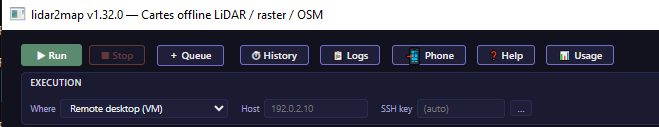
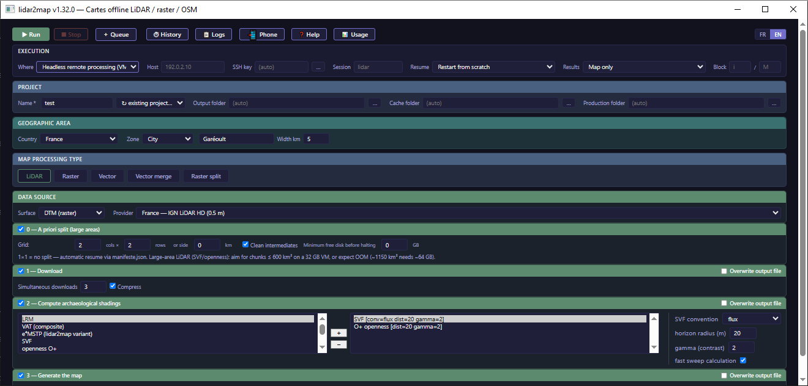

# Exécuter lidar2map sur une VM Ubuntu

*[English](remote.md) | **Français** · [Index de la documentation](../README.fr.md#documentation)*

lidar2map intègre deux modes distants pour les machines virtuelles x86-64 sous
Ubuntu 24.04 LTS ou Ubuntu 26.04 LTS. Ils fonctionnent chez n’importe quel
fournisseur cloud comme sur une VM locale :

- `--remote-gui` prépare un bureau XFCE accessible en RDP et installe
  l’application graphique complète ;
- `--remote-cli` lance un traitement sans bureau dans `tmux`, le surveille et
  synchronise progressivement ses résultats vers l’ordinateur local.

Les commandes utilisent `lidar2map` pour rester lisibles. Utilisez
`lidar2map.exe` sous Windows, `./lidar2map` sous Linux ou
`python lidar2map.py` depuis les sources.

## Commencer par les modes intégrés

Préparer un bureau graphique puis ouvrir le client RDP local :

```bash
lidar2map --remote-gui --ip 192.0.2.10
```

Lancer un traitement sans interface depuis le bundle Linux publié :

```bash
lidar2map --remote-cli --bundle --session paris-lrm \
  root@192.0.2.10 -- \
  --lidar --provider fr-ign --zone-city Paris --zone-width 5 --download \
  --shading lrm:sigma=3 --file-formats mbtiles
```

Tout ce qui suit le séparateur `--` est transmis sans modification à
lidar2map sur la VM. Le contrôleur distant réserve `--output-dir` afin que
chaque session dispose d’un dossier isolé et synchronisable sans ambiguïté.

Aucune archive distante séparée n’est nécessaire : les deux contrôleurs sont
embarqués dans chaque release normale de lidar2map.

| Mode | Quand l’utiliser | Préparation de la VM |
|---|---|---|
| `lidar2map --remote-gui` | Pour utiliser l’interface complète dans un bureau distant | XFCE, xrdp, Xorg, bibliothèques Qt/XCB et lidar2map |
| `lidar2map --remote-cli` | Pour des traitements sans surveillance, reconnectables et synchronisés localement | Uniquement les outils sans interface nécessaires au mode source ou bundle choisi |

## Prérequis communs

La VM doit être neuve ou dans un état cohérent, joignable en SSH et disposer
d’un accès Internet. L’ordinateur Windows, Linux ou macOS doit fournir le
client OpenSSH `ssh`. Le mode graphique utilise aussi `scp` et `ssh-keygen`.

L’authentification peut utiliser le mot de passe administrateur ou une clé
privée. Une clé est recommandée pour éviter les demandes répétées de mot de
passe. La préparation s’exécute avec `root` ou un compte disposant de `sudo`
sans interaction.

N’ouvrir dans le pare-feu que les ports nécessaires :

- TCP 22 pour SSH dans les deux modes ;
- TCP 3389 pour le mode graphique/RDP, de préférence limité à l’adresse IP
  publique de l’ordinateur local.

### Préparer une clé SSH

Le plus simple est d’ajouter la clé publique de l’ordinateur local lors de la
création de la VM. Sur une VM existante, suivre les instructions correspondant
à la plateforme locale.

**Windows.** OpenSSH utilise normalement
`%USERPROFILE%\.ssh\id_ed25519`. La créer si nécessaire :

```powershell
ssh-keygen -t ed25519
```

**WSL.** WSL possède un système de fichiers distinct de l’hôte Windows. Copier
la clé Windows dans le système de fichiers natif WSL ; ne pas faire pointer SSH
directement vers `/mnt/c/...`, dont les permissions NTFS trop ouvertes
déclenchent « UNPROTECTED PRIVATE KEY FILE » :

```bash
mkdir -p ~/.ssh
cp /mnt/c/Users/<utilisateur>/.ssh/id_ed25519     ~/.ssh/id_ed25519
cp /mnt/c/Users/<utilisateur>/.ssh/id_ed25519.pub ~/.ssh/id_ed25519.pub
chmod 600 ~/.ssh/id_ed25519
chmod 644 ~/.ssh/id_ed25519.pub
```

**macOS ou Linux natif.** Sur un ordinateur physiquement distinct, préférer
une nouvelle clé à la copie d’une clé privée entre machines :

```bash
ssh-keygen -t ed25519
ssh-copy-id root@<IP_DE_LA_VM>
```

`ssh-copy-id` fonctionne tant que le mot de passe root est actif et le demande
une fois. S’il est désactivé, ajouter la clé publique depuis un ordinateur déjà
approuvé par la VM :

```bash
ssh root@<IP_DE_LA_VM> "echo '<contenu de id_ed25519.pub>' >> ~/.ssh/authorized_keys"
```

Les clés placées à l’emplacement standard sont détectées automatiquement.
`--identity` ne sert que pour une clé stockée ailleurs.

## Mode graphique : XFCE et RDP

Depuis l’interface locale, sélectionner `Bureau distant (VM)` dans le champ
`Où`, puis indiquer l’hôte et, si nécessaire, une clé SSH particulière :

<p align="center">
  
</p>

*Sélection du bureau distant depuis l’interface locale ; la capture utilise la
traduction anglaise de lidar2map.*

La même opération est disponible directement en CLI :

```bash
lidar2map --remote-gui --ip 192.0.2.10
```

Sans option, le contrôleur demande l’adresse IP de la VM. Les valeurs par
défaut sont :

- administrateur SSH : `root` ;
- compte Linux/RDP créé sur la VM : `userlidar` ;
- mot de passe initial : `userlidar` ;
- clé SSH : clé OpenSSH par défaut de l’ordinateur local.

Toutes les sorties, y compris celles de `ssh`, `scp` et de l’installateur
Ubuntu, sont ajoutées à `rlidar2map_GUI.log` à côté de l’exécutable. Si ce
dossier n’est pas inscriptible, le contrôleur se replie sur le dossier courant
ou temporaire. Sous Windows, la fenêtre reste ouverte après une erreur afin de
lire le diagnostic et l’emplacement du journal.

Le contrôleur retire l’ancienne empreinte SSH de cette IP, accepte la nouvelle,
copie le script de préparation et l’exécute. Il installe XFCE, xrdp, Xorg, les
bibliothèques Qt/XCB, la dernière release lidar2map et un raccourci de bureau
sécurisé. Sous Ubuntu 26.04, il isole aussi les bibliothèques Qt de compatibilité
nécessaires à la saisie clavier.

Le raccourci utilise la notification de démarrage XFCE : après un double-clic,
le pointeur reste occupé jusqu’à l’apparition de la fenêtre Qt ou jusqu’au
délai de sécurité du bureau.

À la fin, le client RDP local s’ouvre automatiquement :

- Windows : Connexion Bureau à distance (`mstsc`) ;
- Linux : FreeRDP, ou Remmina si FreeRDP est absent ;
- macOS : Windows App au moyen d’un fichier `.rdp` généré.

Se connecter initialement avec `userlidar/userlidar`, puis changer le mot de
passe :

```bash
ssh -t userlidar@192.0.2.10 passwd
```

Options avancées :

```text
lidar2map --remote-gui --help
lidar2map --remote-gui --ip 192.0.2.10 --identity ~/.ssh/id_ed25519
lidar2map --remote-gui --ip 192.0.2.10 --ssh-user root --user userlidar
lidar2map --remote-gui --ip 192.0.2.10 --upgrade-system
lidar2map --remote-gui --ip 192.0.2.10 --no-rdp
```

`--upgrade-system` est facultatif. Les listes APT sont toujours actualisées,
mais une mise à niveau complète d’Ubuntu n’est pas nécessaire. `--no-rdp`
prépare la VM sans ouvrir le client RDP local.

Le contrôleur embarque `rlidar2map_GUI_vm.sh`, l’extrait temporairement, impose
les fins de ligne Unix LF même si la release a été construite sous Windows,
puis le copie sur la VM. Rien n’est à télécharger ni à exécuter manuellement.
Le journal APT détaillé reste sur la VM dans
`/var/log/rlidar2map_GUI_apt.log`.

## Mode CLI sans bureau

Depuis l’interface locale, sélectionner `Calcul distant sans bureau (VM)` dans
le champ `Où`. Le formulaire de traitement reste identique ; la ligne
`Exécution` ajoute l’hôte, la clé SSH, la session, la stratégie de reprise, les
résultats à synchroniser et l’éventuel bloc `i/M` :

<p align="center">
  
</p>

*Configuration d’un traitement distant sans bureau ; la capture utilise la
traduction anglaise de lidar2map.*

Le mode CLI n’installe ni XFCE ni xrdp et ne nécessite pas le port 3389. Au
premier lancement, il installe uniquement les paquets APT manquants : `tmux`
et, selon le mode, `git`, `python3`, `python3-venv`, `curl` ou `rsync`. Il lance
`apt-get update`, jamais une mise à niveau complète d’Ubuntu.

### Bundle ou sources

- `--bundle` télécharge et utilise le bundle Linux x86-64 publié ;
- `--source` clone ou actualise le dépôt source et prépare son environnement
  Python. C’est le mode par défaut.

Le dépôt source, l’environnement virtuel, le runtime du bundle, `cache/` et
`production/` sont des ressources partagées sur la VM. L’état, le journal et
les résultats de chaque traitement sont isolés par session.

### Sessions et identifiants de run

La VM conserve l’état sous `~/.lidar2map-runs/<session>`. Même si la session par
défaut s’appelle `lidar`, utilisez un `--session` explicite et descriptif pour
chaque traitement. Plusieurs traitements concurrents sur une même VM doivent
avoir des noms de session différents.

Chaque lancement reçoit aussi un `run-id` unique. Les résultats sont copiés
localement sous :

```text
vm-results/<hôte>/<session>/<run-id>/
```

`--local-dir` change cette racine locale. Le `--output-dir` injecté par le
contrôleur isole les résultats et journaux distants. Réutiliser une session
existante ne lance jamais implicitement un second traitement.

### Surveillance, détachement, reconnexion et synchronisation ponctuelle

La surveillance continue est le comportement par défaut. Toutes les 30
secondes, le contrôleur lit l’état atomique distant, affiche la progression du
journal et synchronise les fichiers publiés. À l’état terminal, il effectue la
dernière synchronisation et transmet le vrai code de sortie. L’état, le code et
les horodatages publiés par le wrapper `tmux` font foi ; le succès n’est jamais
déduit du texte du journal. Une fin normale, un crash ou la disparition de
`tmux` sont signalés.

Fermez le moniteur local sans arrêter le traitement avec `Ctrl+C` puis répondez
**Non** à la question d’arrêt, ou lancez dès le départ en mode détaché :

```bash
lidar2map --remote-cli --bundle --detach --session paris-lrm \
  root@192.0.2.10 -- \
  --lidar --provider fr-ign --zone-city Paris --zone-width 5 --download \
  --shading lrm:sigma=3 --file-formats mbtiles
```

Reconnectez-vous sans répéter les arguments lidar2map :

```bash
lidar2map --remote-cli --session paris-lrm root@192.0.2.10
```

Le traitement existant est surveillé et synchronisé ; aucun second calcul
n’est créé. `tmux` conserve l’état terminal après la fermeture du moniteur :
une reconnexion ultérieure effectue la copie finale en attente. Le contrôleur
affiche aussi une commande `tmux attach` pour le diagnostic interactif.

`--once` effectue un contrôle et une synchronisation, puis rend la main :

```bash
lidar2map --remote-cli --once --session paris-lrm root@192.0.2.10
```

`--interval SECONDES` change la cadence de 30 secondes.
`--max-ssh-errors` modifie la tolérance par défaut de trois erreurs SSH ou de
surveillance locale consécutives. `--no-bell` coupe le bip terminal de fin ou
d’erreur.

### Détails de synchronisation et `--sync-only`

Avec `--sync-method auto`, rsync est préféré lorsqu’il est disponible des deux
côtés. Sinon, le client utilise un flux SSH incrémental (`ssh` et `scp`
sélectionnent ce même repli), avec vérification SHA-256 et publication locale
atomique.

Les fichiers et dossiers `.part` ainsi que les auxiliaires SQLite sont ignorés.
Pendant un traitement actif, le repli exige deux inventaires identiques avant
le transfert. Les intermédiaires `.vrt` purs ne sont jamais copiés. Le journal
complet est copié atomiquement une seule fois lorsque le run devient terminal.

`--sync-only` limite les catégories rapatriées :

| Valeur | Fichiers copiés |
|---|---|
| `ombrages` | GeoTIFF intermédiaires d’ombrage (`.tif`) |
| `carte` | Cartes tuilées (`.mbtiles`, `.rmap`, `.sqlitedb`) |
| `tout` | Tous les types de résultats publiés ; valeur par défaut |

Exemple :

```bash
lidar2map --remote-cli --session paris-lrm --sync-only carte \
  root@192.0.2.10
```

`--sync-method` accepte `auto`, `rsync`, `ssh` ou `scp`. Avec le repli, chaque
fichier est contrôlé par SHA-256 avant de remplacer sa destination locale.

### Reprise ou redémarrage

Une session terminée n’est jamais relancée implicitement.

- `--resume` relance les **mêmes arguments lidar2map dans le même run**, sans
  archiver ni supprimer ses résultats. Le `run-id` ne change pas. Les dalles
  déjà téléchargées restent en cache ; seules les données absentes ou en
  erreur doivent être retéléchargées. Cette option convient après un incident
  réseau ponctuel et ne s’applique qu’à une session terminale, jamais active.
- `--restart` archive l’état terminal et ses résultats, crée un nouveau run et
  utilise les arguments fournis après `--`. Il convient à un vrai changement
  de paramètres.

Répéter les arguments d’origine pour `--resume`. Le contrôleur exige une liste
d’arguments, mais ne la compare pas automatiquement avec celle du run
précédent : recopier la commande de reprise affichée plutôt que la reconstituer
de mémoire :

```bash
lidar2map --remote-cli --bundle --resume --session paris-lrm \
  root@192.0.2.10 -- \
  --lidar --provider fr-ign --zone-city Paris --zone-width 5 --download \
  --shading lrm:sigma=3 --file-formats mbtiles
```

Redémarrer avec de nouveaux paramètres :

```bash
lidar2map --remote-cli --bundle --restart --session paris-lrm \
  root@192.0.2.10 -- \
  --lidar --provider fr-ign --zone-city Paris --zone-width 5 --download \
  --shading svf:dist=20,gamma=2 --file-formats mbtiles
```

### Ctrl+C, arrêt ciblé et conservation des fichiers

Pendant la surveillance continue, `Ctrl+C` pose deux questions indépendantes :

1. arrêter ou non le processus appartenant à cette session exacte sur la VM ;
2. après l’arrêt, purger ou non les fichiers distants de cette session.

Répondre **Non** à la première question arrête uniquement le moniteur local :
le traitement `tmux` distant continue. Répondre **Non** à la purge conserve
son état, son journal, ses résultats et le cache partagé pour une reconnexion
ou un futur `--resume`.

Pour arrêter sans interaction une seule session sans toucher aux traitements
concurrents :

```bash
lidar2map --remote-cli --session paris-lrm --stop root@192.0.2.10
```

`--stop` envoie Ctrl+C à cette session afin que lidar2map ferme proprement son
manifeste, ses fichiers `.part` et ses bases SQLite. Après un délai de grâce de
15 secondes, il tue uniquement l’arbre des descendants de ce panneau et sa
session `tmux` si nécessaire. Pendant le provisioning, il termine de la même
façon uniquement les descendants du bootstrap de cette session. Si le runner
ne peut pas publier lui-même son résultat, l’état terminal est enregistré avec
le code 130. `--stop` ne purge aucun fichier et n’accepte aucun argument
lidar2map.

### Purge distante sûre

La commande de purge explicite recommandée est :

```bash
lidar2map --remote-cli --session paris-lrm --purge-remote root@192.0.2.10
```

Elle n’est acceptée que si le run est terminal et qu’aucune session `tmux` ne
reste active. Elle :

1. effectue une dernière synchronisation locale ;
2. annule la suppression si cette synchronisation est incomplète ;
3. mémorise la `session` et le `run-id` exacts qui ont été copiés ;
4. vérifie immédiatement avant la suppression que la cible distante possède
   toujours ce même `run-id` ;
5. supprime uniquement l’état, le journal et les résultats isolés de ce run.

Si un autre run l’a remplacé entre la copie et la purge, aucun nouveau run ni
aucune archive n’est supprimé. L’opération est récupérable et idempotente si la
réponse SSH de purge se perd. La copie locale complète reste dans `vm-results`.

Les dossiers partagés `cache/`, `production/`, le dépôt source,
l’environnement virtuel et le runtime du bundle ne sont jamais supprimés. Ils
restent disponibles pour un autre traitement ou un futur `--resume`.

La dernière synchronisation respecte `--sync-only`. Sa valeur par défaut,
`tout`, conserve tous les types de résultats publiés avant la suppression ; ne
choisir aucune catégorie plus étroite si la copie locale doit être une
sauvegarde complète.

La purge immédiate proposée après Ctrl+C avertit explicitement que des
résultats non synchronisés peuvent être perdus. Pour garantir la dernière
synchronisation, répondre **Non** à cette purge puis utiliser la commande
explicite `--purge-remote` ci-dessus.

### Résumé des options du contrôleur

| Option | Défaut / rôle |
|---|---|
| `VM` | Cible SSH obligatoire : `utilisateur@hôte`, IP ou alias `~/.ssh/config` |
| `--source` / `--bundle` | Le dépôt source est le défaut ; options mutuellement exclusives |
| `-s`, `--session NOM` | Identité persistante `tmux`/run ; défaut `lidar`, nom explicite vivement conseillé |
| `--local-dir DOSSIER` | Change la racine locale `vm-results` |
| `--interval SECONDES` | Intervalle surveillance/synchronisation, défaut 30 |
| `--sync-method MÉTHODE` | `auto`, `rsync`, `ssh` ou `scp` ; auto préfère rsync |
| `--sync-only CATÉGORIE` | `ombrages`, `carte` ou `tout` |
| `--identity FICHIER` | Clé privée SSH ; sinon la configuration et l’agent OpenSSH normaux s’appliquent |
| `--ssh-timeout SECONDES` | Délai maximal par commande, défaut 10 |
| `--ssh-option KEY=VALUE` | Option OpenSSH supplémentaire répétable |
| `--reset-host-key` | Force le retrait préventif de l’ancienne clé `known_hosts` ; normalement un changement détecté est réparé automatiquement |
| `--max-ssh-errors N` | Erreurs consécutives tolérées, défaut 3 |
| `--no-bell` | Coupe le bip terminal |
| `--detach` | Lance ou retrouve le run, synchronise et rend la main sans surveillance continue |
| `--once` | Un contrôle et une synchronisation |
| `--resume` | Relance une session terminale en place avec les mêmes arguments/résultats |
| `--restart` | Archive un run terminal, puis en crée un nouveau avec les arguments fournis |
| `--stop` | Arrête uniquement cette session, proprement puis de force si nécessaire |
| `--purge-remote` | Synchronise une dernière fois et supprime uniquement le run terminal vérifié |

`--restart`, `--resume`, `--stop` et `--purge-remote` sont mutuellement
exclusifs. `--detach` et `--once` sont mutuellement exclusifs et aucun des deux
n’est accepté avec `--stop` ou `--purge-remote`. Les arguments lidar2map sont
obligatoires pour créer, reprendre ou redémarrer un run et doivent être omis
lors d’une reconnexion, d’un arrêt ou d’une purge. Placer les options du
contrôleur avant la cible VM et les arguments lidar2map après `--`.

Une clé inconnue est acceptée à la première connexion. Si OpenSSH signale
qu'une clé mémorisée a changé après réinstallation de la VM ou recyclage de
l'adresse IP, le contrôleur retire automatiquement et uniquement l'entrée
`known_hosts` obsolète de cette cible, accepte la nouvelle clé et réessaie une
fois. Cela vaut pour le lancement, la surveillance et l'arrêt ciblé ; le
provisionneur graphique RDP renouvelle lui aussi l'entrée de la cible.

`--reset-host-key` reste disponible pour forcer ce nettoyage préventivement,
avant même qu'OpenSSH ne signale une erreur :

```bash
lidar2map --remote-cli --reset-host-key --bundle --session paris-lrm \
  root@192.0.2.10 -- \
  --lidar --provider fr-ign --zone-city Paris --zone-width 5
```

## Répartir une zone sur plusieurs VM

`--block i/M`, transmis à lidar2map après `--`, sélectionne le bloc
géographique `i` parmi `M` blocs sans recouvrement. Utiliser une session
explicite pour chaque traitement :

```bash
lidar2map --remote-cli --bundle --session var-bloc-1 root@vm1 -- \
  --lidar --provider fr-ign --laz --zone-department 83 --block 1/3 --download \
  --split-width 5 --cleanup --min-free-gb 20 \
  --shading lrm:sigma=4 --file-formats mbtiles

lidar2map --remote-cli --bundle --session var-bloc-2 root@vm2 -- \
  --lidar --provider fr-ign --laz --zone-department 83 --block 2/3 --download \
  --split-width 5 --cleanup --min-free-gb 20 \
  --shading lrm:sigma=4 --file-formats mbtiles

lidar2map --remote-cli --bundle --session var-bloc-3 root@vm3 -- \
  --lidar --provider fr-ign --laz --zone-department 83 --block 3/3 --download \
  --split-width 5 --cleanup --min-free-gb 20 \
  --shading lrm:sigma=4 --file-formats mbtiles
```

Chaque machine traite son bloc et synchronise sous `vm-results/`. `--block` se
combine avec `--split-width` : chaque machine peut redécouper son propre bloc
pour limiter disque et mémoire. Des IP publiques distinctes permettent aussi
de multiplier le débit lorsqu’un portail national limite les téléchargements
par adresse.

## RAM et taille des morceaux

Sur une grande zone `--lidar`, le pic mémoire des ombrages, surtout SVF et
openness, suit approximativement la surface du morceau après découpage. Le vrai
facteur causal est toutefois la densité de tuiles sources dans le VRT de ce
morceau, pas sa seule surface.

Sur un département découpé en grille 3×3 d’environ 1 150 km² par morceau, seuls
les deux VRT référençant plus de 1 200 tuiles LiDAR ont crashé vers 31 Go de RSS
sur une VM de 32 Go. Les morceaux de 100 à 700 tuiles sont passés. Deux crashs
indépendants ont atteint le même RSS à 23 Mo près après des nombres différents
de morceaux terminés, ce qui exclut une fuite d’un morceau à l’autre. La
surface reste un proxy utile, mais deux morceaux de même taille peuvent
diverger avec la densité de couverture LiDAR. VAT/e4MSTP, qui fusionne SVF et
openness en un passage, tolère mieux le même découpage. Ces repères sont
empiriques, pas des garanties :

| RAM de la VM | Taille de morceau visée |
|---|---|
| 32 Go | Au plus environ 600 km² ; par exemple un département en 4×4 |
| 64 Go | Environ 1 150 km² ; le 3×3 par défaut passe généralement |

Un découpage plus fin coûte du temps par répétition des passes TMS, VRT,
percentiles et coutures. C’est un compromis, pas un réglage à maximiser
automatiquement.

Le contrôleur distant crée automatiquement, au lancement ou à la reconnexion,
un swapfile dédié d’une taille proche de la RAM. Le swap n’accélère pas un
morceau trop dense, mais transforme un kill OOM et la perte depuis le dernier
morceau terminé en ralentissement susceptible d’aller au bout. Le tableau
reste utile pour éviter ce ralentissement.

## Entrées source et standalone pour le développement

Les modes intégrés sont recommandés. Les clients sous-jacents peuvent toujours
être exécutés depuis le dépôt source pour le développement ; ils demandent
Python 3.8 ou plus récent :

```bash
python tools/rlidar2map_GUI.py --ip 192.0.2.10
python tools/rlidar2map_CLI.py --bundle --session paris-lrm \
  root@192.0.2.10 -- --lidar --provider fr-ign --zone-city Paris --zone-width 5
```

Les binaires de développement dédiés `rlidar2map_GUI` et `rlidar2map_CLI`
acceptent les mêmes options. Remplacer ce préfixe par
`lidar2map --remote-gui` ou `lidar2map --remote-cli` avec une release normale.

## Architecture de build et de release

`rlidar2map_CLI.py` et `rlidar2map_GUI.py` sont importés par `lidar2map.py`. Le
dispatch `--remote-cli` / `--remote-gui` intervient avant le bootstrap et les
imports lourds. Ils sont embarqués par les mêmes fichiers
`lidar2map_win.spec` et `lidar2map_mac.spec` que lidar2map ; ce dernier est
réutilisé sous Linux.

La matrice `.github/workflows/release.yml` ne construit donc qu’un exécutable
par OS/architecture et l’exécution distante est incluse dans chaque archive
`lidar2map-<os>-<arch>.<zip|tar.gz>`.

Les fichiers dédiés `tools/rlidar2map_CLI.spec` et
`tools/rlidar2map_GUI.spec` restent disponibles pour les builds standalone de
développement, mais le workflow de release ne les invoque plus.
`lidar2map_icon.png` est intégré à l’exécutable Windows et macOS et installé sur
le raccourci XFCE. Chaque page de release publie la somme SHA-256 de chaque
archive.

---

[Index de la documentation](../README.fr.md#documentation) · [Bien démarrer](getting-started.fr.md)
