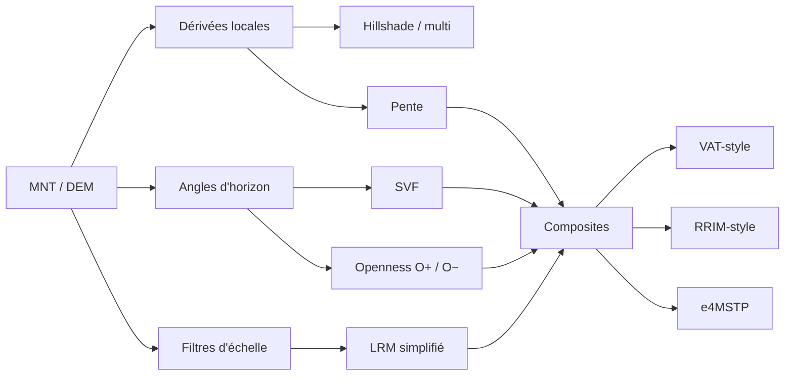
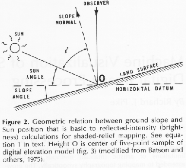
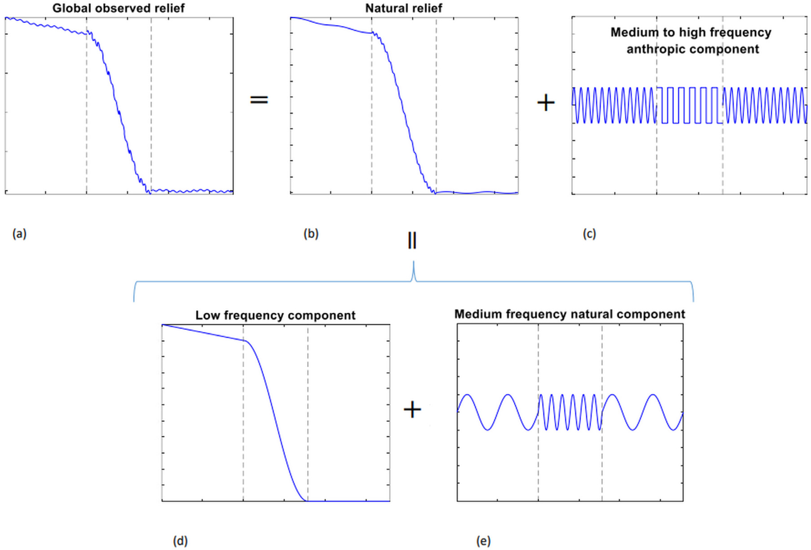
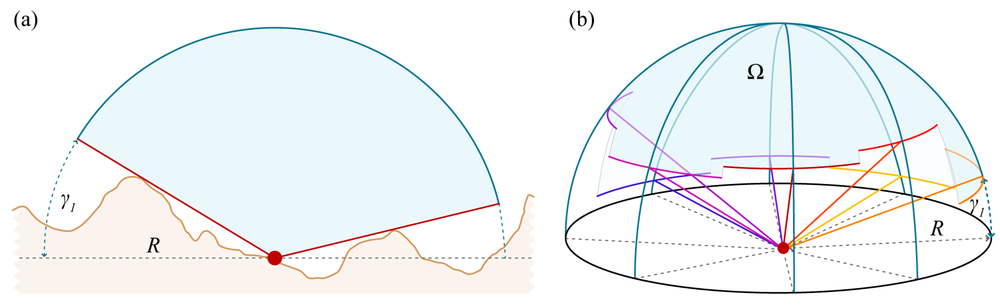
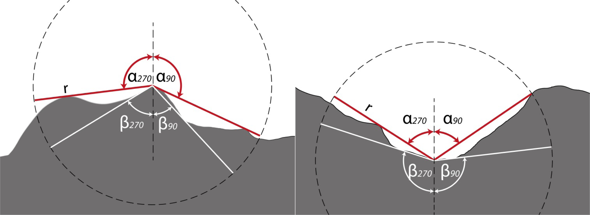
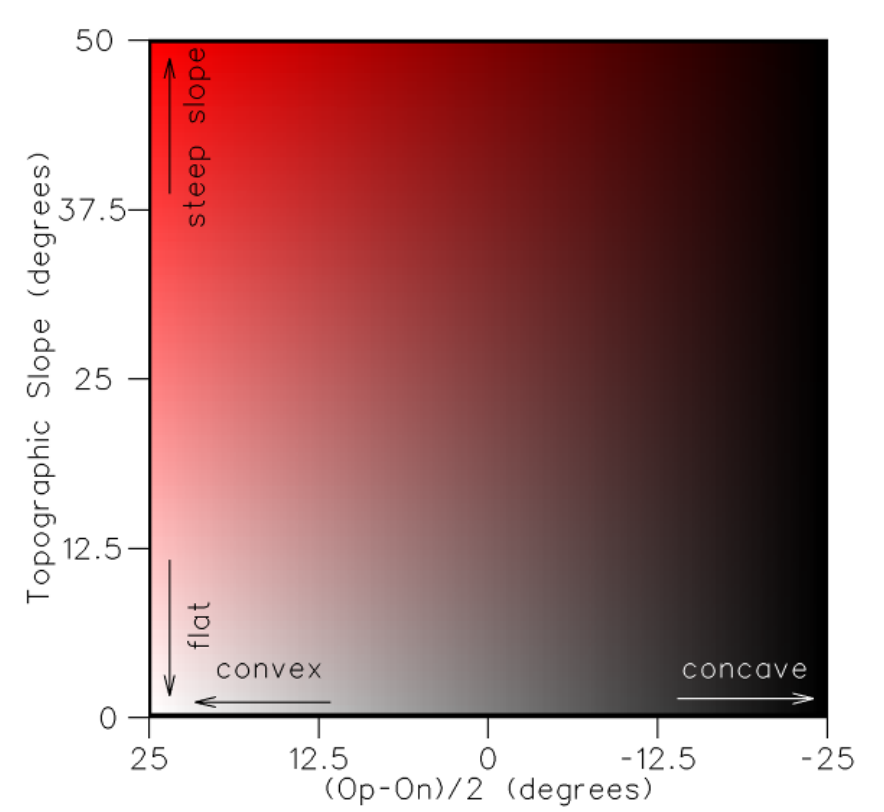
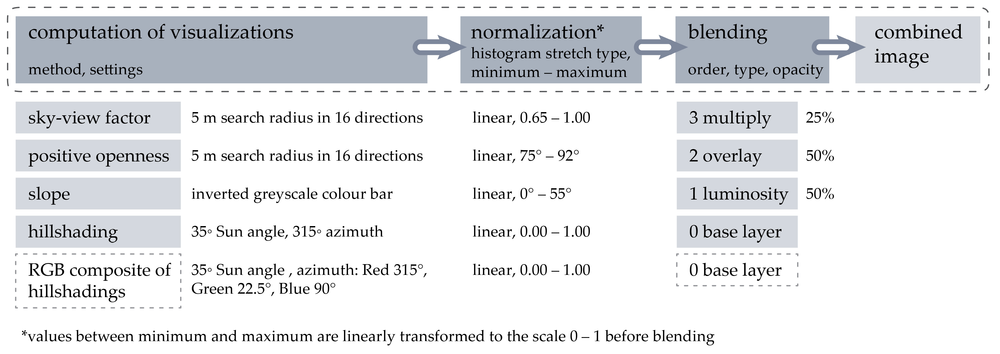
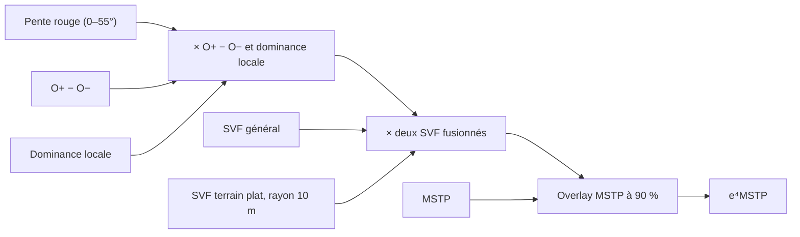
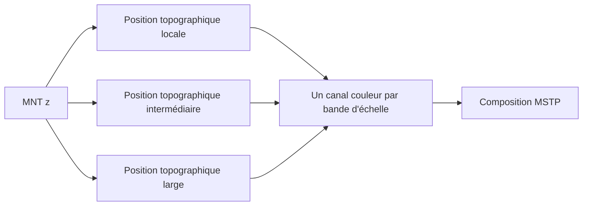

# Choisir et comprendre les ombrages LiDAR

*[English version](shadings.md) | **Français***

Le nuage de points LiDAR contient déjà le relief en trois dimensions : chaque
retour possède des coordonnées $(x,y,z)$. Pour cartographier le terrain, les
points classés « sol » sont interpolés en un **modèle numérique de terrain
(MNT)**, une grille où chaque pixel conserve une altitude. Sur une carte plane,
ce nombre ne rend toutefois pas spontanément visibles la forme d'un talus, le
signe d'un fossé ou un microrelief de quelques décimètres.

Les « ombrages » de lidar2map sont donc, au sens large, des **encodages visuels
2D de la géométrie du MNT**. Ils transforment l'altitude ou ses relations avec
le voisinage — pente et aspect, écart au relief de fond, angles d'horizon,
fraction de ciel visible, convexité et concavité — en luminance ou en couleur.
Ils ne recréent pas une 3D perdue et ne modifient pas le MNT : ils rendent ses
formes perceptibles et sélectionnent les échelles ou propriétés à mettre en
évidence. Seuls le hillshade et le multidirectionnel simulent réellement un
éclairage ; LRM, pente, SVF et openness sont d'autres visualisations
géométriques.


Un visualiseur 3D peut bien sûr afficher directement le nuage ou le MNT, et
l'altitude peut aussi être représentée par des courbes de niveau ou des teintes
hypsométriques. Les rasters 2D restent néanmoins pratiques pour comparer les
méthodes, superposer le résultat à d'autres cartes et l'utiliser hors ligne sur
un téléphone ; leurs dérivées locales sont particulièrement efficaces pour
repérer les faibles reliefs sous couvert forestier.

Les visualisations de relief ne montrent pas toutes la même chose. Une trace qui
ressort fortement dans un LRM peut disparaître dans un hillshade, et une forme
claire dans l'openness positif peut être ambiguë tant que l'openness négatif n'a
pas été consulté. Il n'existe donc pas d'ombrage universel.

Les paramètres d'échelle et de distance doivent être adaptés à la taille des
formes recherchées et à la résolution du MNT. Pour le LRM, une valeur explicite
de `sigma` est exprimée en mètres et sa valeur en pixels est :

$$
\sigma_{px}=\frac{\sigma_m}{\rho}
$$

$\rho$ est la résolution du MNT en mètres par pixel. Une petite valeur accentue
les détails fins, mais aussi le bruit, les traces de
traitement du MNT et les objets modernes. La GUI permet d'ajouter plusieurs
instances d'un même rendu afin de comparer différentes échelles.

## Vue d'ensemble



| Rendu lidar2map — nom développé | À regarder en priorité | Avantages | Limites principales |
|---|---|---|---|
| `lrm` — **Local Relief Model**<br>ici **SLRM**, *Simple Local Relief Model* | murs bas, fossés étroits, plateformes, microrelief | très lisible, sans direction solaire, rapide | échelle unique ; enlève le contexte général ; petit σ = bruit et halos |
| `vat` — **Visualization for Archaeological Topography**<br>variante VAT-style de lidar2map | lecture composite générale | creux, bosses et ruptures dans une image | composite plus difficile à interpréter ; plus lent que LRM |
| `opos` (O+) — **positive openness**<br>ouverture positive | tertres, crêtes, levées, bords hauts | aucune direction d'éclairage ; excellent pour les convexités | renseigne peu sur les creux ; dépend fortement du rayon |
| `oneg` (O−) — **negative openness**<br>ouverture négative | fossés, chemins creux, cuvettes, bords bas | complément direct de O+ | renseigne peu sur les bosses ; rendu naturellement granuleux |
| `svf` — **Sky-View Factor**<br>facteur de vue du ciel | fossés, murs et formes sur pente | peu de biais directionnel ; conserve une bonne sensation du relief | calcul plus lourd ; sensible au rayon, au stretch et au bruit sur terrain plat |
| `multi` — **multidirectional hillshade**<br>ombrage multidirectionnel | lecture générale familière | rapide, intuitif, moins biaisé qu'un seul azimut | reste une simulation d'éclairage ; certaines formes restent masquées |
| `315` `045` `135` `225` — **hillshades directionnels**<br>azimuts de la lumière | vérification d'une structure orientée | très efficace quand le soleil est perpendiculaire à la trace | biais d'azimut fort ; toujours comparer plusieurs directions |
| `slope` — **pente**<br>angle local du terrain | talus, escarpements et ruptures de pente | rapide, indépendant de l'azimut | ne distingue ni montée/descente, ni bosse/creux ; sensible au bruit |
| `rrim` — **Red Relief Image Map**<br>carte de relief rouge | lecture couleur pente + relief local | combine rupture de pente et anomalie locale | implémentation lidar2map différente du RRIM académique ; code couleur à apprendre |
| `e4mstp` — **e⁴MSTP**<br>**Multiscale Topographic Position — enhanced version 4** | exploration multi-échelle d'une petite zone | rassemble beaucoup d'indices dans une image couleur | très lourd ; code couleur à apprendre ; variante lidar2map non identique au preset RVT |

## Paramètres dans lidar2map

### Champs affichés par l'interface

Chaque clic sur **+** crée une instance avec ses propres paramètres. On peut
donc ajouter deux fois le même type, par exemple un SVF local et un SVF de plus
grande portée. Les clés entre parenthèses sont celles de la CLI répétable
`--shading TYPE:cle=valeur,...`.

| Sortie | Paramètres affichés | Valeurs initiales | Plage proposée dans la GUI |
|---|---|---|---|
| `lrm` | lissage (`sigma`, m) | 15 pixels natifs, convertis en mètres | 1–100 m, pas 0,5 m ; le champ peut être vidé pour revenir à l'auto |
| `vat` | rayon d'horizon (`dist`), gamma final (`gamma`) | 20 m ; 2,0 | 10–200 m, pas 5 m ; 0,3–3, pas 0,1 |
| `e4mstp` | rayon d'horizon (`dist`), gamma final (`gamma`) | 20 m ; 0,8 | mêmes plages que VAT |
| `svf` | convention (`conv`), rayon (`dist`), gamma (`gamma`), calcul rapide (`sweep`) | `flux` ; 20 m ; 2,0 ; activé | `flux` ou `rvt` ; 10–200 m ; 0,3–3 ; activé/désactivé |
| `opos` | rayon (`dist`), gamma (`gamma`) | 20 m ; 2,0 | 10–200 m ; 0,3–3 |
| `oneg` | rayon (`dist`), gamma miroir (`gamma`) | 20 m ; 2,0 | 10–200 m ; 0,3–3 |
| `rrim` | lissage (`sigma`, m) | 15 pixels natifs, convertis en mètres | 1–100 m, pas 0,5 m ; auto si le champ est vidé |
| `multi`, `315`, `045`, `135`, `225` | hauteur du soleil (`elevation`) | 25° | 5–60°, pas 1° |
| `slope` | aucun | — | — |

Ces bornes sont les **plages proposées par l'interface**, pas la définition
mathématique des méthodes. `dist` et `sigma` sont saisis en mètres puis arrondis
au pixel du MNT le plus proche. `gamma`, en revanche, ne change pas la géométrie
calculée : il règle seulement la luminance après l'étirement des valeurs.

### LRM et RRIM : `sigma`

`sigma` est l'**écart-type du lissage gaussien**, et non le rayon exact d'un
objet. Sa valeur automatique est 15 pixels natifs : 7,5 m sur un MNT à
0,5 m/pixel, 15 m sur un MNT à 1 m/pixel.

- Dans `lrm`, un petit `sigma` ne conserve que les écarts très locaux : détails
  fins, mais aussi bruit et petits halos. Un grand `sigma` laisse apparaître des
  structures plus larges, avec davantage de relief naturel de fond.
- Dans `rrim`, `sigma` ne modifie que la composante SLRM claire/foncée placée
  dans les canaux vert et bleu. Le rouge, commandé par la pente, ne change pas.
- L'étirement du LRM entre ses percentiles 5 et 95 rend le contraste relatif à
  la zone calculée. Comparer deux instances sur la même emprise est donc plus
  fiable que comparer leurs niveaux de gris entre deux projets différents.

### SVF : `conv`, `dist`, `gamma` et `sweep`

- `conv=flux` utilise la convention $\cos^2\gamma_k$ ; c'est le défaut de
  lidar2map. `conv=rvt` utilise $1-\sin\gamma_k$, convention du **Relief
  Visualization Toolbox**. Ce choix change la formule, pas la qualité du
  calcul.
- `dist` est la distance maximale jusqu'à laquelle l'horizon est recherché dans
  16 directions. Une petite valeur privilégie les murs et fossés proches et
  calcule plus vite ; une grande valeur inclut enceintes, voiries et relief plus
  éloigné, mais coûte nettement plus de temps.
- `gamma` est appliqué après l'étirement percentile :
  $I=I_0^\gamma$. En dessous de 1, l'image s'éclaircit ; à 1, elle reste
  linéaire ; au-dessus de 1, les tons intermédiaires s'assombrissent.
- `sweep` activé choisit l'algorithme d'horizon accéléré. Il conserve la même
  formule et le même rayon, mais peut produire un léger aliasing. Le désactiver
  utilise le calcul de référence, plus précis et plus lent.

### Openness O+ et O− : `dist` et `gamma`

`dist` est ici encore le rayon maximal de recherche de l'horizon. Petit rayon :
convexités ou concavités locales ; grand rayon : formes topographiques plus
larges. Il ne s'agit ni d'un flou ni de la résolution de sortie.

Pour `opos`, le gamma ordinaire $I=I_0^\gamma$ suit la règle du SVF. Pour
`oneg`, lidar2map emploie un **gamma miroir** :

$$
I=1-(1-I_0)^\gamma
$$

Avec O−, augmenter `gamma` pousse donc le fond vers le blanc tout en gardant les
creux profonds sombres ; cela augmente leur séparation visuelle sans assombrir
toute l'image. O+ et O− utilisent toujours le calcul d'horizon de référence :
le paramètre `sweep` ne leur est pas proposé.

### VAT et e4MSTP : portée exacte de `dist` et `gamma`

- Dans `vat`, `dist` règle le rayon du SVF `flux` et de l'openness positif
  internes ; il ne change pas la pente. Les composants sont fusionnés sans
  gamma, puis `gamma` est appliqué une seule fois au composite final. Une valeur
  supérieure à 1 l'assombrit, une valeur inférieure à 1 l'éclaircit.
- Dans `e4mstp`, `dist` ne règle que le SVF et les openness O+/O− internes. Il ne
  change ni les deux SLRM fixes ($\sigma=1{,}5$ m et 8 m), ni les bandes MSTP
  internes (1,5–5 m, 12–27 m et 55–100 m), ni la pente. `gamma` agit seulement
  sur la couleur finale ; son défaut 0,8 éclaircit légèrement le composite.

Ainsi, augmenter `dist` dans e4MSTP ne signifie pas « agrandir toutes les
échelles ». Il élargit uniquement le contexte des couches calculées à partir de
l'horizon.

### Hillshades et pente : `elevation`

Pour `315`, `045`, `135` et `225`, le type choisi fixe déjà l'azimut de la
lumière. `elevation` est seulement sa hauteur au-dessus de l'horizon :

- faible valeur : lumière rasante, microrelief et contraste directionnel forts,
  avec davantage de zones noires ;
- forte valeur : image plus claire et plus douce, relief moins marqué ;
- 25° est le défaut de lidar2map ; 45° convient à une lecture plus générale.

`multi` applique la même hauteur à quatre éclairages fixes (225°, 270°, 315° et
360°), puis les pondère selon l'aspect de la pente. Leurs azimuts ne sont pas
réglables. `slope` n'a aucun paramètre : il encode directement la pente locale
de 0 à 90°, indépendamment du soleil, de `dist` et de `gamma`.

### Syntaxe et presets CLI

Une occurrence de `--shading` produit une sortie ; l'option peut être répétée :

```text
--shading lrm:sigma=10
--shading svf:conv=rvt,dist=20,gamma=1,sweep=0
--shading oneg:dist=100,gamma=2
```

Le raccourci `--shading-preset` ajoute `svf + opos + lrm + multi + slope` :

| Preset | Rayon SVF/O+ | Sigma LRM | Soleil | Choix automatique |
|---|---:|---:|---:|---|
| `micro` | 15 m | 8 m | 25° | résolution ≤ 0,75 m/pixel |
| `standard` | 30 m | 15 m | 25° | 0,75 < résolution ≤ 2,5 m/pixel |
| `landscape` | 80 m | 40 m | 30° | résolution > 2,5 m/pixel |

`--shading-preset auto` sélectionne la ligne d'après la résolution du provider.
Le mot-clé `--shadings tous` exclut volontairement VAT et e4MSTP : ces deux
composites lourds recalculeraient des couches déjà demandées.

## Repères historiques

| Année | Méthode | Apport |
|---:|---|---|
| 1981 | gradient de Horn | estimation robuste de pente/aspect sur une fenêtre 3×3 |
| 1992 | hillshade multidirectionnel de Mark | quatre éclairages pondérés pour réduire le biais d'orientation |
| 2002 | openness de Yokoyama, Shirasawa et Pike | description angulaire des convexités et concavités sans soleil artificiel |
| 2008 | RRIM de Chiba, Kaneta et Suzuki | pente en rouge + dominance/openness en luminosité |
| 2010 | Local Relief Model de Hesse | retrait du relief de fond pour isoler les formes locales |
| 2011 | SVF de Zakšek, Oštir et Kokalj | part de ciel visible appliquée à la visualisation du relief |
| 2013 | openness appliqué par Doneus | lecture archéologique conjointe des convexités et concavités |
| 2018 | MSTP de Guyot, Hubert-Moy et Lorho | position topographique à trois échelles réunie en RGB |
| 2019 | VAT de Kokalj et Somrak | combinaison raisonnée de plusieurs visualisations archéologiques |
| 2025 | e4MSTP de Kokalj | fusion de MSTP, deux SVF, openness positif/négatif, dominance locale et pente rouge |

L'e4MSTP n'est pas une création de lidar2map. La version 4 est décrite par
[Kokalj (2025)](https://doi.org/10.1002/arp.70002), intégrée au RVT Python 2.2.3
depuis juillet 2025, puis explicitée par [Kokalj et Čož
(2025)](https://doi.org/10.13140/RG.2.2.19992.66563). La sortie actuelle de
lidar2map est toutefois une **variante inspirée de cette méthode**, et non le
preset RVT reproduit à l'identique ; les différences sont détaillées plus bas.

## Pente et hillshade

lidar2map calcule les dérivées avec l'opérateur 3×3 de Horn. Pour les neuf
altitudes suivantes :

```text
a b c
d e f
g h i
```

les gradients sont :

$$
p=\frac{(c+2f+i)-(a+2d+g)}{8\,\Delta x},\qquad
q=\frac{(g+2h+i)-(a+2b+c)}{8\,\Delta y}
$$

et la pente :

$$
s=\arctan\!\left(\sqrt{p^2+q^2}\right)
$$

Le hillshade directionnel applique ensuite une illumination lambertienne :

$$
I=\max\left(0,
\cos z\cos s+\sin z\sin s\cos(A-\alpha)\right)
$$

où $z$ est l'angle zénithal du soleil, $A$ son azimut, $s$ la pente et
$\alpha$ l'aspect. Une lumière basse (`elevation=20` à `30`) accentue le
microrelief, mais allonge les ombres et augmente le contraste. Une lumière à
45° est plus neutre pour un usage général. Il s'agit d'une illumination locale,
pas d'un lancer de rayons calculant de véritables ombres portées.



*La luminance dépend de l'angle $i$ entre le rayon solaire et la normale à la
pente ; la pente, son aspect et la position du soleil déterminent donc ensemble
l'intensité. Figure 2 de [Pike
(1992)](https://pubs.usgs.gov/bul/b2016/chapb/ch_b.html), U.S. Geological
Survey, [domaine
public](https://www.usgs.gov/information-policies-and-instructions/copyrights-and-credits).*

### Multidirectionnel (`multi`)

La méthode de [Mark (1992)](https://doi.org/10.3133/ofr92422) combine quatre
hillshades. lidar2map, comme le mode multidirectionnel de GDAL, utilise les
azimuts 225°, 270°, 315° et 360° avec :

$$
I_{multi}=\frac{\sum_k w_k I_k}{\sum_k w_k},\qquad
w_k=\sin^2(A_k-\alpha)
$$

La pondération renforce les éclairages perpendiculaires à la pente locale. Le
rendu est plus équilibré qu'une lumière unique, mais il reste dépendant d'un
modèle d'illumination.

## LRM dans lidar2map : la variante simplifiée

Le LRM complet publié par [Hesse
(2010)](https://doi.org/10.1002/arp.374) construit un modèle de relief local
« purgé » à partir des contours zéro, puis le soustrait au MNT. lidar2map emploie
la variante plus courante et plus rapide appelée **Simple Local Relief Model
(SLRM)** dans le Relief Visualization Toolbox :

$$
R_\sigma(x,y)=z(x,y)-\bigl(G_\sigma*z\bigr)(x,y)
$$

$G_\sigma*z$ est le MNT lissé par une gaussienne d'écart-type $\sigma$.




*Le profil observé est la somme d'un relief naturel de fond et de composantes
locales de fréquence plus élevée. Le LRM exploite cette séparation d'échelles
pour isoler les petites formes. Figure 2 de [Toumazet, Simon et Mayoral
(2021)](https://doi.org/10.3390/geomatics1040026), [CC BY
4.0](https://creativecommons.org/licenses/by/4.0/).*

- Petit $\sigma$ : petits détails, arêtes nettes, mais davantage de bruit et de
  halos.
- Grand $\sigma$ : terrasses et structures plus larges, mais les détails fins se
  fondent dans le contexte.
- Il ne s'agit pas d'une coupure nette : $\sigma$ règle une réponse progressive
  en fréquence, pas une « taille maximale d'objet » exacte.

Le défaut de lidar2map vaut 15 pixels de la résolution native, soit 7,5 m pour
le LiDAR IGN à 0,5 m/pixel. Une valeur explicite inférieure à ce défaut cible
des formes plus petites ; une valeur supérieure conserve davantage de
structures larges.

## Sky-View Factor (`svf`)

Le SVF mesure la fraction de l'hémisphère céleste visible depuis chaque pixel.
Pour des angles d'horizon $\gamma_k$ échantillonnés dans $n$ directions,
lidar2map propose deux conventions visuelles :

$$
SVF_{flux}\approx\frac{1}{n}\sum_{k=1}^{n}\cos^2\gamma_k
$$

et la convention RVT :

$$
SVF_{rvt}\approx\frac{1}{n}\sum_{k=1}^{n}(1-\sin\gamma_k)
$$



*En coupe (a), le relief masque une partie de l'hémisphère céleste ; en plan
(b), l'horizon est recherché dans plusieurs directions jusqu'au rayon $R$.
Figure 2 de [Zakšek, Oštir et Kokalj
(2011)](https://doi.org/10.3390/rs3020398), [CC BY
3.0](https://creativecommons.org/licenses/by/3.0/).*

La méthode a été formalisée comme visualisation de relief par [Zakšek, Oštir et
Kokalj (2011)](https://doi.org/10.3390/rs3020398), puis appliquée aux paysages
archéologiques par [Kokalj, Zakšek et Oštir
(2011)](https://doi.org/10.1017/S0003598X00067594).

lidar2map emploie 16 directions. Le paramètre `dist` borne la recherche de
l'horizon : 20 m vise le microrelief ; 100 m peut mieux faire ressortir grandes
enceintes et voiries, au prix d'un calcul plus long et d'un contexte plus large.

## Openness positif et négatif

L'[openness de Yokoyama, Shirasawa et Pike
(2002)](https://www.asprs.org/wp-content/uploads/pers/2002journal/march/2002_mar_257-265.pdf)
résume les angles d'horizon dans plusieurs directions et dans un rayon donné :

$$
\theta_k(r)=\arctan\!\left(\frac{z(p+r u_k)-z(p)}{r}\right)
$$

$$
\beta_k=\max_{r\in(0,L]}\theta_k(r),\qquad
\delta_k=\min_{r\in(0,L]}\theta_k(r)
$$

$$
O^+=\frac{1}{n}\sum_k\left(\frac{\pi}{2}-\beta_k\right),\qquad
O^-=\frac{1}{n}\sum_k\left(\frac{\pi}{2}+\delta_k\right)
$$

$L$ est le rayon d'analyse et $u_k$ une direction. **O− n'est pas simplement
l'inverse de O+.** Ils mesurent deux géométries complémentaires.



*Les angles zénithaux rouges définissent O+ ; les angles au nadir blancs
définissent O−. Le calcul est répété dans toutes les directions jusqu'au rayon
$r$. Figure 1 de [Doneus
(2013)](https://doi.org/10.3390/rs5126427), [CC BY
3.0](https://creativecommons.org/licenses/by/3.0/).*

Dans lidar2map, `oneg` est affiché inversé afin que les creux apparaissent
sombres. Comparer O+ et O− côte à côte est plus informatif que de choisir l'un
des deux. Les deux sorties sont étirées par percentiles pour chaque jeu de
données : leurs valeurs affichées sont des contrastes visuels, pas des angles
physiques directement comparables entre projets.

## RRIM : publication et variante lidar2map

Le RRIM original de [Chiba, Kaneta et Suzuki
(2008)](https://isprs.org/proceedings/XXXVII/congress/2_pdf/11_ThS-6/08.pdf)
encode la pente dans la saturation rouge et la dominance dans la luminosité,
avec une quantité dérivée de l'openness :

$$
D=\frac{O^+-O^-}{2}
$$



*Dans le RRIM publié, l'axe vertical commande le rouge selon la pente ; l'axe
horizontal $D$ sépare les convexités des concavités et commande la luminosité.
Extrait recadré de la figure 7 de [Chiba, Kaneta et Suzuki
(2008)](https://isprs.org/proceedings/XXXVII/congress/2_pdf/11_ThS-6/08.pdf),
[CC BY 3.0](https://creativecommons.org/licenses/by/3.0/).*

La sortie `rrim` de lidar2map est un **composite RRIM-style**, pas une
reproduction exacte. Elle utilise :

$$
R=255\left[\min\left(1,\max\left(0,\frac{s}{45^\circ}\right)\right)\right]^{0.7}
$$

$$
G=B=255\,N_{5,95}(R_\sigma)^{0.8}
$$

où $N_{5,95}$ est l'étirement du résiduel LRM simplifié entre ses percentiles 5
et 95. Cette variante associe donc pente rouge et relief local clair/foncé ;
elle ne doit pas être interprétée comme une carte quantitative de dominance au
sens du papier de 2008.

## VAT et e4MSTP

Le VAT publié par [Kokalj et Somrak
(2019)](https://doi.org/10.3390/rs11070747) combine hillshade, pente inversée,
openness positif et SVF avec des étirements et modes de fusion définis.



*Chaîne du VAT publié : calcul et normalisation des couches, puis fusion dans
un ordre et avec des opacités définis. Figure 1 de [Kokalj et Somrak
(2019)](https://doi.org/10.3390/rs11070747), [CC BY
4.0](https://creativecommons.org/licenses/by/4.0/). La variante de lidar2map
décrite ci-dessous n'est pas ce preset à l'identique.*

Le rendu `vat` de lidar2map est **VAT-style**. Sa base est le SVF ; un overlay
d'openness positif renforce les convexités, puis la pente assombrit les talus.
Avec les opacités internes actuelles de 0,5 :

$$
V=\left[0.5S+0.5B(S,O^+)\right]\left(1-0.5P\right)
$$

$B$ est la fusion Overlay : pour $S\leq 0.5$, $B(S,O^+)=2SO^+$ ; au-delà,
$B(S,O^+)=1-2(1-S)(1-O^+)$. Puis le gamma choisi est appliqué. $S$ est le SVF
normalisé et $P$ la pente normalisée. Ce mélange n'est donc pas pixel-identique
au preset VAT du RVT.

### e4MSTP publié

L'e⁴MSTP publié par [Kokalj
(2025)](https://doi.org/10.1002/arp.70002) est une combinaison complexe conçue
pour la détection multi-échelle ; « e⁴ » signifie *enhanced version 4*. La
[recette de référence du
RVT](https://rvt-py.readthedocs.io/en/latest/rvt.blend.html#rvt.blend.e4mstp)
empile les couches dans cet ordre :



- la différence O+ − O−, étirée de −15 à 15, est posée à 50 % sur la
  dominance locale étirée de 0,5 à 1,8 ;
- un SVF général étiré de 0,7 à 1 est fusionné avec un second SVF pour terrain
  plat, calculé avec un rayon de 10 m et étiré de 0,9 à 1 ; l'ensemble est
  multiplié à 25 % ;
- le MSTP est enfin ajouté en mode Overlay à 90 %.

Cette version est particulièrement efficace pour les faibles variations de
relief en terrain très plat et les petites structures. En contrepartie, ses
couleurs demandent un apprentissage et servent davantage à la détection et à la
reconnaissance qu'à l'interprétation détaillée. Un mode de fusion Luminosité
permet de la lire sans les couleurs.

### Variante actuelle de lidar2map

La sortie `e4mstp` de lidar2map réunit son calcul MSTP, un SVF, O+, O−, la pente
et deux résiduels SLRM ($\sigma=1{,}5$ m et 8 m). Elle ne calcule pas la
dominance locale, ne fusionne pas les deux SVF de la recette de référence et
emploie une approximation gaussienne du MSTP avec des échelles et un codage RGB
différents de ceux du RVT. Les étirements, opacités et modes de fusion diffèrent
également. Il s'agit donc d'une **variante expérimentale inspirée de
l'e4MSTP**, non d'une reproduction pixel-identique du preset RVT.

Sa position topographique standardisée à chaque échelle part de :

$$
DEV_\sigma=\frac{z-G_\sigma(z)}
{\sqrt{\max(G_\sigma(z^2)-G_\sigma(z)^2,0)}+10^{-3}}
$$

Il peut être très riche sur une petite zone, mais son coût et le nombre de
couches fusionnées le rendent moins adapté comme première lecture ou pour un
département entier.



*Principe géométrique du MSTP : mesurer la position relative d'un point dans
son voisinage à trois échelles, puis réunir ces trois informations en couleur.
L'affectation précise des canaux et les échelles diffèrent selon
l'implémentation ; l'e4MSTP ajoute ensuite les couches du schéma précédent.*

## Lecture croisée et validation

1. **Échelle :** comparer plusieurs valeurs de LRM, du détail fin aux formes
   plus larges.
2. **Signe de la forme :** lire O+ et O− côte à côte pour distinguer
   convexités et concavités.
3. **Contexte :** utiliser SVF, VAT ou RRIM pour replacer l'anomalie dans le
   relief environnant.
4. **Orientation :** comparer plusieurs azimuts de hillshade si la géométrie
   reste ambiguë.
5. **Retour aux données :** vérifier orthophoto, cadastre, cartes anciennes et
   terrain. Une visualisation n'est jamais une preuve archéologique.

Les artefacts du MNT peuvent imiter des vestiges : bord de dalle, interpolation
sous végétation, bâtiment supprimé, drain moderne, piste forestière, bruit du
nuage ou différence de campagne LiDAR. Une forme crédible doit survivre à
plusieurs visualisations indépendantes et présenter une géométrie cohérente.

## Références

- Horn, 1981 — [*Hill Shading and the Reflectance Map*](https://doi.org/10.1109/PROC.1981.11918).
- Pike, 1992 — [*Machine Visualization of Synoptic Topography by Digital Image Processing*](https://pubs.usgs.gov/bul/b2016/chapb/ch_b.html).
- Mark, 1992 — [*A multidirectional, oblique-weighted, shaded-relief image of the Island of Hawaii*](https://doi.org/10.3133/ofr92422).
- Yokoyama, Shirasawa & Pike, 2002 — [*Visualizing Topography by Openness*](https://www.asprs.org/wp-content/uploads/pers/2002journal/march/2002_mar_257-265.pdf).
- Chiba, Kaneta & Suzuki, 2008 — [*Red Relief Image Map*](https://isprs.org/proceedings/XXXVII/congress/2_pdf/11_ThS-6/08.pdf).
- Hesse, 2010 — [*LiDAR-derived Local Relief Models*](https://doi.org/10.1002/arp.374).
- Toumazet, Simon & Mayoral, 2021 — [*Self-AdaptIve LOcal Relief Enhancer (SAILORE)*](https://doi.org/10.3390/geomatics1040026).
- Zakšek, Oštir & Kokalj, 2011 — [*Sky-View Factor as a Relief Visualization Technique*](https://doi.org/10.3390/rs3020398).
- Kokalj, Zakšek & Oštir, 2011 — [application archéologique du SVF](https://doi.org/10.1017/S0003598X00067594).
- Doneus, 2013 — [*Openness as Visualization Technique for Interpretative Mapping*](https://doi.org/10.3390/rs5126427).
- Kokalj & Hesse, 2017 — [*Airborne Laser Scanning Raster Data Visualization*](https://doi.org/10.3986/9789612549848).
- Guyot, Hubert-Moy & Lorho, 2018 — [approche MSTP multi-échelle](https://doi.org/10.3390/rs10020225).
- Kokalj & Somrak, 2019 — [*Why Not a Single Image?* — VAT](https://doi.org/10.3390/rs11070747).
- Kokalj, 2025 — [*Standardizing Visualization in Ancient Maya Lidar Research*](https://doi.org/10.1002/arp.70002).
- Kokalj & Čož, 2025 — [*Advancement of Relief Interpretation with a Complex Combination of Visualisation Techniques*](https://doi.org/10.13140/RG.2.2.19992.66563).
- Relief Visualization Toolbox — [documentation de l'eMSTP](https://rvt-py.readthedocs.io/en/latest/listofvis_emstp.html) et [recette e4MSTP](https://rvt-py.readthedocs.io/en/latest/rvt.blend.html#rvt.blend.e4mstp).

Les fichiers sources et les licences des figures sont détaillés dans le
[registre des illustrations](images/shadings/README.md).
