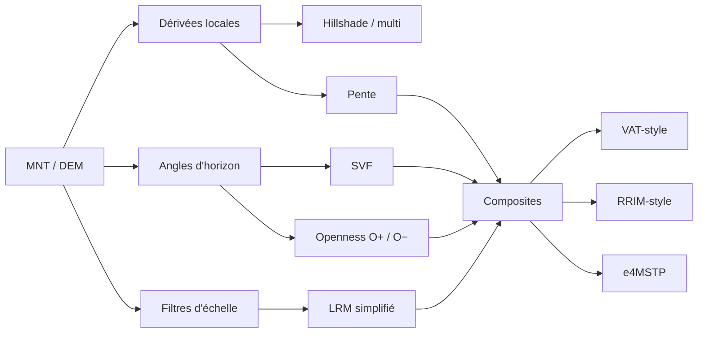
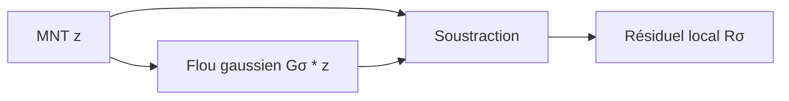

# Choisir et comprendre les ombrages LiDAR

*[English version](shadings.md) | **Français***

Les visualisations de relief ne montrent pas toutes la même chose. Une trace qui
ressort fortement dans un LRM peut disparaître dans un hillshade, et une forme
claire dans l'openness positif peut être ambiguë tant que l'openness négatif n'a
pas été consulté. Il n'existe donc pas d'ombrage universel.

Les paramètres d'échelle et de distance doivent être adaptés à la taille des
formes recherchées et à la résolution du MNT. Pour le LRM, une valeur explicite
de `sigma` est exprimée en mètres et sa valeur en pixels est :

$$
\sigma_{px}=\frac{\sigma_m}{\rho}
$$

$\rho$ est la résolution du MNT en mètres par pixel. Une petite valeur accentue
les détails fins, mais aussi le bruit, les traces de
traitement du MNT et les objets modernes. La GUI permet d'ajouter plusieurs
instances d'un même rendu afin de comparer différentes échelles.

## Vue d'ensemble



| Rendu lidar2map | À regarder en priorité | Avantages | Limites principales |
|---|---|---|---|
| `lrm` | murs bas, fossés étroits, plateformes, microrelief | très lisible, sans direction solaire, rapide | échelle unique ; enlève le contexte général ; petit σ = bruit et halos |
| `vat` | lecture composite générale | creux, bosses et ruptures dans une image | composite plus difficile à interpréter ; plus lent que LRM |
| `opos` (O+) | tertres, crêtes, levées, bords hauts | aucune direction d'éclairage ; excellent pour les convexités | renseigne peu sur les creux ; dépend fortement du rayon |
| `oneg` (O−) | fossés, chemins creux, cuvettes, bords bas | complément direct de O+ | renseigne peu sur les bosses ; rendu naturellement granuleux |
| `svf` | fossés, murs et formes sur pente | peu de biais directionnel ; conserve une bonne sensation du relief | calcul plus lourd ; sensible au rayon, au stretch et au bruit sur terrain plat |
| `multi` | lecture générale familière | rapide, intuitif, moins biaisé qu'un seul azimut | reste une simulation d'éclairage ; certaines formes restent masquées |
| `315` `045` `135` `225` | vérification d'une structure orientée | très efficace quand le soleil est perpendiculaire à la trace | biais d'azimut fort ; toujours comparer plusieurs directions |
| `slope` | talus, scarps et ruptures de pente | rapide, indépendant de l'azimut | ne distingue ni montée/descente, ni bosse/creux ; sensible au bruit |
| `rrim` | lecture couleur pente + relief local | combine rupture de pente et anomalie locale | implémentation lidar2map différente du RRIM académique ; code couleur à apprendre |
| `e4mstp` | exploration multi-échelle d'une petite zone | rassemble beaucoup d'indices dans une image couleur | très lourd, complexe, composite propre à lidar2map |

## Repères historiques

| Année | Méthode | Apport |
|---:|---|---|
| 1981 | gradient de Horn | estimation robuste de pente/aspect sur une fenêtre 3×3 |
| 1992 | hillshade multidirectionnel de Mark | quatre éclairages pondérés pour réduire le biais d'orientation |
| 2002 | openness de Yokoyama, Shirasawa et Pike | description angulaire des convexités et concavités sans soleil artificiel |
| 2008 | RRIM de Chiba, Kaneta et Suzuki | pente en rouge + dominance/openness en luminosité |
| 2010 | Local Relief Model de Hesse | retrait du relief de fond pour isoler les formes locales |
| 2011 | SVF de Zakšek, Oštir et Kokalj | part de ciel visible appliquée à la visualisation du relief |
| 2019 | VAT de Kokalj et Somrak | combinaison raisonnée de plusieurs visualisations archéologiques |

`e4MSTP` est une composition expérimentale propre à lidar2map. Ce nom ne doit
pas être compris comme celui d'une méthode académique publiée sous cette formule
exacte.

## Pente et hillshade

lidar2map calcule les dérivées avec l'opérateur 3×3 de Horn. Pour les neuf
altitudes suivantes :

```text
a b c
d e f
g h i
```

les gradients sont :

$$
p=\frac{(c+2f+i)-(a+2d+g)}{8\,\Delta x},\qquad
q=\frac{(g+2h+i)-(a+2b+c)}{8\,\Delta y}
$$

et la pente :

$$
s=\arctan\!\left(\sqrt{p^2+q^2}\right)
$$

Le hillshade directionnel applique ensuite une illumination lambertienne :

$$
I=\max\left(0,
\cos z\cos s+\sin z\sin s\cos(A-\alpha)\right)
$$

où $z$ est l'angle zénithal du soleil, $A$ son azimut, $s$ la pente et
$\alpha$ l'aspect. Une lumière basse (`elevation=20` à `30`) accentue le
microrelief, mais allonge les ombres et augmente le contraste. Une lumière à
45° est plus neutre pour un usage général.

### Multidirectionnel (`multi`)

La méthode de [Mark (1992)](https://doi.org/10.3133/ofr92422) combine quatre
hillshades. lidar2map, comme le mode multidirectionnel de GDAL, utilise les
azimuts 225°, 270°, 315° et 360° avec :

$$
I_{multi}=\frac{\sum_k w_k I_k}{\sum_k w_k},\qquad
w_k=\sin^2(A_k-\alpha)
$$

La pondération renforce les éclairages perpendiculaires à la pente locale. Le
rendu est plus équilibré qu'une lumière unique, mais il reste dépendant d'un
modèle d'illumination.


*Le même relief éclairé à 315° (a) puis 45° (b) : les structures parallèles à
la lumière deviennent difficiles à lire. Figure 1 de [Zakšek, Oštir et Kokalj
(2011)](https://doi.org/10.3390/rs3020398), données NASA/JPL/University of
Arizona, [CC BY 3.0](https://creativecommons.org/licenses/by/3.0/).*

## LRM dans lidar2map : la variante simplifiée

Le LRM complet publié par [Hesse
(2010)](https://doi.org/10.1002/arp.374) construit un modèle de relief local
« purgé » à partir des contours zéro, puis le soustrait au MNT. lidar2map emploie
la variante plus courante et plus rapide appelée **Simple Local Relief Model
(SLRM)** dans le Relief Visualization Toolbox :

$$
R_\sigma(x,y)=z(x,y)-\bigl(G_\sigma*z\bigr)(x,y)
$$

$G_\sigma*z$ est le MNT lissé par une gaussienne d'écart-type $\sigma$.



- Petit $\sigma$ : petits détails, arêtes nettes, mais davantage de bruit et de
  halos.
- Grand $\sigma$ : terrasses et structures plus larges, mais les détails fins se
  fondent dans le contexte.
- Il ne s'agit pas d'une coupure nette : $\sigma$ règle une réponse progressive
  en fréquence, pas une « taille maximale d'objet » exacte.

Le défaut de lidar2map vaut 15 pixels de la résolution native, soit 7,5 m pour
le LiDAR IGN à 0,5 m/pixel. Une valeur explicite inférieure à ce défaut cible
des formes plus petites ; une valeur supérieure conserve davantage de
structures larges.

## Sky-View Factor (`svf`)

Le SVF mesure la fraction de l'hémisphère céleste visible depuis chaque pixel.
Pour des angles d'horizon $\gamma_k$ échantillonnés dans $n$ directions,
lidar2map propose deux conventions visuelles :

$$
SVF_{flux}\approx\frac{1}{n}\sum_{k=1}^{n}\cos^2\gamma_k
$$

et la convention RVT :

$$
SVF_{rvt}\approx\frac{1}{n}\sum_{k=1}^{n}(1-\sin\gamma_k)
$$


*En coupe (a), le relief masque une partie de l'hémisphère céleste ; en plan
(b), l'horizon est recherché dans plusieurs directions jusqu'au rayon $R$.
Figure 2 de [Zakšek, Oštir et Kokalj
(2011)](https://doi.org/10.3390/rs3020398), [CC BY
3.0](https://creativecommons.org/licenses/by/3.0/).*

La méthode a été formalisée comme visualisation de relief par [Zakšek, Oštir et
Kokalj (2011)](https://doi.org/10.3390/rs3020398), puis appliquée aux paysages
archéologiques par [Kokalj, Zakšek et Oštir
(2011)](https://doi.org/10.1017/S0003598X00067594).

lidar2map emploie 16 directions. Le paramètre `dist` borne la recherche de
l'horizon : 20 m vise le microrelief ; 100 m peut mieux faire ressortir grandes
enceintes et voiries, au prix d'un calcul plus long et d'un contexte plus large.

## Openness positif et négatif

L'[openness de Yokoyama, Shirasawa et Pike
(2002)](https://www.asprs.org/wp-content/uploads/pers/2002journal/march/2002_mar_257-265.pdf)
résume les angles d'horizon dans plusieurs directions et dans un rayon donné :

$$
\theta_k(r)=\arctan\!\left(\frac{z(p+r u_k)-z(p)}{r}\right)
$$

$$
\beta_k=\max_{r\in(0,L]}\theta_k(r),\qquad
\delta_k=\min_{r\in(0,L]}\theta_k(r)
$$

$$
O^+=\frac{1}{n}\sum_k\left(\frac{\pi}{2}-\beta_k\right),\qquad
O^-=\frac{1}{n}\sum_k\left(\frac{\pi}{2}+\delta_k\right)
$$

$L$ est le rayon d'analyse et $u_k$ une direction. **O− n'est pas simplement
l'inverse de O+.** Ils mesurent deux géométries complémentaires.


*Les angles zénithaux rouges définissent O+ ; les angles au nadir blancs
définissent O−. Le calcul est répété dans toutes les directions jusqu'au rayon
$r$. Figure 1 de [Doneus
(2013)](https://doi.org/10.3390/rs5126427), [CC BY
3.0](https://creativecommons.org/licenses/by/3.0/).*

Dans lidar2map, `oneg` est affiché inversé afin que les creux apparaissent
sombres. Comparer O+ et O− côte à côte est plus informatif que de choisir l'un
des deux.

## RRIM : publication et variante lidar2map

Le RRIM original de [Chiba, Kaneta et Suzuki
(2008)](https://isprs.org/proceedings/XXXVII/congress/2_pdf/11_ThS-6/08.pdf)
encode la pente dans la saturation rouge et la dominance dans la luminosité,
avec une quantité dérivée de l'openness :

$$
D=\frac{O^+-O^-}{2}
$$

La sortie `rrim` de lidar2map est un **composite RRIM-style**, pas une
reproduction exacte. Elle utilise :

$$
R=255\left[\min\left(1,\max\left(0,\frac{s}{45^\circ}\right)\right)\right]^{0.7}
$$

$$
G=B=255\,N_{5,95}(R_\sigma)^{0.8}
$$

où $N_{5,95}$ est l'étirement du résiduel LRM simplifié entre ses percentiles 5
et 95. Cette variante associe donc pente rouge et relief local clair/foncé ;
elle ne doit pas être interprétée comme une carte quantitative de dominance au
sens du papier de 2008.

## VAT et e4MSTP

Le VAT publié par [Kokalj et Somrak
(2019)](https://doi.org/10.3390/rs11070747) combine hillshade, pente inversée,
openness positif et SVF avec des étirements et modes de fusion définis.


*Chaîne du VAT publié : calcul et normalisation des couches, puis fusion dans
un ordre et avec des opacités définis. Figure 1 de [Kokalj et Somrak
(2019)](https://doi.org/10.3390/rs11070747), [CC BY
4.0](https://creativecommons.org/licenses/by/4.0/). La variante de lidar2map
décrite ci-dessous n'est pas ce preset à l'identique.*

Le rendu `vat` de lidar2map est **VAT-style**. Sa base est le SVF ; un overlay
d'openness positif renforce les convexités, puis la pente assombrit les talus.
Avec les opacités internes actuelles de 0,5 :

$$
V=\left[0.5S+0.5B(S,O^+)\right]\left(1-0.5P\right)
$$

$B$ est la fusion Overlay : pour $S\leq 0.5$, $B(S,O^+)=2SO^+$ ; au-delà,
$B(S,O^+)=1-2(1-S)(1-O^+)$. Puis le gamma choisi est appliqué. $S$ est le SVF
normalisé et $P$ la pente normalisée. Ce mélange n'est donc pas pixel-identique
au preset VAT du RVT.

`e4mstp` est un composite couleur spécifique à lidar2map : il réunit position
topographique multi-échelle, SVF, O+, O−, pente et deux résiduels locaux
($\sigma=1{,}5$ m et 8 m). Sa position topographique standardisée à chaque
échelle part de :

$$
DEV_\sigma=\frac{z-G_\sigma(z)}
{\sqrt{\max(G_\sigma(z^2)-G_\sigma(z)^2,0)}+10^{-3}}
$$

Il peut être très riche sur une petite zone, mais son coût et le nombre de
couches fusionnées le rendent moins adapté comme première lecture ou pour un
département entier.


*Principe du MSTP publié : le MNT produit des écarts topographiques aux échelles
micro, méso et macro, ensuite réunis en RGB. Figure 5 de [Guyot, Hubert-Moy et
Lorho (2018)](https://doi.org/10.3390/rs10020225), [CC BY
4.0](https://creativecommons.org/licenses/by/4.0/). `e4mstp` reprend l'idée
multi-échelle, mais sa composition et sa formule restent propres à lidar2map.*

## Lecture croisée et validation

1. **Échelle :** comparer plusieurs valeurs de LRM, du détail fin aux formes
   plus larges.
2. **Signe de la forme :** lire O+ et O− côte à côte pour distinguer
   convexités et concavités.
3. **Contexte :** utiliser SVF, VAT ou RRIM pour replacer l'anomalie dans le
   relief environnant.
4. **Orientation :** comparer plusieurs azimuts de hillshade si la géométrie
   reste ambiguë.
5. **Retour aux données :** vérifier orthophoto, cadastre, cartes anciennes et
   terrain. Une visualisation n'est jamais une preuve archéologique.

Les artefacts du MNT peuvent imiter des vestiges : bord de dalle, interpolation
sous végétation, bâtiment supprimé, drain moderne, piste forestière, bruit du
nuage ou différence de campagne LiDAR. Une forme crédible doit survivre à
plusieurs visualisations indépendantes et présenter une géométrie cohérente.

## Références

- Horn, 1981 — [*Hill Shading and the Reflectance Map*](https://doi.org/10.1109/PROC.1981.11918).
- Mark, 1992 — [*A multidirectional, oblique-weighted, shaded-relief image of the Island of Hawaii*](https://doi.org/10.3133/ofr92422).
- Yokoyama, Shirasawa & Pike, 2002 — [*Visualizing Topography by Openness*](https://www.asprs.org/wp-content/uploads/pers/2002journal/march/2002_mar_257-265.pdf).
- Chiba, Kaneta & Suzuki, 2008 — [*Red Relief Image Map*](https://isprs.org/proceedings/XXXVII/congress/2_pdf/11_ThS-6/08.pdf).
- Hesse, 2010 — [*LiDAR-derived Local Relief Models*](https://doi.org/10.1002/arp.374).
- Zakšek, Oštir & Kokalj, 2011 — [*Sky-View Factor as a Relief Visualization Technique*](https://doi.org/10.3390/rs3020398).
- Kokalj, Zakšek & Oštir, 2011 — [application archéologique du SVF](https://doi.org/10.1017/S0003598X00067594).
- Kokalj & Hesse, 2017 — [*Airborne Laser Scanning Raster Data Visualization*](https://doi.org/10.3986/9789612549848).
- Kokalj & Somrak, 2019 — [*Why Not a Single Image?* — VAT](https://doi.org/10.3390/rs11070747).
- Relief Visualization Toolbox — [documentation des visualisations](https://rvt-py.readthedocs.io/en/latest/).

Les fichiers sources et les licences des figures sont détaillés dans le
[registre des illustrations](images/shadings/README.md).
