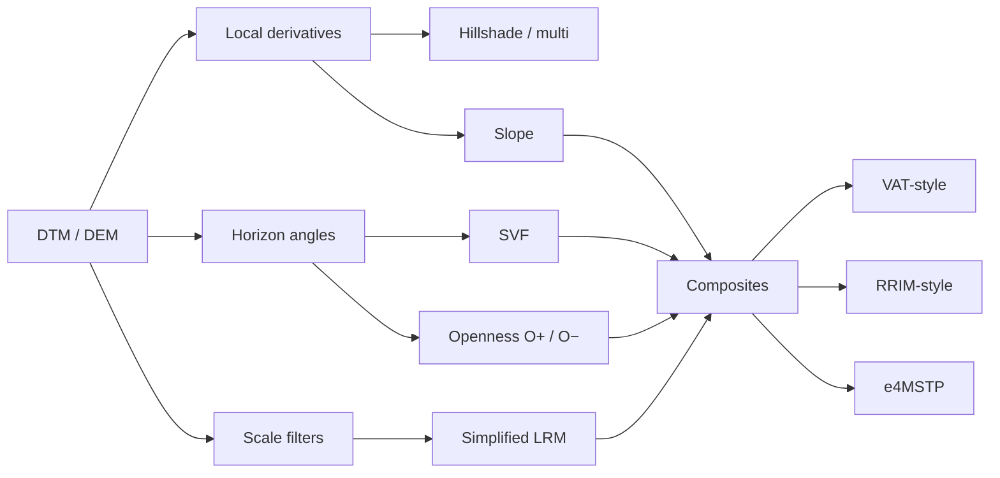
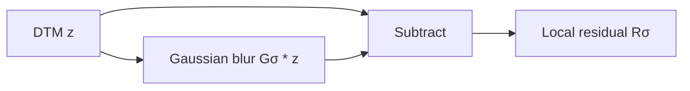
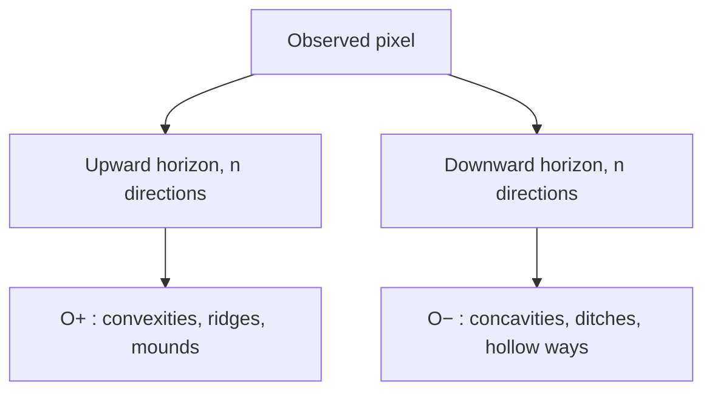

# Choosing and understanding LiDAR visualizations

***English** | [Version française](shadings.fr.md)*

Relief visualizations do not all show the same information. A trace that is
strong in a local-relief image can vanish in a hillshade; a bright feature in
positive openness may remain ambiguous until negative openness is inspected.
There is no universal best visualization.

> **Nico's recommendation:** my favourite lidar2map rendering for small detail
> is **LRM with `sigma=3`**. I always compare it with **VAT**, **positive
> openness O+**, and **negative openness O−**: LRM raises the alert, VAT gives
> context, O+ checks positive forms, and O− checks negative forms.

Add these four instances in the GUI, or use:

```bash
--shading lrm:sigma=3 \
--shading vat:dist=20,gamma=2 \
--shading opos:dist=20,gamma=2 \
--shading oneg:dist=20,gamma=2
```

`sigma=3` is in metres. On the French IGN 0.5 m/pixel DTM, this is a Gaussian
standard deviation of 6 pixels. It deliberately favours small anomalies, but
also reveals more DTM processing noise, modern features, and edge artefacts.

## Overview



| lidar2map output | Look for | Strengths | Main limitations |
|---|---|---|---|
| `lrm` | low walls, narrow ditches, platforms, microrelief | readable, illumination-independent, fast | one scale; removes broad context; small σ amplifies noise and halos |
| `vat` | general cross-check after LRM | pits, mounds and breaks in one image | composite is harder to interpret; slower than LRM |
| `opos` (O+) | mounds, ridges, banks, upper edges | no illumination direction; excellent for convexities | says little about depressions; strongly radius-dependent |
| `oneg` (O−) | ditches, hollow ways, pits, lower edges | direct complement to O+ | says little about positive forms; naturally granular |
| `svf` | ditches, walls, and features on slopes | little directional bias; retains a useful relief impression | costlier; sensitive to radius, stretch, and flat-ground noise |
| `multi` | familiar overview | fast, intuitive, less biased than one azimuth | still an illumination model; some features remain hidden |
| `315` `045` `135` `225` | an oriented structure | powerful when light is perpendicular to the trace | strong azimuth bias; always compare directions |
| `slope` | banks, scarps, abrupt breaks | fast and azimuth-independent | no uphill/downhill or mound/pit distinction; noise-sensitive |
| `rrim` | coloured slope plus local relief | combines gradient breaks with local anomalies | lidar2map differs from academic RRIM; colour grammar must be learned |
| `e4mstp` | multi-scale exploration of a small area | gathers many clues in one colour image | very expensive, complex, lidar2map-specific composite |

## Historical landmarks

| Year | Method | Contribution |
|---:|---|---|
| 1981 | Horn gradient | robust 3×3 slope/aspect estimate |
| 1992 | Mark multidirectional hillshade | four weighted illuminations reduce orientation bias |
| 2002 | Yokoyama, Shirasawa & Pike openness | illumination-free angular description of convexity and concavity |
| 2008 | Chiba, Kaneta & Suzuki RRIM | red slope plus openness/dominance lightness |
| 2010 | Hesse Local Relief Model | removes broad relief to isolate local landforms |
| 2011 | Zakšek, Oštir & Kokalj SVF | visible-sky fraction applied to relief visualization |
| 2019 | Kokalj & Somrak VAT | structured blend of archaeological visualizations |

`e4MSTP` in lidar2map is an experimental composition. It is not a separately
published academic method with this exact formula.

## Slope and hillshade

lidar2map estimates derivatives with Horn's 3×3 operator. For:

```text
a b c
d e f
g h i
```

the gradients are:

$$
p=\frac{(c+2f+i)-(a+2d+g)}{8\,\Delta x},\qquad
q=\frac{(g+2h+i)-(a+2b+c)}{8\,\Delta y}
$$

and slope is:

$$
s=\arctan\!\left(\sqrt{p^2+q^2}\right)
$$

Directional hillshade then applies Lambertian illumination:

$$
I=\max\left(0,
\cos z\cos s+\sin z\sin s\cos(A-\alpha)\right)
$$

where $z$ is solar zenith, $A$ solar azimuth, $s$ slope, and $\alpha$ aspect.
A low light (`elevation=20` to `30`) emphasizes microrelief but increases
contrast; 45° is more neutral for general use. This is local illumination, not
a ray-cast model of true cast shadows.

### Multidirectional (`multi`)

[Mark (1992)](https://doi.org/10.3133/ofr92422) combines four hillshades.
lidar2map, like GDAL's multidirectional mode, uses azimuths 225°, 270°, 315°,
and 360°:

$$
I_{multi}=\frac{\sum_k w_k I_k}{\sum_k w_k},\qquad
w_k=\sin^2(A_k-\alpha)
$$

This favours illumination perpendicular to the local slope. It is more balanced
than one light source, but it remains an illumination model.

## LRM in lidar2map: the simplified variant

The full LRM published by [Hesse
(2010)](https://doi.org/10.1002/arp.374) builds a purged local elevation model
from zero contours before subtraction. lidar2map uses the faster, common
**Simple Local Relief Model (SLRM)** variant:

$$
R_\sigma(x,y)=z(x,y)-\bigl(G_\sigma*z\bigr)(x,y)
$$

where $G_\sigma*z$ is a Gaussian-smoothed DTM.



- Small $\sigma$: fine detail and sharp edges, but more noise and halos.
- Large $\sigma$: broader terraces and structures, while fine detail merges
  into the background.
- Gaussian scale is progressive, not an exact maximum object size.

The lidar2map default is 15 native pixels, or 7.5 m for IGN's 0.5 m/pixel
LiDAR. `sigma=3` is therefore much more strongly tuned to small features than
the general-purpose default.

## Sky-View Factor (`svf`)

SVF measures the visible fraction of the sky hemisphere. For horizon angles
$\gamma_k$ sampled along $n$ directions, lidar2map offers two visual
conventions:

$$
SVF_{flux}\approx\frac{1}{n}\sum_{k=1}^{n}\cos^2\gamma_k
$$

and the RVT convention:

$$
SVF_{rvt}\approx\frac{1}{n}\sum_{k=1}^{n}(1-\sin\gamma_k)
$$

SVF was developed as a relief visualization by [Zakšek, Oštir & Kokalj
(2011)](https://doi.org/10.3390/rs3020398) and applied to archaeological
landscapes by [Kokalj, Zakšek & Oštir
(2011)](https://doi.org/10.1017/S0003598X00067594).

lidar2map uses 16 directions. `dist` limits the horizon search: 20 m targets
microrelief; 100 m may reveal large enclosures and roads, with greater runtime
and a broader spatial context.

## Positive and negative openness

[Yokoyama, Shirasawa & Pike's openness
(2002)](https://www.asprs.org/wp-content/uploads/pers/2002journal/march/2002_mar_257-265.pdf)
summarizes horizon angles over several directions and within a set radius:

$$
\theta_k(r)=\arctan\!\left(\frac{z(p+r u_k)-z(p)}{r}\right)
$$

$$
\beta_k=\max_{0<r\le L}\theta_k(r),\qquad
\delta_k=\min_{0<r\le L}\theta_k(r)
$$

$$
O^+=\frac{1}{n}\sum_k\left(\frac{\pi}{2}-\beta_k\right),\qquad
O^-=\frac{1}{n}\sum_k\left(\frac{\pi}{2}+\delta_k\right)
$$

$L$ is the analysis radius and $u_k$ a direction. **O− is not merely the
inverse of O+.** They describe complementary geometry.

```text
              highest horizon
                    ●
                   /|
                  / | Δz
----------------P--+---------------- horizontal
                 <--- r --->
                  θ = atan(Δz/r)
```



lidar2map displays `oneg` inverted so depressions are dark. O+ and O− are best
read side by side. Both outputs are percentile-stretched per dataset, so their
display values are visual contrasts, not directly comparable physical angles
between projects.

## RRIM: publication and lidar2map variant

The original RRIM by [Chiba, Kaneta & Suzuki
(2008)](https://isprs.org/proceedings/XXXVII/congress/2_pdf/11_ThS-6/08.pdf)
maps slope to red chroma and dominance to lightness, using an openness-derived
quantity:

$$
D=\frac{O^+-O^-}{2}
$$

lidar2map's `rrim` is an **RRIM-style composite**, not an exact reproduction:

$$
R=255\,\operatorname{clip}(s/45^\circ,0,1)^{0.7}
$$

$$
G=B=255\,N_{5,95}(R_\sigma)^{0.8}
$$

$N_{5,95}$ stretches the simplified LRM residual between its 5th and 95th
percentiles. This variant combines red slope and light/dark local relief; it is
not a quantitative dominance map in the 2008 sense.

## VAT and e4MSTP

VAT as published by [Kokalj & Somrak
(2019)](https://doi.org/10.3390/rs11070747) combines hillshade, inverted slope,
positive openness, and SVF with defined stretches and blend modes.

lidar2map's `vat` is **VAT-style**. SVF is the base, a positive-openness overlay
enhances convexity, and slope darkens scarps. With the current internal 0.5
opacities:

$$
V=\left[0.5S+0.5\,\operatorname{overlay}(S,O^+)\right]
\left(1-0.5P\right)
$$

followed by the selected gamma. $S$ is normalized SVF and $P$ normalized slope.
It is therefore not pixel-identical to the RVT VAT preset.

`e4mstp` is a lidar2map-specific colour composite. It combines multi-scale
topographic position, SVF, O+, O−, slope, and two local residuals
($\sigma=1.5$ m and 8 m). Its standardized deviation at each scale is based on:

$$
DEV_\sigma=\frac{z-G_\sigma(z)}
{\sqrt{\max(G_\sigma(z^2)-G_\sigma(z)^2,0)}+10^{-3}}
$$

It can be information-rich on a small site, but its many Gaussian scales and
horizon layers make it unsuitable as a first view or a cheap department-wide
render.

## Recommended reading workflow

1. **Fine detection:** LRM `sigma=3`.
2. **Context:** VAT, to test whether the anomaly belongs to a broader natural
   form or gradient break.
3. **Feature sign:** O+ for a bank/convexity, O− for a ditch/concavity.
4. **Orientation:** one or more directional hillshades when geometry remains
   ambiguous.
5. **Return to evidence:** check aerial imagery, cadastral and historical maps,
   and the ground. A visualization is never archaeological proof.

DTM artefacts can mimic archaeology: tile edges, vegetation interpolation,
removed buildings, modern drains, forestry tracks, point-cloud noise, or survey
campaign boundaries. A credible feature should survive several independent
visualizations and retain coherent geometry.

## References

- Horn, 1981 — [*Hill Shading and the Reflectance Map*](https://doi.org/10.1109/PROC.1981.11918).
- Mark, 1992 — [*A multidirectional, oblique-weighted, shaded-relief image of the Island of Hawaii*](https://doi.org/10.3133/ofr92422).
- Yokoyama, Shirasawa & Pike, 2002 — [*Visualizing Topography by Openness*](https://www.asprs.org/wp-content/uploads/pers/2002journal/march/2002_mar_257-265.pdf).
- Chiba, Kaneta & Suzuki, 2008 — [*Red Relief Image Map*](https://isprs.org/proceedings/XXXVII/congress/2_pdf/11_ThS-6/08.pdf).
- Hesse, 2010 — [*LiDAR-derived Local Relief Models*](https://doi.org/10.1002/arp.374).
- Zakšek, Oštir & Kokalj, 2011 — [*Sky-View Factor as a Relief Visualization Technique*](https://doi.org/10.3390/rs3020398).
- Kokalj, Zakšek & Oštir, 2011 — [archaeological SVF application](https://doi.org/10.1017/S0003598X00067594).
- Kokalj & Hesse, 2017 — [*Airborne Laser Scanning Raster Data Visualization*](https://doi.org/10.3986/9789612549848).
- Kokalj & Somrak, 2019 — [*Why Not a Single Image?* — VAT](https://doi.org/10.3390/rs11070747).
- Relief Visualization Toolbox — [visualization documentation](https://rvt-py.readthedocs.io/en/latest/).
