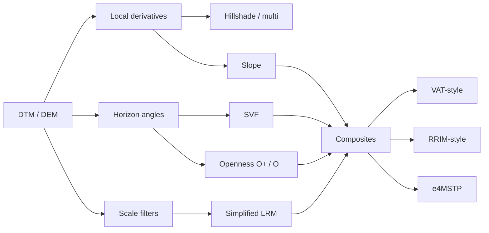
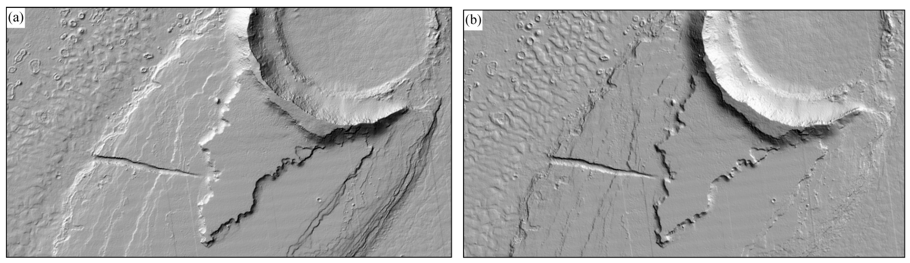
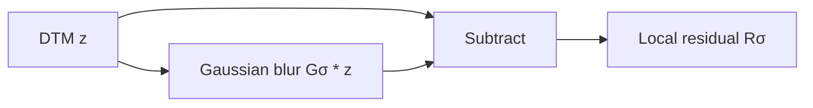
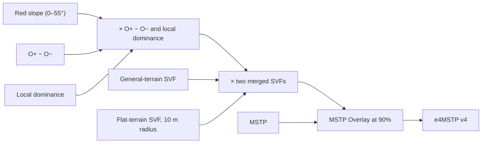
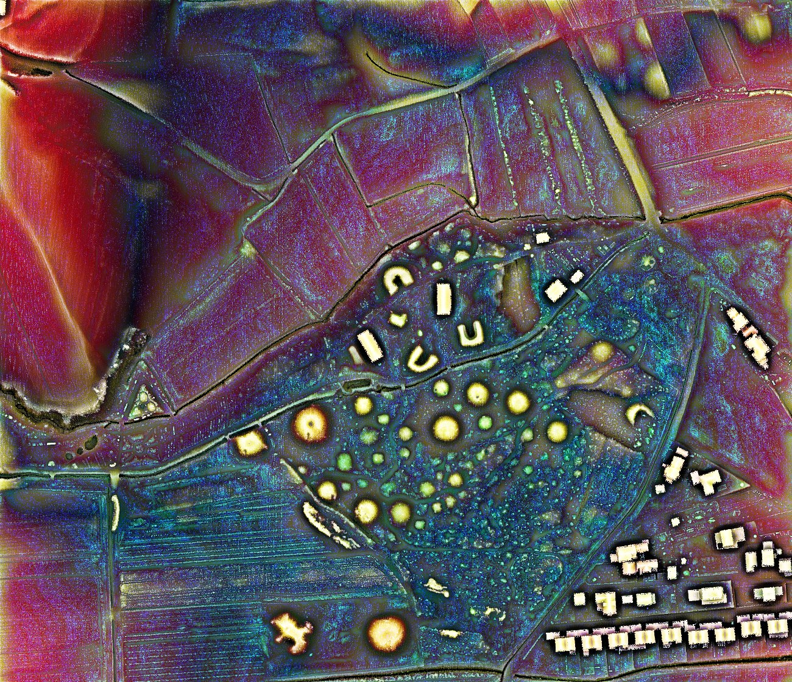
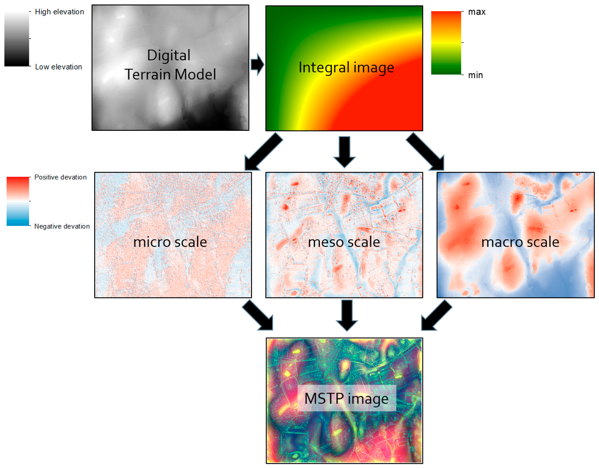

# Choosing and understanding LiDAR visualizations

***English** | [Version française](shadings.fr.md)*

Relief visualizations do not all show the same information. A trace that is
strong in a local-relief image can vanish in a hillshade; a bright feature in
positive openness may remain ambiguous until negative openness is inspected.
There is no universal best visualization.

Scale and distance parameters should match the size of the target landforms and
the DTM resolution. For LRM, an explicit `sigma` value is expressed in metres;
its value in pixels is:

$$
\sigma_{px}=\frac{\sigma_m}{\rho}
$$

$\rho$ is the DTM resolution in metres per pixel. A small value emphasizes fine
detail, but also DTM processing noise, modern
features, and edge artefacts. The GUI can add several instances of the same
visualization to compare scales.

## Overview



| lidar2map output | Look for | Strengths | Main limitations |
|---|---|---|---|
| `lrm` | low walls, narrow ditches, platforms, microrelief | readable, illumination-independent, fast | one scale; removes broad context; small σ amplifies noise and halos |
| `vat` | general composite reading | pits, mounds and breaks in one image | composite is harder to interpret; slower than LRM |
| `opos` (O+) | mounds, ridges, banks, upper edges | no illumination direction; excellent for convexities | says little about depressions; strongly radius-dependent |
| `oneg` (O−) | ditches, hollow ways, pits, lower edges | direct complement to O+ | says little about positive forms; naturally granular |
| `svf` | ditches, walls, and features on slopes | little directional bias; retains a useful relief impression | costlier; sensitive to radius, stretch, and flat-ground noise |
| `multi` | familiar overview | fast, intuitive, less biased than one azimuth | still an illumination model; some features remain hidden |
| `315` `045` `135` `225` | an oriented structure | powerful when light is perpendicular to the trace | strong azimuth bias; always compare directions |
| `slope` | banks, scarps, abrupt breaks | fast and azimuth-independent | no uphill/downhill or mound/pit distinction; noise-sensitive |
| `rrim` | coloured slope plus local relief | combines gradient breaks with local anomalies | lidar2map differs from academic RRIM; colour grammar must be learned |
| `e4mstp` | multi-scale exploration of a small area | gathers many clues in one colour image | very expensive; colour grammar takes practice; lidar2map variant differs from the RVT preset |

## Historical landmarks

| Year | Method | Contribution |
|---:|---|---|
| 1981 | Horn gradient | robust 3×3 slope/aspect estimate |
| 1992 | Mark multidirectional hillshade | four weighted illuminations reduce orientation bias |
| 2002 | Yokoyama, Shirasawa & Pike openness | illumination-free angular description of convexity and concavity |
| 2008 | Chiba, Kaneta & Suzuki RRIM | red slope plus openness/dominance lightness |
| 2010 | Hesse Local Relief Model | removes broad relief to isolate local landforms |
| 2011 | Zakšek, Oštir & Kokalj SVF | visible-sky fraction applied to relief visualization |
| 2013 | Doneus openness application | joint archaeological reading of convexities and concavities |
| 2018 | Guyot, Hubert-Moy & Lorho MSTP | three topographic-position scales combined as RGB |
| 2019 | Kokalj & Somrak VAT | structured blend of archaeological visualizations |
| 2025 | Kokalj e4MSTP | fusion of MSTP, two SVFs, positive/negative openness, local dominance, and red slope |

e4MSTP was not created by lidar2map. Version 4 is described by [Kokalj
(2025)](https://doi.org/10.1002/arp.70002), has been included in RVT Python
2.2.3 since July 2025, and was further explained by [Kokalj & Čož
(2025)](https://doi.org/10.13140/RG.2.2.19992.66563). The current lidar2map
output is nevertheless a **variant inspired by that method**, not a
pixel-identical implementation of the RVT preset; the differences are detailed
below.

## Slope and hillshade

lidar2map estimates derivatives with Horn's 3×3 operator. For:

```text
a b c
d e f
g h i
```

the gradients are:

$$
p=\frac{(c+2f+i)-(a+2d+g)}{8\,\Delta x},\qquad
q=\frac{(g+2h+i)-(a+2b+c)}{8\,\Delta y}
$$

and slope is:

$$
s=\arctan\!\left(\sqrt{p^2+q^2}\right)
$$

Directional hillshade then applies Lambertian illumination:

$$
I=\max\left(0,
\cos z\cos s+\sin z\sin s\cos(A-\alpha)\right)
$$

where $z$ is solar zenith, $A$ solar azimuth, $s$ slope, and $\alpha$ aspect.
A low light (`elevation=20` to `30`) emphasizes microrelief but increases
contrast; 45° is more neutral for general use. This is local illumination, not
a ray-cast model of true cast shadows.

### Multidirectional (`multi`)

[Mark (1992)](https://doi.org/10.3133/ofr92422) combines four hillshades.
lidar2map, like GDAL's multidirectional mode, uses azimuths 225°, 270°, 315°,
and 360°:

$$
I_{multi}=\frac{\sum_k w_k I_k}{\sum_k w_k},\qquad
w_k=\sin^2(A_k-\alpha)
$$

This favours illumination perpendicular to the local slope. It is more balanced
than one light source, but it remains an illumination model.



*The same relief illuminated from 315° (a) and 45° (b): structures parallel to
the light become difficult to read. Figure 1 from [Zakšek, Oštir & Kokalj
(2011)](https://doi.org/10.3390/rs3020398), data NASA/JPL/University of Arizona,
[CC BY 3.0](https://creativecommons.org/licenses/by/3.0/).*

## LRM in lidar2map: the simplified variant

The full LRM published by [Hesse
(2010)](https://doi.org/10.1002/arp.374) builds a purged local elevation model
from zero contours before subtraction. lidar2map uses the faster, common
**Simple Local Relief Model (SLRM)** variant:

$$
R_\sigma(x,y)=z(x,y)-\bigl(G_\sigma*z\bigr)(x,y)
$$

where $G_\sigma*z$ is a Gaussian-smoothed DTM.



- Small $\sigma$: fine detail and sharp edges, but more noise and halos.
- Large $\sigma$: broader terraces and structures, while fine detail merges
  into the background.
- Gaussian scale is progressive, not an exact maximum object size.

The lidar2map default is 15 native pixels, or 7.5 m for IGN's 0.5 m/pixel
LiDAR. An explicit value below that general-purpose default targets smaller
features; a larger value retains broader structures.

## Sky-View Factor (`svf`)

SVF measures the visible fraction of the sky hemisphere. For horizon angles
$\gamma_k$ sampled along $n$ directions, lidar2map offers two visual
conventions:

$$
SVF_{flux}\approx\frac{1}{n}\sum_{k=1}^{n}\cos^2\gamma_k
$$

and the RVT convention:

$$
SVF_{rvt}\approx\frac{1}{n}\sum_{k=1}^{n}(1-\sin\gamma_k)
$$


*In profile (a), relief masks part of the sky hemisphere; in plan view (b), the
horizon is searched along several directions out to radius $R$. Figure 2 from
[Zakšek, Oštir & Kokalj
(2011)](https://doi.org/10.3390/rs3020398), [CC BY
3.0](https://creativecommons.org/licenses/by/3.0/).*

SVF was developed as a relief visualization by [Zakšek, Oštir & Kokalj
(2011)](https://doi.org/10.3390/rs3020398) and applied to archaeological
landscapes by [Kokalj, Zakšek & Oštir
(2011)](https://doi.org/10.1017/S0003598X00067594).

lidar2map uses 16 directions. `dist` limits the horizon search: 20 m targets
microrelief; 100 m may reveal large enclosures and roads, with greater runtime
and a broader spatial context.

## Positive and negative openness

[Yokoyama, Shirasawa & Pike's openness
(2002)](https://www.asprs.org/wp-content/uploads/pers/2002journal/march/2002_mar_257-265.pdf)
summarizes horizon angles over several directions and within a set radius:

$$
\theta_k(r)=\arctan\!\left(\frac{z(p+r u_k)-z(p)}{r}\right)
$$

$$
\beta_k=\max_{r\in(0,L]}\theta_k(r),\qquad
\delta_k=\min_{r\in(0,L]}\theta_k(r)
$$

$$
O^+=\frac{1}{n}\sum_k\left(\frac{\pi}{2}-\beta_k\right),\qquad
O^-=\frac{1}{n}\sum_k\left(\frac{\pi}{2}+\delta_k\right)
$$

$L$ is the analysis radius and $u_k$ a direction. **O− is not merely the
inverse of O+.** They describe complementary geometry.


*Red zenith angles define O+; white nadir angles define O−. The calculation is
repeated in every direction out to radius $r$. Figure 1 from [Doneus
(2013)](https://doi.org/10.3390/rs5126427), [CC BY
3.0](https://creativecommons.org/licenses/by/3.0/).*

lidar2map displays `oneg` inverted so depressions are dark. O+ and O− are best
read side by side. Both outputs are percentile-stretched per dataset, so their
display values are visual contrasts, not directly comparable physical angles
between projects.

## RRIM: publication and lidar2map variant

The original RRIM by [Chiba, Kaneta & Suzuki
(2008)](https://isprs.org/proceedings/XXXVII/congress/2_pdf/11_ThS-6/08.pdf)
maps slope to red chroma and dominance to lightness, using an openness-derived
quantity:

$$
D=\frac{O^+-O^-}{2}
$$

lidar2map's `rrim` is an **RRIM-style composite**, not an exact reproduction:

$$
R=255\left[\min\left(1,\max\left(0,\frac{s}{45^\circ}\right)\right)\right]^{0.7}
$$

$$
G=B=255\,N_{5,95}(R_\sigma)^{0.8}
$$

$N_{5,95}$ stretches the simplified LRM residual between its 5th and 95th
percentiles. This variant combines red slope and light/dark local relief; it is
not a quantitative dominance map in the 2008 sense.

## VAT and e4MSTP

VAT as published by [Kokalj & Somrak
(2019)](https://doi.org/10.3390/rs11070747) combines hillshade, inverted slope,
positive openness, and SVF with defined stretches and blend modes.


*Published VAT workflow: compute and normalize the layers, then blend them in a
defined order and at defined opacities. Figure 1 from [Kokalj & Somrak
(2019)](https://doi.org/10.3390/rs11070747), [CC BY
4.0](https://creativecommons.org/licenses/by/4.0/). The lidar2map variant below
is not this exact preset.*

lidar2map's `vat` is **VAT-style**. SVF is the base, a positive-openness overlay
enhances convexity, and slope darkens scarps. With the current internal 0.5
opacities:

$$
V=\left[0.5S+0.5B(S,O^+)\right]\left(1-0.5P\right)
$$

$B$ is the Overlay blend: for $S\leq 0.5$, $B(S,O^+)=2SO^+$; above that value,
$B(S,O^+)=1-2(1-S)(1-O^+)$. The selected gamma is then applied. $S$ is
normalized SVF and $P$ normalized slope. It is therefore not pixel-identical to
the RVT VAT preset.

### Published e4MSTP

The e4MSTP v4 published by [Kokalj
(2025)](https://doi.org/10.1002/arp.70002) is a complex blend designed for
multi-scale detection; “e4” means *enhanced, version 4*. The [reference RVT
recipe](https://rvt-py.readthedocs.io/en/latest/rvt.blend.html#rvt.blend.e4mstp)
stacks the layers in this order:



- the O+ − O− difference, stretched from −15 to 15, is placed at 50% over
  local dominance stretched from 0.5 to 1.8;
- a general-terrain SVF stretched from 0.7 to 1 is merged with a second SVF
  for flat terrain, computed with a 10 m radius and stretched from 0.9 to 1;
  the combined layer is multiplied at 25%;
- MSTP is finally added in Overlay mode at 90%.

This version is particularly effective at showing subtle topographic variation
in very flat terrain and small structures. Its colours take time to learn and
are better suited to detection and recognition than detailed interpretation.
A Luminosity blend can remove the colours when they distract from the forms.



*Example of the reference e4MSTP recipe on the 0.5 m Pivola DTM. Illustration
from the [Relief Visualization Toolbox
Python](https://github.com/EarthObservation/RVT_py/blob/8002c0c9ea34a4970c8298139ab4399247961433/docs/figures/rvtvis_qgis_Pivola_dem_05m_e4MSTP_8bit.jpg),
© ZRC SAZU and University of Ljubljana, licensed under [Apache
2.0](https://www.apache.org/licenses/LICENSE-2.0).*

### Current lidar2map variant

lidar2map's `e4mstp` output combines its MSTP calculation, one SVF, O+, O−,
slope, and two SLRM residuals ($\sigma=1.5$ m and 8 m). It does not calculate
local dominance, does not merge the two SVFs from the reference recipe, and
uses a Gaussian approximation of MSTP with different scales and RGB encoding
from RVT. The stretches, opacities, and blend modes also differ. It is therefore
an **experimental e4MSTP-inspired variant**, not a pixel-identical reproduction
of the RVT preset.

Its standardized topographic deviation at each scale is based on:

$$
DEV_\sigma=\frac{z-G_\sigma(z)}
{\sqrt{\max(G_\sigma(z^2)-G_\sigma(z)^2,0)}+10^{-3}}
$$

It can be information-rich on a small site, but its many Gaussian scales and
horizon layers make it unsuitable as a first view or a cheap department-wide
render.



*Published MSTP foundation: the DTM produces topographic deviations at micro,
meso and macro scales, then combines them as RGB. e4MSTP v4 enriches this
foundation with the layers described above. Figure 5 from [Guyot, Hubert-Moy &
Lorho (2018)](https://doi.org/10.3390/rs10020225), [CC BY
4.0](https://creativecommons.org/licenses/by/4.0/).*

## Cross-reading and validation

1. **Scale:** compare several LRM values, from fine detail to broader forms.
2. **Feature sign:** read O+ and O− side by side to distinguish convexities from
   concavities.
3. **Context:** use SVF, VAT, or RRIM to place an anomaly in the surrounding
   relief.
4. **Orientation:** compare several hillshade azimuths when geometry remains
   ambiguous.
5. **Return to evidence:** check aerial imagery, cadastral and historical maps,
   and the ground. A visualization is never archaeological proof.

DTM artefacts can mimic archaeology: tile edges, vegetation interpolation,
removed buildings, modern drains, forestry tracks, point-cloud noise, or survey
campaign boundaries. A credible feature should survive several independent
visualizations and retain coherent geometry.

## References

- Horn, 1981 — [*Hill Shading and the Reflectance Map*](https://doi.org/10.1109/PROC.1981.11918).
- Mark, 1992 — [*A multidirectional, oblique-weighted, shaded-relief image of the Island of Hawaii*](https://doi.org/10.3133/ofr92422).
- Yokoyama, Shirasawa & Pike, 2002 — [*Visualizing Topography by Openness*](https://www.asprs.org/wp-content/uploads/pers/2002journal/march/2002_mar_257-265.pdf).
- Chiba, Kaneta & Suzuki, 2008 — [*Red Relief Image Map*](https://isprs.org/proceedings/XXXVII/congress/2_pdf/11_ThS-6/08.pdf).
- Hesse, 2010 — [*LiDAR-derived Local Relief Models*](https://doi.org/10.1002/arp.374).
- Zakšek, Oštir & Kokalj, 2011 — [*Sky-View Factor as a Relief Visualization Technique*](https://doi.org/10.3390/rs3020398).
- Kokalj, Zakšek & Oštir, 2011 — [archaeological SVF application](https://doi.org/10.1017/S0003598X00067594).
- Doneus, 2013 — [*Openness as Visualization Technique for Interpretative Mapping*](https://doi.org/10.3390/rs5126427).
- Kokalj & Hesse, 2017 — [*Airborne Laser Scanning Raster Data Visualization*](https://doi.org/10.3986/9789612549848).
- Guyot, Hubert-Moy & Lorho, 2018 — [multi-scale MSTP approach](https://doi.org/10.3390/rs10020225).
- Kokalj & Somrak, 2019 — [*Why Not a Single Image?* — VAT](https://doi.org/10.3390/rs11070747).
- Kokalj, 2025 — [*Standardizing Visualization in Ancient Maya Lidar Research*](https://doi.org/10.1002/arp.70002).
- Kokalj & Čož, 2025 — [*Advancement of Relief Interpretation with a Complex Combination of Visualisation Techniques*](https://doi.org/10.13140/RG.2.2.19992.66563).
- Relief Visualization Toolbox — [eMSTP documentation](https://rvt-py.readthedocs.io/en/latest/listofvis_emstp.html) and [e4MSTP recipe](https://rvt-py.readthedocs.io/en/latest/rvt.blend.html#rvt.blend.e4mstp).

Original files and figure licences are listed in the [illustration
registry](images/shadings/README.md).
